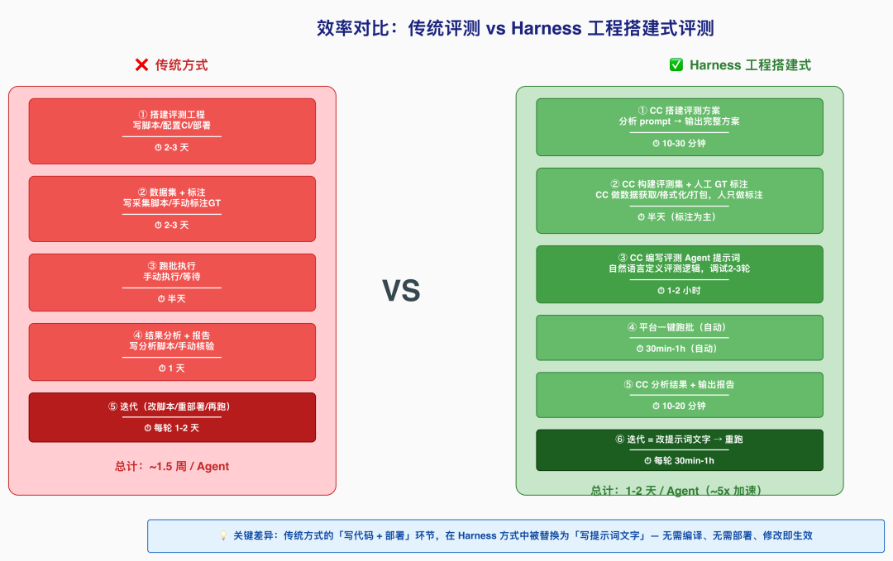

# Agent 评测 Harness 工程方案

> 原文: [微信文章](https://mp.weixin.qq.com/s/n9zkbKTi3Q1j-L2vgmO1Vw)
> 来自阿里巴巴技术实践

---

## 一、背景与问题

### 业务场景

内容生成链路由多个子 Agent 协作完成（图片理解、内容审核、文案生成、风格匹配等），prompt 频繁迭代（天级），需快速验证效果。

### 传统评测痛点

| 痛点 | 表现 |
|------|------|
| 启动成本高 | 搭工程、写脚本、部署服务 → 一周 |
| 人力密集 | 标注、分析、报告全需人工 |
| 迭代慢 | prompt 改一行要等半天重跑 |
| 可复现性差 | 评测逻辑散落脚本/Notebook |
| 指标不统一 | 不同 Agent 各搞一套 |
| 工程化沉重 | 每换一个 Agent 新写一套代码 |

---

## 二、Harness 工程搭建式评测

### 核心思路

**用一个顶级 Agent（Claude Code）搭建评测 Harness，系统性地评测一群业务 Agent。**

```
传统：人写评测代码 → 跑脚本 → 看结果 → 改代码 → 再跑
Harness：CC 搭建评测骨架 → 平台跑批 → CC 分析结果 → 人决策
```

### 为什么 Claude Code 适合

| 能力 | 在 Harness 中的作用 |
|------|-------------------|
| 深度理解 prompt | 分析被测 Agent 逻辑，设计评测维度 |
| 代码生成 | 数据获取/处理脚本 |
| 结构化输出 | 评测方案、Agent 提示词、报告 |
| 多轮协作 | v1→v2→v3 跨版本迭代 |
| 数据分析 | 统计、归因、对比 |

> **关键洞察**：评测本质是结构化评估规则 + 执行流程。传统做法编码为 Python 脚本，Harness 式编码为 Agent 提示词——更灵活、可读、易迭代。

---

## 三、三层架构

```
┌────────────────────────────────┐
│     人：GT标注 + 方案审核       │
├────────────────────────────────┤
│  Claude Code：Harness全链路    │
│  (方案/数据/评测Prompt/分析)    │
├────────────────────────────────┤
│  评测平台：批量推理主循环       │
└────────────────────────────────┘
```

---

## 四、Harness 搭建五步法

1. **评测方案设计** → 输出评测方案 .md
2. **数据集构建** → 评测集 Excel（含 GT 标注和 ground_truth）
3. **评测 Agent 编写** → 评测逻辑编码为 Prompt
4. **平台跑批** → 评测平台批量推理
5. **结果分析** → CC 实时分析 + 报告

---

## 五、与传统评测工程的类比

| 传统 | Harness 式 | 变化 |
|------|-----------|------|
| test_config.yaml | 评测方案 .md | 配置 → 自然语言文档 |
| test_data.json | 评测集 Excel | 数据格式人可读 |
| test_runner.py (数百行) | 评测 Agent 提示词 (数千字) | 执行逻辑：代码 → Prompt |
| report_generator.py | CC 实时分析 | 报告：脚本 → 交互 |
| CI + 环境 | 评测平台一键跑批 | 零部署成本 |

---

## 六、职责分工

| 角色 | 职责 | 不做什么 |
|------|------|----------|
| **人** | GT 标注、方案审核、最终决策 | 不写评测脚本、不算指标 |
| **Claude Code** | Harness 全链路搭建 + 结果分析 | 不做批量推理（交平台） |
| **评测平台** | 批量推理主循环 | 不决策 |

---

## 七、优势总结

- **零工程启动**：从想法到评测跑通 < 1 天
- **Prompt 即代码**：评测逻辑可读、可维护、易迭代
- **人可以看懂评测逻辑**：不用读 Python 脚本
- **跨版本持续**：评测方案和 Agent 提示词随被测 Agent 一起进化

---

## 插图




## 相关笔记

- [[Hermes Agent 操作习惯]]
