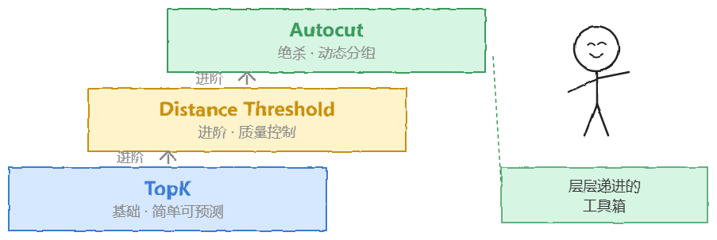
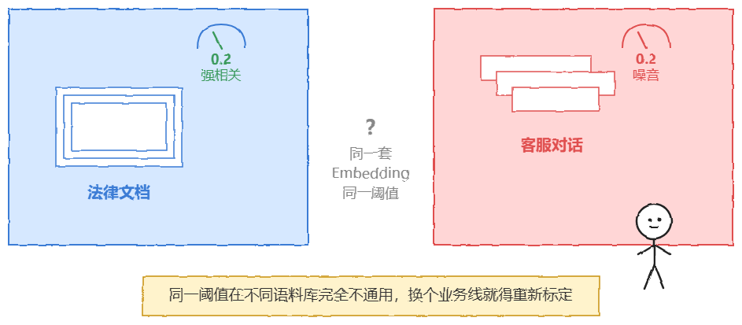
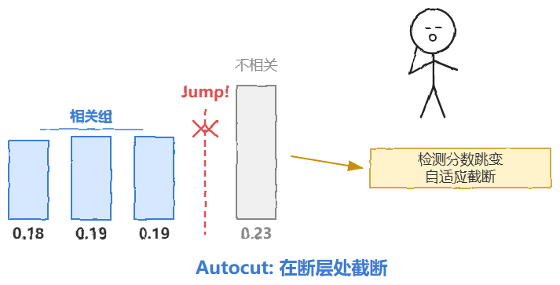
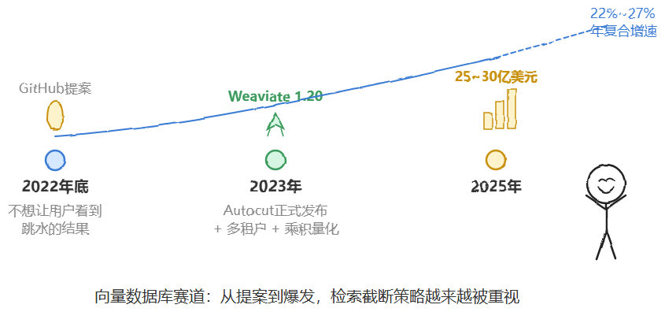
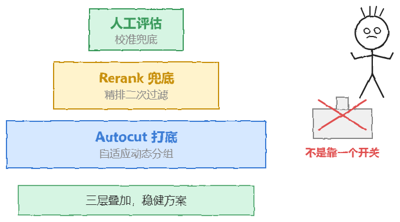

# RAG 检索截断策略：Top-K、Distance Threshold 与 Autocut

> 原文: [微信文章](https://mp.weixin.qq.com/s/M3UQZoZGOPUfDJpY8wWMmA)

淘天三面真题：对 RAG 检索的结果怎么截断？你说设个 TopK 取前 5 条，面试官追问「那第 100 条也很重要怎么办？」——这个问题本质上在考你对检索截断策略的系统理解，TopK 只是最基础的一层，真正的工程方案远不止于此。

检索截断不能搞「死板」的方式，得用「动态」的。基于 Weaviate 的设计理念，这里有三个层级的回答策略，可以直接展示你的技术深度。

> 三层策略不是谁取代谁的关系，而是层层递进的一个工具箱。具体用哪个取决于你的产品形态和数据分布，面试的时候最好主动点出来。

---

## 第一层：基础场景用 Top_K

只有在前端 UI 展示（如「相关推荐」这种场景），或者 Token 预算极度有限的时候，才使用硬性的 Limit。

**适用场景：** 必须填满 N 个坑位的时候。

**硬伤：** 不仅容易漏掉关键信息，还容易把毫不相关的第 K 条塞进去，然后误导模型。

几乎所有主流向量数据库都把 Top_K 当作最基础的 API 参数——Pinecone 的查询接口默认 `top_k`，Qdrant、Milvus 也是类似的写法。Pinecone 偏全托管，索引/扩容等运维都替你包了，查询延迟在个位数到十几毫秒之间。

这也就解释了为什么 Top_K 至今仍然是最常见的默认选项——简单、可预测、跨平台通用。只是治标不治本而已。

---

## 第二层：进阶控制用 Distance Threshold

为了保证质量，设置一个「距离阈值」——只有相似度达到一定标准的内容（如 distance < 0.2），才配进入 Context。

**痛点：** 阈值太难调！不同的 Embedding 模型分布不一样，0.2 在这个模型里是强相关，在那个模型里可能就是噪音。你需要极度了解你的数据空间才行。

更隐蔽的坑：即便同一个模型，不同语料库的距离分布也会发生漂移。法律文档和客服对话用同一套 Embedding，阈值可能完全不通用。换个业务线就得重新标定一次，维护成本并不比调 K 值低多少。

---

## 第三层：绝杀技 Autocut

这是最让人惊艳的一个思路。我不规定数量，也不死磕绝对分数，我看的是**「分数的跳变」**。

**核心原理：** 检索结果的相似度通常是分组的。比如 `[0.18, 0.19, 0.19]` 是一组非常相关的，紧接着下一个突然变成 `0.23`。Autocut 检测到这个「Jump」（断层），然后直接在这里截断。

- `Autocut: 1` = 只要第一组最相关的
- `Autocut: 2` = 允许稍远一点的第二组

**为什么说这对 RAG 是神技？**

因为它实现了**语义连贯性（Semantically Coherent）**——不需要预先知道数据分布，自适应地把「长得像」的一坨抓出来。既不会因为 TopK 引入噪音，也不会因为 Threshold 设错而漏掉数据。

### Autocut 的起源

这个思路不是凭空冒出来的。早在 2022 年底，Weaviate 团队就在 GitHub 上提出过提案，出发点很朴素——不想让用户看到那些相关性已经明显跳水的结果。最初提案想简单设个固定阈值，但很快发现单纯的阈值抓不住向量搜索的微妙之处。有些情况下前几条距离都在 0.9 左右缓慢下降，第四条却陡然跳到 0.2——这种大幅下降反而说明距离 0.75 的那条也可能是相关的。

于是团队转向借用了**曲率检测算法**去找那个「拐点」（knee point），这才是 Autocut 名字里「自动」二字的真正由来。功能最终在 2023 年随 Weaviate 1.20 版本正式发布。

### 使用细节与局限

- Autocut 和 Limit 并不互斥，反而经常组合使用——Limit 兜底防止极端情况下分组过大
- 如果检索结果本身分布就很平滑，压根没有明显的「断层」，Autocut 会退化到近似 Top_K 的效果
- **更适合**：「相关」和「不相关」泾渭分明的场景（事实性问答），而非主题模糊、结果连续渐变的开放式检索

### 生态对比

| 产品 | 截断策略 | 特点 |
|------|----------|------|
| **Weaviate** | Autocut（原生分组截断） | 独特标签，曲率检测找拐点 |
| **Qdrant** | Top_K + 阈值 | 强调索引/打分/过滤可组合原语，自己拼装检索逻辑 |
| **Pinecone** | Top_K + 阈值 | 全托管，查询延迟个位数到十几 ms |
| **Milvus** | Top_K + 阈值 | 无等价的原生分组截断 |

> 向量数据库赛道涨得很快，2025 年全球市场规模约 25-30 亿美元，年复合增速 22%-27%。检索截断策略这种「细节优化」，未来只会越来越被重视。

---

## 面试总结话术

> 「我在做 RAG 的时候，会优先使用类似 Autocut 的动态截断策略。我们不仅要追求 Retrieve 到数据，更要防止无关 Context 对 LLM 造成的那种'中毒'。让数据自然的边界来决定截断点，而不是人为拍脑袋定的数字。」

但最好再补一句更诚实的：**Autocut 不是银弹**，遇到分布平滑、断层不明显的检索场景，它照样会失灵。真正稳健的方案往往是 **Autocut 打底 + Rerank 兜底 + 业务侧人工评估校准**，三层叠加，而不是指望一个开关就能解决所有问题。

---

## 相关笔记

- [[02 RAG 工程面试体系]]
