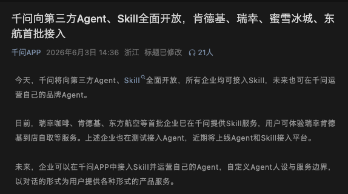
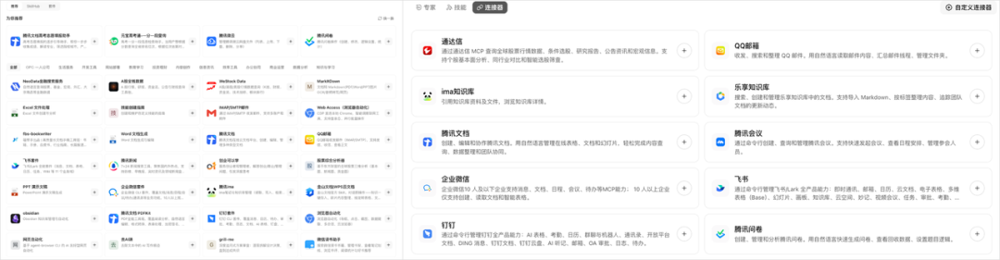

# 盘点 16 个把自己蒸馏成 Skills 的国民级 App

> 原文: [微信文章](https://mp.weixin.qq.com/s/08Z-Jk4nccaBAbh65aqtKA)

瑞幸咖啡上线 AI 开放平台（支持 MCP、CLI、Skill 三种接入方式），能够用 AI 点咖啡、查门店、搜商品。这波浪潮越来越明显：国民级产品正在把自己蒸馏成 Skill/MCP 对外开放。

以下是目前能找到的国产 Skill/MCP/CLI 完整盘点：

---

## 餐饮

### 1. 瑞幸咖啡 Skill

- 网址：open.lkcoffee.com
- 支持 Skill、MCP、CLI 三种方式
- 能力：搜门店 → 选商品 → 下单 → 扫码支付（到店自取，不支持外卖）

### 2. 麦当劳 MCP

- 网址：https://open.mcd.cn/mcp
- 能力：查活动日历、领券、点餐
- 支付仍需跳 app 完成

---

## 出行

### 3. 飞猪 Skill

- 网址：https://flyai.open.fliggy.com/
- 底层接 MCP，无需 API Key 即可试用
- 能力：机票、酒店、门票、用车咨询/规划/预定

### 4. 滴滴 Skill

- 网址：https://mcp.didichuxing.com/
- 2025.9 上线 MCP，2026.4 上线 Skill
- 能力：实时叫车、预约出行、订单查询、司机位置
- **亮点**：司机到达时可用 Hook 触发飞书电话通知

### 5. 高德地图 Skill

- 网址：https://lbs.amap.com/
- 2025.7 上线 MCP，2026.4 上线 Skill 市场
- 能力：位置服务、地图开发、Android/iOS Agent、RTOS 地图
- 支持酒店搜索并生成地图链接

### 6. 腾讯地图 Skill

- 网址：https://lbs.qq.com
- 能力：搜索、规划、天气查询、前端地图开发（3D/Tree.js/GLTF）
- 与高德功能重叠，但多了前端地图开发 Skill

### 7. 美团跑腿 Skill

- GitHub：github.com/meituan/MT-Paotui-For-Client
- 2026.5 发布
- 能力：地址簿匹配、订单预览确认、支付需跳 app

---

## 办公协作（主战场）

### 8. 飞书 Skill

- 网址：https://open.feishu.cn/
- 支持 Skill、CLI、MCP 三种形态
- CLI 于 2026.3 开源

### 9. 钉钉 Skill

- 网址：https://open.dingtalk.com/
- 支持 Skill、CLI、MCP
- 消息、待办、日程、审批流全覆盖

### 10. 企业微信 Skill

- GitHub：github.com/WecomTeam/wecom-cli
- 支持 CLI、Skill、MCP
- 消息收发、通讯录管理等

### 11. 腾讯文档 Skill

- 网址：https://docs.qq.com/open/document/
- 支持 Skill、MCP
- 在线文档创建/编辑、知识库管理、AI PPT 生成

---

## 金融支付

### 12. 支付宝 Skill

- 网址：https://open.alipay.com/
- 2025.4 推出国内首个支付 MCP
- 能力：手机/网页支付、订单查询、退款（面向开发者）
- 个人开发者无需企业资质也可使用

### 13. 微信支付 Skill

- GitHub：github.com/wechatpay-apiv3/wechatpay-skills
- 2025 年开放 MCP（仅限腾讯元器），2026.4 上线 Skill
- 能力：判断支付产品、生成示例代码、安全检查、商品券管理

---

## 生活娱乐

### 14. 微信读书 Skill

- 网址：weread.qq.com/r/weread-skills
- 2026.5 推出
- 能力：书架、阅读进度、阅读统计、笔记检索、书籍搜索、智能推荐

### 15. 网易云音乐 Skill

- GitHub：github.com/NetEase/skills
- 2026.3 推出 Skill 和 CLI
- 能力：搜索播放、歌单管理、偏好画像分析

### 16. 美图 Skill

- 网址：https://www.miraclevision.com/open-claw
- 支持 CLI 和 Skill
- 能力：图片编辑、文生图、文生视频、AI 写真、换脸、虚拟换装、背景替换

---

## 生态平台视角

千问在 1 月接入淘宝、支付宝、飞猪、高德等阿里生态；6 月开放第三方 Skill（肯德基、蜜雪冰城、东方航空首批接入）。豆包 6 月 22 日上线打车服务（曹操出行）。WorkBuddy 内置大量腾讯系 Skill（QQ 邮箱、腾讯文档、ima、问卷、微云）。

---

## 核心洞察

**付钱这件事，没人敢打通最后一公里。** 几乎所有涉及支付的环节——瑞幸扫码、麦当劳跳 app、美团跑腿打开 app——都让用户自己完成。技术上很简单，但信任上还没到那一步。

**现在很像 2017 年小程序刚出来的时候。** Skill 和 MCP 这种 Agent 基建正处于窗口期，先做的人在探路，大量品牌还在观望。但趋势不可逆。当你的 Agent 能点咖啡、叫出租车、查航班、发飞书、管文档、搜酒店——它就不再只是工具，而是数字世界里的另一个你。

---

## 相关笔记

- [[Loop Engineering-Prompt该退环境了]] — Prompt 工程退场，Loop 工程上位
- [[AI Agent Skill 实战解析]] — Skill 实战攻略
- [[Skill编排的6种依赖关系]] — Skill 之间6种依赖模式
- [[LLM Wiki + Hermes Agent + Obsidian 个人知识库方案]] — 知识库方法论
