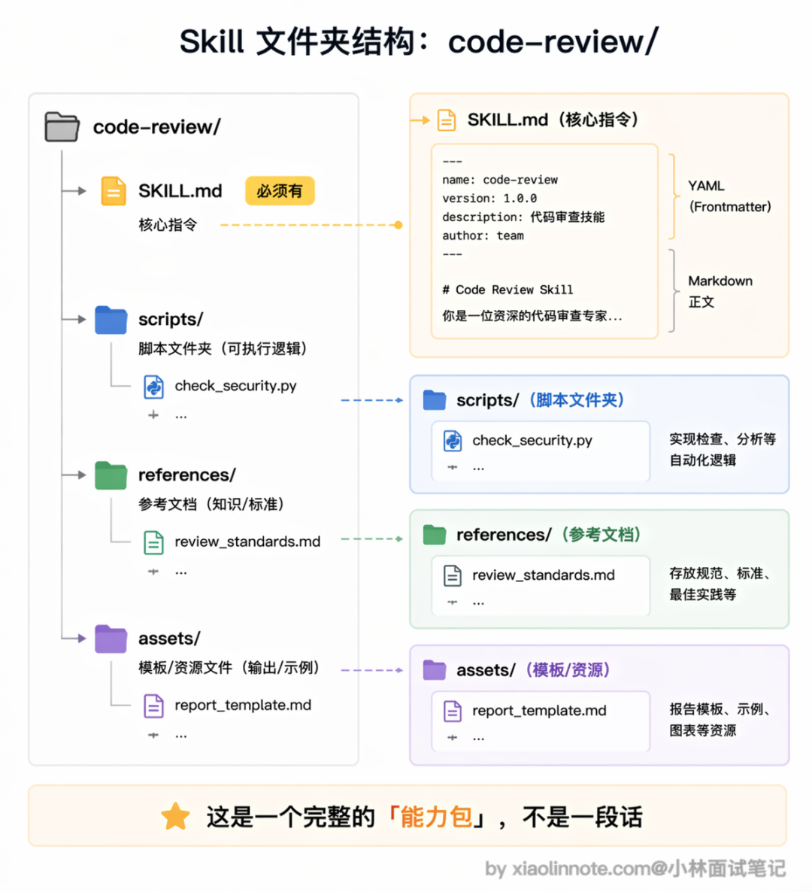
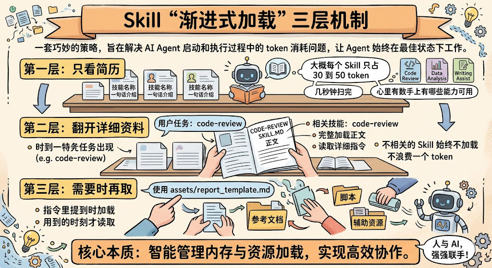

# Agent Skill 本质与设计

> 原文：[微信文章](https://mp.weixin.qq.com/s/Iji8g6yxS7wPeGweOyV5Aw) · 2026-05-22
> 原始资料：`^[raw/articles/wechat-article-*.html]`

---

## 一句话总结

Skill 不是「保存好的 prompt」，而是把指令、脚本、模板一体化打包成**可复用能力包**。核心在于三件事：Agent 自动发现它、按需加载它、在需要时调用里面的脚本和资源。最关键的设计是**渐进式加载**（Progressive Disclosure）。

---

## 为什么需要 Skill？

痛点：每次新对话都要手动贴一遍 prompt，团队里每个人贴的还不一样。

> 「代码审查」第一次贴还好，第二次、第三次就烦了。十个人做代码审查，你关注安全、我关注性能——审查标准完全没法统一。

把 prompt 写到共享文档让人复制 → 本质还是人工流程管理，不是技术方案。版本一多就乱。

Skill 的答案：把反复使用的指令、流程、模板打包成标准化模块，Agent **自己知道什么时候该用、怎么用**，不再依赖你手动复制粘贴。

---

## Skill 的结构

一个 Skill 就是一个文件夹，核心是 `SKILL.md`：

```
code-review/                  # Skill 文件夹
├── SKILL.md                  # 核心指令文件（必须有）
├── scripts/                  # 可执行脚本
│   └── check_security.py
├── references/               # 参考文档
│   └── review_standards.md
└── assets/                   # 模板、资源文件
    └── report_template.md
```



### SKILL.md 示例

```markdown
---
name: code-review
description: "对代码进行全面审查，检查 bug、安全漏洞和性能问题"
---

# 代码审查 Skill

## 指令

### 第一步：理解代码上下文
阅读提交的代码，理解功能和所属模块，确认修改范围。

### 第二步：逐项检查
1. 功能正确性：逻辑 bug、边界条件
2. 安全性：注入、XSS、权限绕过
3. 性能：N+1 查询、不必要的循环、内存泄漏
4. 可读性：命名清晰度、关键逻辑注释

### 第三步：输出报告
使用 assets/report_template.md 的模板格式输出结构化审查报告。
```

---

## 渐进式加载：Skill 最聪明的设计



假设 20 个 Skill，每个 2000 token，全加载吃掉 4 万 token——上下文窗口的五分之一，且大部分当前任务用不上。

**三层机制**：

| 层级 | 行为 | Token 占用 |
|------|------|-----------|
| **第一层**：看简历 | Agent 启动时只加载 name + description | ~30-50 token/Skill |
| **第二层**：翻详细资料 | 任务匹配到某个 Skill 后，才加载 SKILL.md 正文 | 按需 |
| **第三层**：用到才取 | 执行中需要时，才读取 assets/scripts/references | 按需 |

不相关的 Skill 始终不被加载，不浪费一个 token。

---

## Skill vs MCP 工具

## Skill vs MCP / Tool / Prompt / Slash Command

| 概念 | 本质 | 类比 |
|------|------|------|
| **Tool（MCP）** | 给 Agent 配的电脑、软件和数据库权限 | 能力 |
| **Skill** | 教 Agent 拿到工具后按什么流程做 | SOP 操作手册 |
| **Prompt** | 一句话指令，用完即弃 | 口头交代 |
| **Slash Command** | 手动触发的快捷指令 | 快捷键，需你主动调用 |

> **Skill 的关键区别**：Agent 可以**自动发现并调用** Skill——看到任务后自己判断「这个需要 code-review」，主动加载执行，不需要你告诉它。Slash Command 必须你手动输入触发。这个自动发现能力是 Skill 更进一层的地方。

MCP 和 Skill 是互补的：MCP 提供外部工具和数据访问，Skill 提供用这些工具完成任务的知识和流程。

---

## 好 Skill 的设计原则

1. **单一职责**：一个 Skill 只做一件事（如 code-review、write-tests）
2. **触发条件清晰**：name + description 足够让 Agent 判断何时适用
3. **三层分离**：核心指令（SKILL.md）+ 脚本（scripts/）+ 辅助（references/assets/）
4. **渐进式可用**：只读 description 就能判断是否匹配，正文才需要深入了解
5. **可独立执行**：不依赖其他 Skill 的内部状态，通过标准接口交互

---

## 从 Anthropic 到开放标准

- **2025 年 10 月**：Anthropic 推出 Agent Skills，覆盖 Claude Code、Claude API、claude.ai
- **2025 年 12 月**：规范作为**开放标准**发布，任何 Agent 平台都可按此格式实现 Skills

开放的原因：设计足够简单——一个文件夹 + 一份 Markdown 文件，不需要运行时、不需要新语言。你写一份 Skill，未来有机会在不同 Agent 平台之间复用，不被某个产品绑死。类比 USB-C 接口。

---

## 面试要点

- **不要说「Skill 就是 prompt」**——要说清楚结构（文件夹、SKILL.md、渐进式加载）
- **Skill 和 MCP 的关系**：MCP 提供外部能力，Skill 教 Agent 怎么用
- **渐进式加载是核心设计**：解决 20+ Skill 时的上下文浪费问题
- Anthropic 2025 年 10 月推出 Agent Skills，同年 12 月开源规范

---

## 相关笔记

- [[AI Agent Skill 实战解析]] — Skill 实战攻略（公众号/博客模式）
- [[Skill编排的6种依赖关系]] — Skill 之间 6 种依赖模式
- [[MCP 三层次架构深度解析]] — MCP 角色·能力·协议深度图解
- [[16个国民级App蒸馏成Skills盘点]] — Skills 生态产品一览
