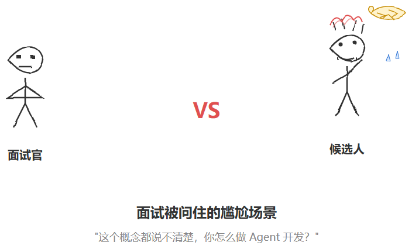
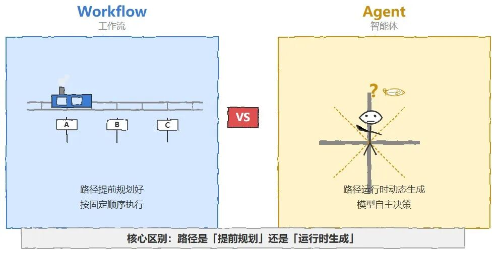
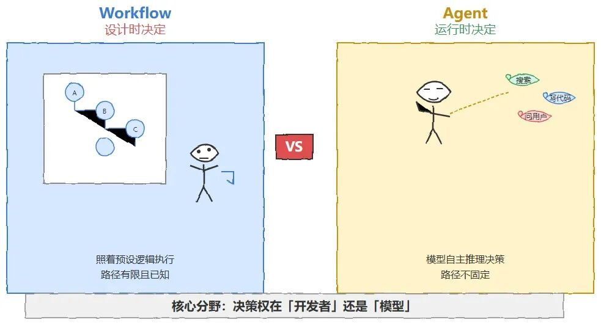
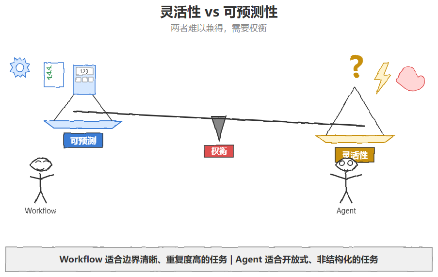
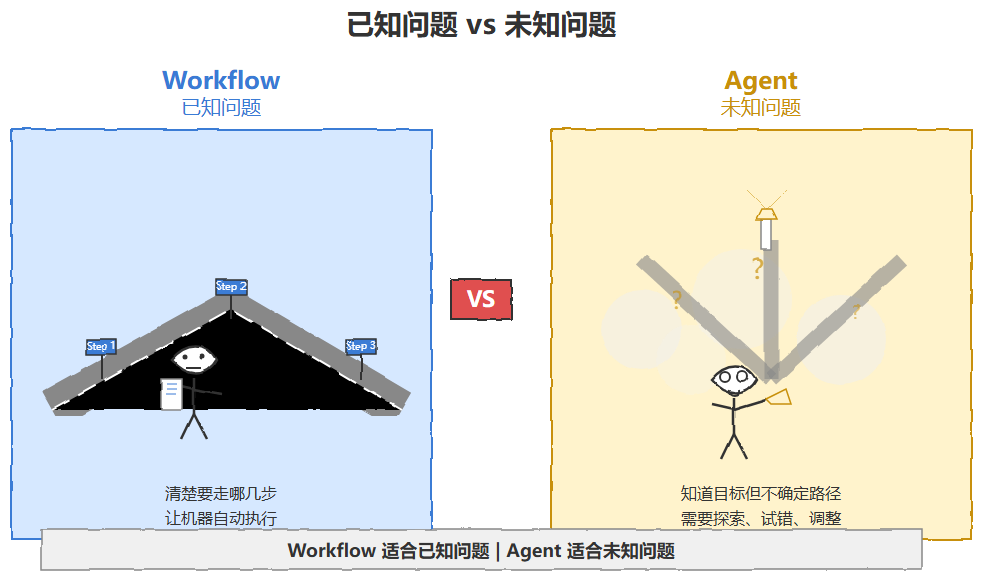
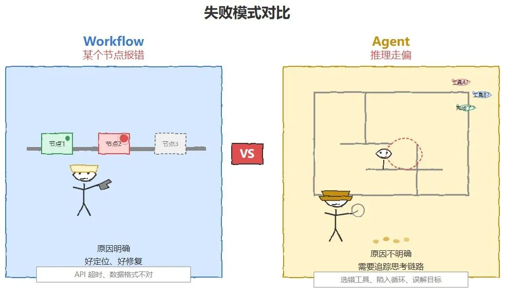

# Agent vs Workflow：五个维度彻底分清

> 原文：[微信文章](https://mp.weixin.qq.com/s/oys00aQAumcuySSq_bDO1g) · 2026-07-09 · 高德一面
> 原始资料：`^[raw/articles/wechat-workflow-vs-agent-2026.html]`

---

## 一句话总结

Workflow 路径提前规划好，Agent 路径运行时动态生成——核心区别是**决策权归属**。

---

## 概念定义

**Workflow（工作流）**：一系列预先定义好的步骤，按固定/半固定顺序执行。路径在运行前已确定，即使有条件分支、循环、并行，所有可能性都预先枚举。

**Agent（智能体）**：自主感知环境、做决策、采取行动达成目标的系统。LLM Agent = 给模型目标 + 工具 → 模型自己决定每一步做什么。



---

## 五个相同点

| # | 维度 | 说明 |
|---|------|------|
| 1 | **目标导向** | 都有明确输入、可衡量输出，围绕目标组织动作 |
| 2 | **调用外部工具** | 都需要与外部世界交互（API、数据库、微服务） |
| 3 | **LLM 作为执行单元** | Workflow 某节点可以是「调 LLM 摘要」，Agent 整体由 LLM 驱动 |
| 4 | **状态管理+错误处理** | 都需要维护进展、中间结果、重试/回退/超时 |
| 5 | **模块化和可复用** | Workflow 封装组件，Agent 封装标准化工具 |



---

## 五个不同点

### 1. 决策权归属（最核心）

| Workflow | Agent |
|----------|-------|
| 开发者在设计阶段定好 | 模型运行时实时决定 |
| 路径有限且已知 | 同一任务可能走不同路径 |

### 2. 灵活性与可预测性

| 维度 | Workflow | Agent |
|------|----------|-------|
| 可预测性 | 高，行为透明，好测试 | 低，同样输入可能不同结果 |
| 审计/成本控制 | 容易 | 困难 |
| 适合场景 | 边界清晰、重复度高（财务对账、批量文档） | 开放式、非结构化（市场调研） |



### 3. 对不确定性的适应

| Workflow | Agent |
|----------|-------|
| 适合「已知问题」 | 适合「未知问题」 |
| 路径明确，自动执行 | 需要探索、试错、根据反馈调整 |



### 4. 开发维护成本

| 维度 | Workflow | Agent |
|------|----------|-------|
| 主要成本 | 前期设计（穷举分支） | Prompt工程 + 工具设计 + 评估体系 |
| 运行时成本 | 低 | 高（多轮推理、更多 token） |
| 需求变更 | 需改流程定义 | 模型举一反三，不需改代码 |

### 5. 失败模式

| Workflow | Agent |
|----------|-------|
| 某个节点报错，原因明确 | 推理走偏（选错工具、重复循环、误判完成） |
| 传统日志排查 | 需追踪思考链路的可观测性工具 |

---

## 实践：不是二选一

```
Workflow 骨骼 + Agent 肌肉
```

**推荐架构**：整体流程用 Workflow 固定，不确定环节嵌入 Agent。复杂 Agent 内部也常用子工作流。



**选择原则**：
- 任务越边界清晰、重复度越高 → Workflow
- 任务越开放、越依赖情境判断 → Agent



---

## 面试要点

- **不要只说定义**，要讲清楚五个维度的对比
- **核心分水岭**：决策权归属——开发者预先定（Workflow） vs 模型实时定（Agent）
- **实践表态**：成熟的系统是「工作流骨架 + 局部智能体」的混合架构
- 能举一个具体场景说明选择逻辑（如「审核流程 Workflow + 内容分析 Agent」）

---

## 相关笔记

- [[Agent 路由系统设计指南]] — Orchestrator（协调层）就是 Workflow + Agent 的组合实践
- [[Agent 架构面试题-Agent核心篇]] — ReAct、Plan-Execute、Reflection 范式
- [[Skill编排的6种依赖关系]] — Workflow 中的依赖模式
- [[Function Calling 与工具调用面试题合集]] — Agent vs Workflow 对比表（阿里面试题）
