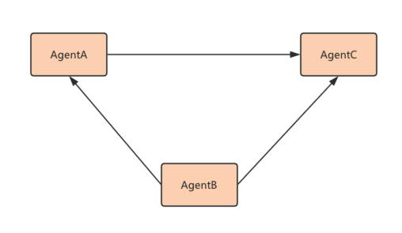
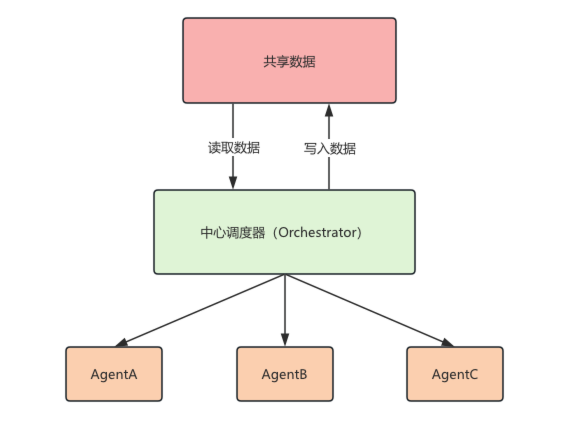
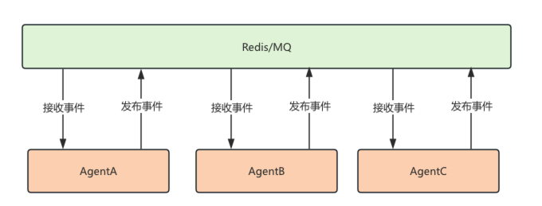
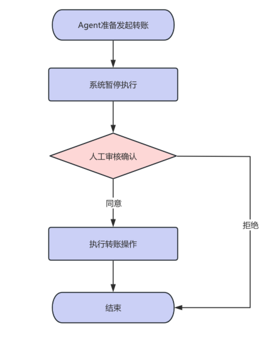

# Agent 面试真题 02：10 个 Agent 架构问题

> 原文：[微信文章](https://mp.weixin.qq.com/s/CMXYo-EvF_9FqmldKQ9tVw)

---

## 一句话总结

覆盖面试中最高频的 10 个 Agent 架构问题：多 Agent 通信、Orchestrator vs Peer、上下文共享、循环调用防护、角色分工、状态流转、Human-in-the-Loop、安全对齐等，附带 LangGraph 代码示例。

---

## 1. 多 Agent 之间如何通信？

三种主要方式：

### 消息传递（Message Passing）
Agent 之间直接发送消息，灵活但 token 消耗大、调试困难、上下文易失控。



### 中心调度器（Orchestrator）+ 共享状态（Shared State）
最常见的生产方案。Agent 不直接通信，所有消息经中心调度器，通过共享状态对象交互（如 LangGraph 的 State）。



### 事件总线（Event Bus）
复杂系统中使用，Agent A 发布事件，Agent B/C 订阅事件。



---

## 2. 为什么选择 Orchestrator + Shared State？

生产环境首选。优势：

- Agent 不直接通信，共享状态交换数据
- Orchestrator 统一调度和状态流转
- 避免 Agent 间复杂依赖
- 提升可观测性、可恢复性、可维护性
- Shared State 常存于 Redis/数据库，LangGraph StateGraph 同理

---

## 3. 中心化 Orchestrator vs 去中心化 Peer？

| 维度 | 中心化 Orchestrator | 去中心化 Peer |
|------|---------------------|---------------|
| 控制权 | 中央调度器 | 各 Agent |
| 通信方式 | 通过调度器 | 直接通信 |
| 调试难度 | 低 | 高 |
| 可观测性 | 高 | 低 |
| Token 成本 | 较低 | 较高 |
| 扩展性 | 一般 | 强 |
| 灵活性 | 一般 | 强 |
| 死循环风险 | 低 | 高 |
| 生产环境 | 常见 | 较少 |

> 大部分业务场景用中心化 Orchestrator 就够了，简单可控，好排查。

---

## 4. 多 Agent 如何共享上下文？

四种方案：

### 共享状态对象（Shared State）
所有 Agent 共享一个 State，可读写。

```python
class AgentState(TypedDict):
    task: str
    research_result: str
    analysis: str
    report: str

def research_agent(state: AgentState):
    result = search(state["task"])
    return {"research_result": result}

def writer_agent(state: AgentState):
    report = generate_report(state["research_result"], state["analysis"])
    return {"report": report}
```

### 共享记忆（Memory）
Memory 作为共享上下文，所有 Agent 可见。

### 共享 Workspace
多 Agent 共同操作文件系统，通过共享文件传递上下文。AI 编程 Agent 中使用非常多。

### 消息传递
Agent 之间发送消息作为上下文。

---

## 5. 多 Agent 如何避免循环调用？

循环调用（A→B→A）是最常见问题。三种防护：

**设置步数上限：**
```python
app = graph.compile(checkpointer=checkpointer)
result = app.invoke(input, config={"recursion_limit": 25})
```

**单向状态流**：限制调用关系，A→B 不能逆向：
```python
def router(state):
    last_agent = state["last_agent"]
    if last_agent == "agent_a":
        return "agent_b"
    elif last_agent == "agent_b":
        return "end"  # 不能回到 A
```

**Token/时间预算**：
```python
if state["total_tokens"] > MAX_TOKENS:
    return "force_end"
```

---

## 6. 如何设计 Agent 角色分工？

四个核心原则：

1. **单一职责**：每个 Agent 只做一件事。Planner（拆解）→ Coder（编码）→ Reviewer（审查），prompt 简单，输出稳定。

2. **按能力边界拆分**：Research Agent（搜索）≠ Writer Agent（写作）≠ Reviewer Agent（审核）。

3. **高内聚低耦合**：Researcher 不关心文章怎么写，Writer 不关心资料来源。易于替换扩展。

4. **按流程拆分**：
   ```
   简历解析 Agent → 岗位匹配 Agent → 面试评估 Agent → Offer 生成 Agent
   ```

---

## 7. 如何从业务需求推导 Agent 架构？

**三步法：**

1. **需求拆解** → 识别需要推理决策 vs 传统代码的环节
2. **判断单/多 Agent**：简单固定 → 单 Agent；多领域多职责 → 多 Agent
3. **设计协作**：生产环境用 Orchestrator + Shared State + 重试/超时/人工兜底

> 规则明确、逻辑固定的任务，直接用代码实现，不强行用 Agent。

---

## 8. 如何设计 Agent 状态流转？

本质是状态机设计。典型状态：

```
PLAN（规划）→ EXECUTE（执行）→ REVIEW（检查）→ DONE（完成）
```

**关键考虑：**
- **状态切换条件**：什么条件下进入下一状态
- **异常处理**：重试、降级、转人工
- **终止条件**：最大重试次数、Token 预算、超时

LangGraph 通过 State + Edge + Conditional Edge 实现可编排状态机。

---

## 9. 如何设计 Human-in-the-Loop 流程？

> 原则：「低风险自动执行，高风险人工确认」

**适用场景**：退款、转账、删除数据、发布上线、合同审批。

**转账流程示例**：
```
确认金额 → 人工审核 → 批准/拒绝/修改 → 继续执行
```

**LangGraph 实现**：
- `interrupt()` 暂停
- `Command(resume=...)` 恢复

Agent 保存当前状态，审批完成后继续执行。

---

## 10. 如何确保 Agent 安全、可控、对齐？

从六个层面设计：

### 能力边界
明确 Agent 能做什么、不能做什么。提示词仅作软约束，不能作为唯一安全机制。

### 工具权限控制
- 不同 Agent 分配不同工具权限
- 高风险工具白名单限制
- 工具参数校验
- 敏感操作增加审批

```python
def refund_order(order_id: str, amount: float):
    if amount > 1000:
        raise PermissionError("大额退款需要人工审核")
    return do_refund(order_id, amount)
```

### Human-in-the-Loop
高风险操作必须人工确认。



### 状态机约束
只有满足条件才能进入下一状态；错误时进入重试/修正/人工处理。

### 输出校验
- JSON Schema 校验
- 规则引擎
- 单元测试/静态检查
- Reviewer Agent 审核

### 监控、审计、可回滚
记录：用户输入、Agent 决策、工具调用、状态流转、人工审批、错误重试。

---

## 相关笔记

- [[AI Agent 50道高频面试题答案合集]] — 50 道高频面试题完整答案
- [[AI Agent 面试题与答案]] — 补充面试题集合
- [[腾讯AI Agent后端开发一面]] — 腾讯 Agent 一面面经实录
- [[大模型算法岗面经-Agent项目拷打实录]] — Agent 项目面试经验
