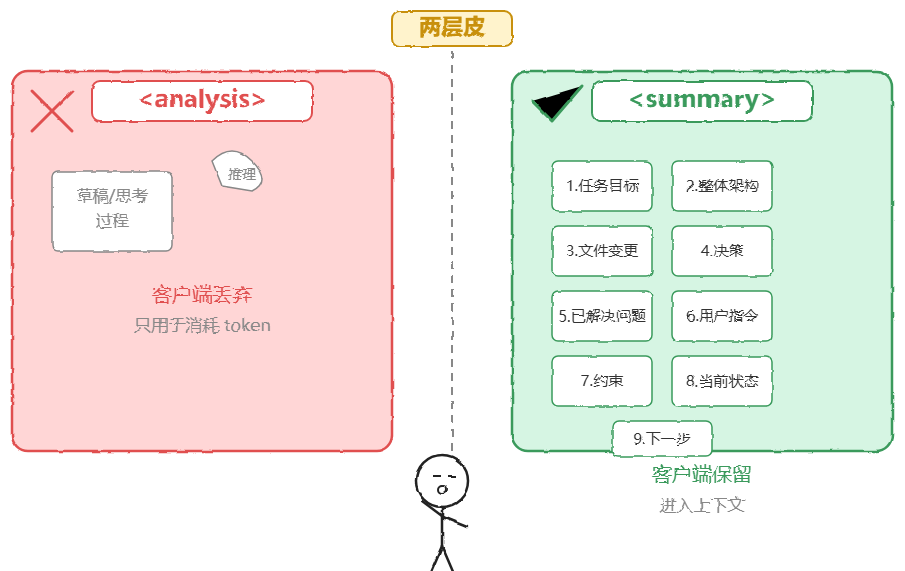

# Claude Code /compact 深度解析

> 原文：[微信文章](https://mp.weixin.qq.com/s/_d7gaT8DJmys_grHe1suhw) · 2026-07-04
> 原始资料：`^[raw/articles/wechat-claude-code-compact-2026.html]`

---

## 一句话总结

`/compact` 不是简单的「自动总结」，而是**9 章结构化模板 + 两层皮设计 + 客户端补偿**的工程补丁——光靠摘要无法恢复可执行状态。

---

## 一、/compact 到底做了什么

激活 `/compact` 后的完整流程：

1. 原始对话（~99 条消息、~10 万 token）最后拼接一条**伪装的 CRITICAL user 消息**
2. 强制指令级别，要求模型按固定模板输出结构化摘要
3. 模型按 **9 章模板** 压缩对话历史：

| 章节 | 内容 |
|------|------|
| 1. 任务目标 | 本次会话要完成什么 |
| 2. 整体架构 | 项目结构、技术栈 |
| 3. 文件变更 | 修改了哪些文件 |
| 4. 决策 | 做的关键决策及理由 |
| 5. 已解决的问题 | 已修复的 bug |
| 6. 全部用户指令 | **原封不动保留** |
| 7. 约束 | 环境限制、权限边界 |
| 8. 当前状态 | 做到哪了 |
| 9. 下一步 | 每步附加 **direct quote 原文摘录** |

> 本质：让模型按固定模板把长对话压缩成结构化摘要，模板写死防止自由发挥。

---

## 二、两层皮设计

模型输出包含 `<analysis>` + `
`，各司其职：

| 层 | 内容 | 去向 |
|----|------|------|
| `<analysis>` | 模型内部推理/草稿（Chain of Thought） | **客户端丢弃** |
| `
` | 9 章结构化摘要 | 进入上下文 |

**四重防御**：

1. **禁止执行工具**：压缩过程中禁调 Read/Bash/Edit，防止偷偷改文件
2. **强制 CoT**：先推理再摘要，确保准确性
3. **第 6 章用户指令原文保留**：防止转述丢细节
4. **第 9 章每步加 direct quote**：确保压缩后可衔接

---

## 三、压缩效果

| 维度 | 压缩前 | 压缩后 |
|------|--------|--------|
| 消息数 | 99 条 | 4 条 |
| Token | ~10 万 | ~1 万 |
| 压缩率 | — | **90%** |

但高压缩率本身就抹掉了过程细节——留下的只有结构化结论。

---

## 四、客户端补偿：4 条消息之外还附了什么

`
` 只是压缩后的第一步。模型能否「恢复」到可干活状态，靠的是摘要之外的一系列补偿：

1. **5 个文件自动附录**：主动重读对话中提到的文件，确保内容是新的（而非摘要里可能已过时的片段）
2. **planAttachment**：当前任务的规划附件
3. **skillAttachment**：技能/指令附件模板
4. **hook context**：系统注入的辅助信息
5. **紧接着一条 assistant 回复**：确保对话结尾不缺失

---

## 五、总结：/compact 是大补丁，不是优雅方案

| 局限 | 补偿 |
|------|------|
| 摘要丢细节 | 文件重读 |
| 缺可执行计划 | planAttachment |
| 连续性断裂 | 结尾衔接 + direct quote |
| 状态丢失 | N 种额外上下文注入 |

> `/compact` 更像工程补丁而非优雅机制。上下文漂移、状态丢失、连续性断裂这些坑，需要大量补偿来维持一致性。

---

## 相关笔记

- [[Claude Code 多 Agent 实现机制]] — Subagent Fork / Coordinator 路由
- [[Agent 主循环终止条件深度解析]] — 上下文污染与循环防护
- [[Loop Engineering-Prompt该退环境了]] — 从 Prompt 到 Loop 的范式转移
