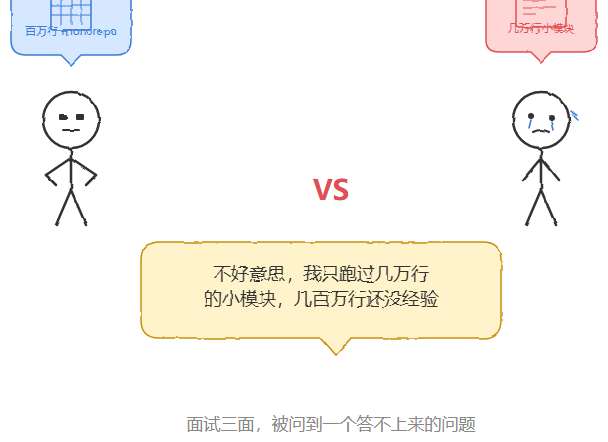
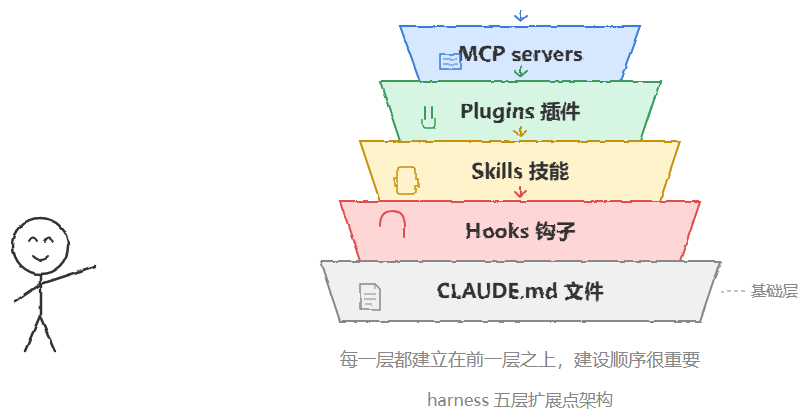

# Claude Code 在百万行代码库中的最佳实践

> 原文：[微信文章](https://mp.weixin.qq.com/s/e_GzFEM7ws-C62MOei6fTA) · 2026-07-17 · 三面面试题
> 原始资料：`^[raw/articles/wechat-claude-code-large-codebase-2026.html]`
> 参考：Anthropic 官方博客 — How Claude Code works in large codebases

---

## 一句话总结

Claude Code 不走 RAG 的 embedding 索引路线——它像真正的工程师一样直接在文件系统里游走，grep 精确定位，顺着代码引用一路跟下去。但在百万行级别，决定体验上限的不是模型，是团队有没有搭建好 CLAUDE.md → Hooks → Skills → Plugins → MCP 这套五层 harness。

---

## 一、为什么 Claude Code 不怕「代码库太大」

| 方案 | 做法 | 问题 |
|------|------|------|
| **RAG（多数 AI 工具）** | 整个代码库做 embedding → 索引 → 检索片段 | 索引跟不上提交速度，检索结果可能是几周前状态 |
| **Claude Code** | 直接在文件系统游走，grep + 引用追踪 | 永远面对活的、最新的代码 |

> 权衡：导航能力取决于一开始有没有「足够的上下文知道该去哪找」。十亿行代码里找模糊模式 → 上下文窗口先耗尽。

---

## 二、决定 Claude Code 表现的，不只是模型

五层 harness（脚手架）体系，按建设顺序层层依赖：

| 层 | 作用 | 关键原则 |
|----|------|---------|
| **CLAUDE.md** | 每次会话自动加载的上下文 | 根目录放全局，子目录放局部约定。**每次加载，内容必须精炼** |
| **Hooks** | 生命周期钩子 | 不只是「防错」——stop hook 在会话结束时反思，自动提出 CLAUDE.md 更新建议 |
| **Skills** | 渐进式披露，按需加载专业知识 | 安全审查 Skill 只在安全评估时加载；可绑定到特定路径 |
| **Plugins** | 把 skills、hooks、MCP 打包成可安装整体 | 解决「好实践留在少数人手里传不出去」——新人装上插件第一天就拥有老员工的能力 |
| **MCP Servers** | 连接内部工具、数据源和 API | 扩展 Claude 的外部能力边界 |

此外还有两个关键能力：

- **LSP 集成**：像 IDE 一样精确导航到符号定义、查找所有引用，而不是靠字符串模式匹配
- **Subagents**：把「探索代码库」和「实际改代码」分开——先用只读子代理摸清子系统，写文件，再让主 agent 带着完整信息动手改

---

## 三、三个反复出现的配置模式

### 模式一：让代码库在规模化下依然可导航

- CLAUDE.md 精简分层（根目录全局 + 子目录局部）
- 不在仓库根目录启动，在具体子目录启动（Claude 自动向上遍历加载沿途 CLAUDE.md）
- 按子目录限定 test/lint 命令范围，避免改一个服务跑全量测试超时
- 用 `.ignore` 排除生成文件和第三方代码
- 目录结构不清晰时，在根目录写「代码库地图」列出每个顶层文件夹的用途

### 模式二：随着模型能力进化，主动维护 CLAUDE.md

> 针对旧模型局限性写的规则，换了新模型可能反而变成束缚。

如「每次重构都必须拆成单文件改动」——老模型需要，但新模型完全能做跨文件协调修改。

**建议**：每 3-6 个月做一次配置复盘，或模型大版本更新后专门检查。

### 模式三：明确谁来负责 Claude Code 的管理和推广

- 先投入小团队（甚至一个人）把工具链搭好 → 再大规模开放
- 新角色「**Agent Manager**」：介于 PM 和工程师之间，专门维护整套 Claude Code 生态
- 没有专门团队 → 至少有一个 **DRI**（唯一责任人），对配置、权限、插件市场、CLAUDE.md 规范拥有决策权和维护责任

---

## 四、面试回答框架

> 单个模块几万行和整个仓库几百万行，考验的不是模型能不能理解代码，而是：
> 1. CLAUDE.md 有没有分层写好（根目录全局 + 子目录局部）
> 2. 有没有用 LSP 做符号级导航
> 3. 测试命令有没有按子目录拆开
> 4. 团队里有没有人专门负责维护这套配置
> 5. 有没有随着模型升级定期复盘配置（避免旧规则束缚新能力）

---

## 相关笔记

- [[Claude Code 多 Agent 实现机制]] — Subagent Fork / Coordinator 路由
- [[Claude Code 缓存优化四大杀手]] — K/V Cache + 前缀匹配
- [[Claude Code compact 上下文压缩深度解析]] — /compact 两层皮设计
- [[Agent Skill 本质与设计面试题解析]] — Skill 渐进式加载
- [[Skill 版本管理完全指南]] — changelog → 语义化 → Git
