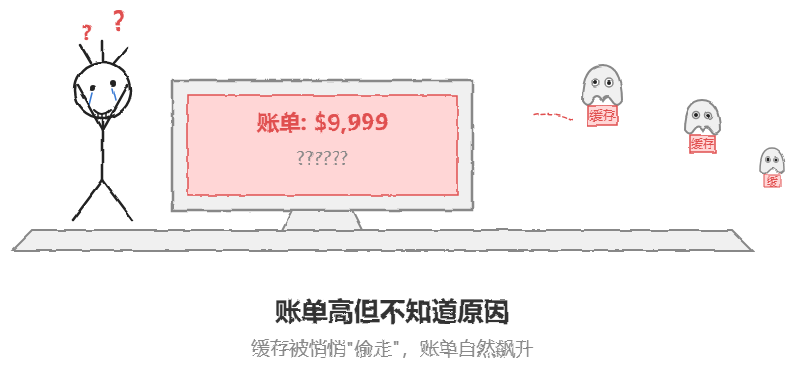
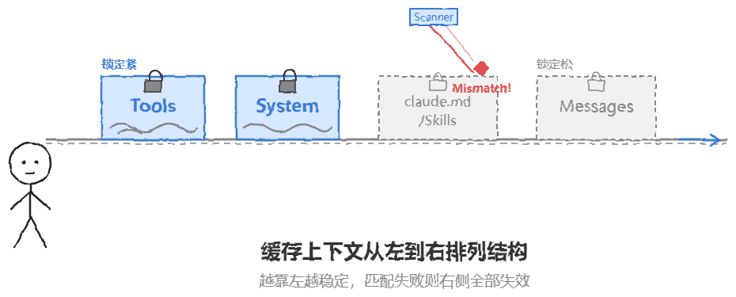
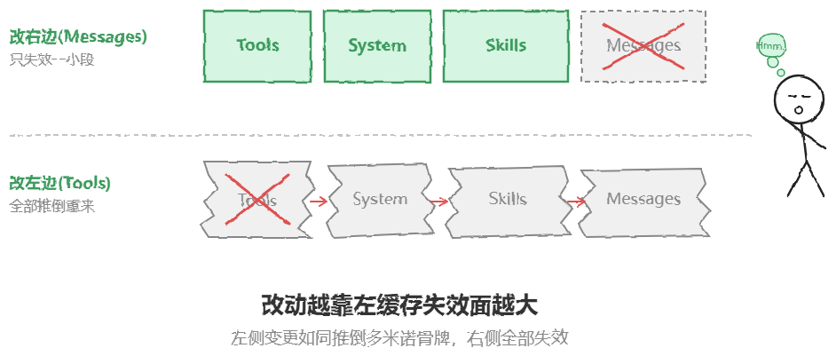
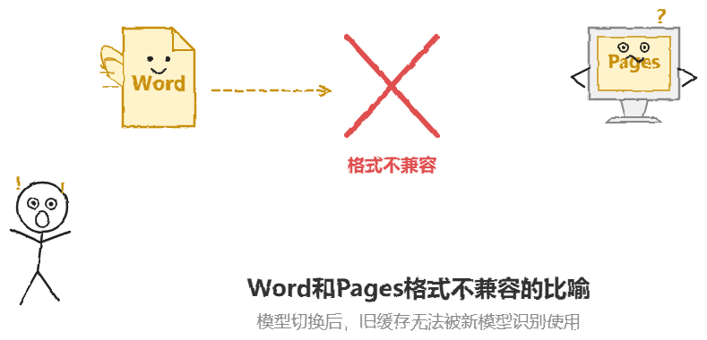
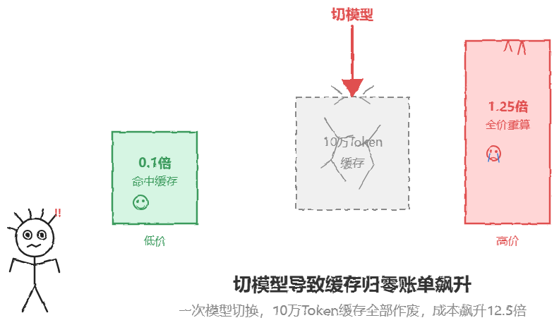
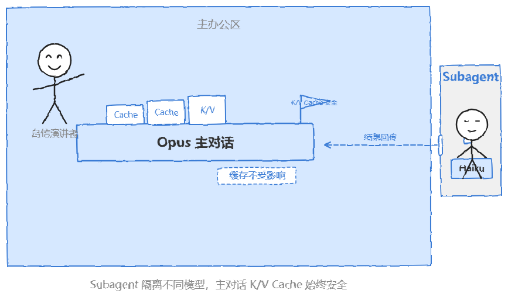

# Claude Code 缓存优化：四大杀手与三条核心原则

> 原文：[微信文章](https://mp.weixin.qq.com/s/j42pxCeAyIw3Lbc2o5UgwQ) · 2026-06-30 · 蚂蚁二面
> 原始资料：`^[raw/articles/wechat-claude-cache-2026.html]`

---

## 一句话总结

缓存存的不是文本，是 K/V Cache——Transformer Attention 层的 Key 和 Value 张量。缓存命中是**线性前缀匹配**，左边一变、右边全废。四个操作按杀伤力排序：切模型 > 加 MCP > 改 claude.md/Skills > 中断超过 5 分钟。

---

## 缓存的本质：存的不是文本

很多人的直觉误区：缓存存的是对话文本，一样就复用。

**实际**：缓存存的是 Transformer 每一层 Attention 计算出的 **K/V Cache**（Key 和 Value 张量）。缓存命中 = K/V Cache 直接复用，跳过重算。

> 面试官问「怎么省缓存」，表面考省钱，实际考对 Transformer 注意力机制在工程层面的理解深度。「少切模型」是 60 分，说出 K/V Cache 和前缀匹配本质才是 90 分。



---

## 上下文排列：从左到右线性前缀匹配

```
[Tools 工具定义] → [System 系统提示词] → [claude.md / Skills] → [Messages 对话历史]
```



**规则**：从左到右逐段比对 → 匹配上的复用 K/V Cache → 遇到断点，从断点往右全部重新计算。



> 位置越靠左的改动，杀伤范围越大。

---

## 四大缓存杀手

### 第一名：中途切模型 ⚠️ 全废



Opus 和 Sonnet 架构、权重完全不同 → K/V Cache 天然不兼容 → 全部作废。



**解法**：Subagent 隔离不同模型，各自维护各自的缓存，主 Session 始终跑同一模型。



### 第二名：中途装新 MCP

MCP 在 Tools 数组最左边 → 一变就带动 System 和 Messages 全部失效。真正的破坏发生在 `resume` 或 `reload plugin` 时。

**解法**：任务开始前一次性装好所有 MCP，像手术前准备器械。

### 第三名：改 claude.md 或装新 Skills

同样只在启动时读取，中途修改无效。风险在 `resume` 时重新拼装 Messages → 缓存断裂。

**解法**：任务开始前配齐 claude.md 和 Skills。

### 第四名：中断超过 5 分钟

K/V Cache 有 TTL（默认 5 分钟）。超时后缓存失效，下次请求从零开始。

**解法**：订阅用户设置 `CLAUDE_CODE_CACHE_TTL=3600000`（1 小时），API Key 用户的 TTL 由服务端控制。

---

## 四条杀手的共性：线性前缀匹配的本质

四大杀手的杀伤力排序不是按「谁最常犯」排，而是按**改动位置离左边多近**排：

```
切模型（最左：全废）> 加MCP（Tools区）> 改claude.md/Skills（Messages区）> 中断超时（TTL过期）
```

共同本质：它们改变的不是文本，而是 K/V Cache 的**计算前提**。
- 切模型 → 权重变了，K/V 完全不兼容
- 加 MCP → Tools 数组变了 → System+Messages 全部重算
- 改 claude.md → Messages 数组变了 → 后续 Messages 全重算
- 中断超过 TTL → K/V Cache 被服务端回收

---

## 架构师视角的工程取舍

### 为什么缓存用前缀匹配而非语义匹配？

前缀匹配实现简单，命中判断 O(1)，无需额外推理。语义匹配需要额外模型推理，本身就是一笔缓存开销。这是一个**工程上的刻意权衡**：放弃复杂匹配的高命中率，换取零延迟的判断成本。

### 为什么 MCP/Skills 只在启动时读一次？

安全设计。如果运行时动态加载 MCP/Skills，每轮对话都要检查配置是否变更，这本身就需要一次「有无变化」的判断——而判断结果如果变了，缓存也已经废了。不如干脆只在启动时加载，让开发者自己管理重载时机。

### TTL 为什么是 5 分钟而不是更长？

服务端成本。K/V Cache 占 GPU 显存。TTL 越长 → 闲置连接占的显存越多 → 能同时服务的用户越少。5 分钟是「用户体验」和「服务端成本」的平衡点。订阅用户的 TTL 更长是因为他们有更高的资源配额。

---

## TTL 配置细节

| 配置 | 用户类型 |
|------|---------|
| `CLAUDE_CODE_CACHE_TTL=3600000` | 订阅用户（1小时，毫秒） |
| 服务端默认 5 分钟 | API Key 用户（不可改） |
| Session 内连续对话不重置 TTL | 只有新请求才检查超时 |

---

## 面试高分话术

> 「Claude Code 的缓存本质是 K/V Cache 的线性前缀匹配，不是文本缓存的简单复用。上下文从左到右排列：Tools → System → claude.md/Skills → Messages。任何左边元素的变更都会导致右边全部重算——位置越左杀伤越大。核心策略三条：前置全部配置（避免 resume 触发重组）、Subagent 隔离不同模型（各自维护各自缓存）、延长 TTL 到 1 小时（减少超时重建）。面试官问"怎么省缓存"，表面考省钱，实际考对 Transformer 注意力机制在工程层面的理解深度。」

---

## 相关笔记

- [[Claude Code compact 上下文压缩深度解析]] — /compact 两层皮设计
- [[Claude Code 多 Agent 实现机制]] — Subagent / Coordinator 路由
- [[AI Agent 四大框架深度对比]] — 含 Claude Code SDK 与其他框架对比
