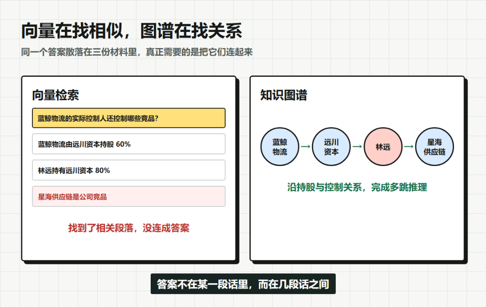
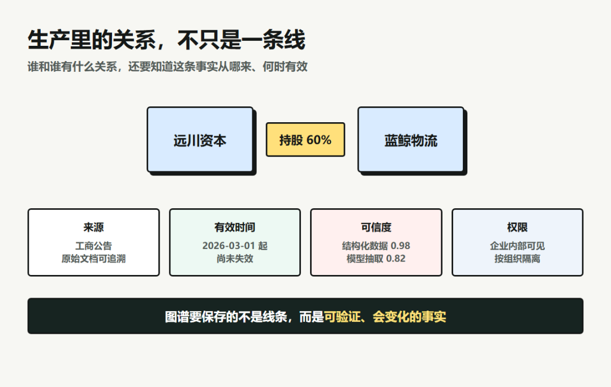
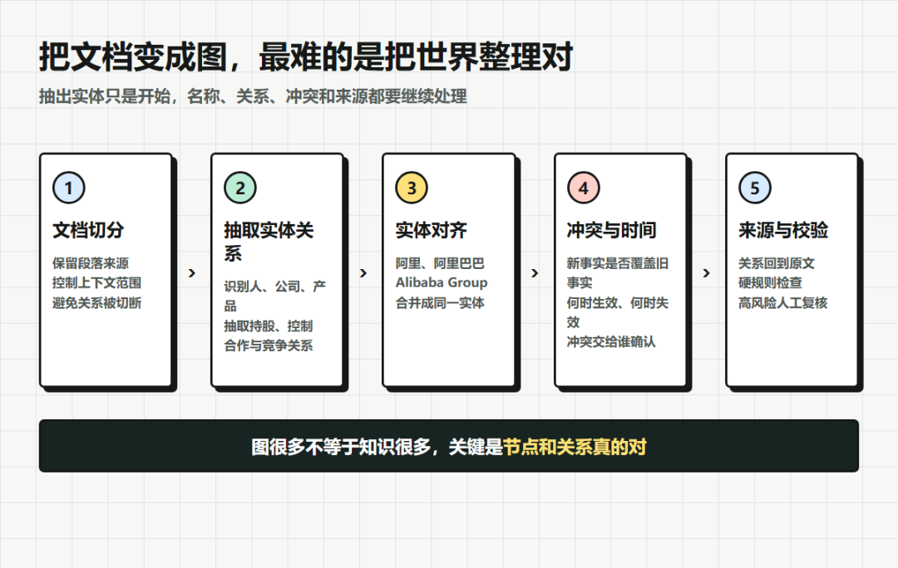
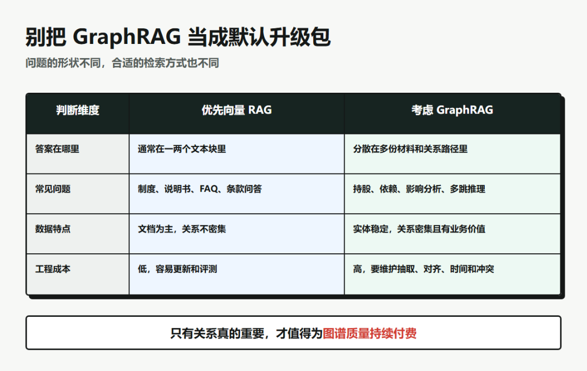

# 向量库 vs 知识图谱：GraphRAG 深度解析

> 原文：[微信文章](https://mp.weixin.qq.com/s/z35vCEnPcKxbALglNmulpw) · 2026-07-15
> 原始资料：`^[raw/articles/wechat-graphrag-knowledge-graph-2026.html]`

---

## 一句话总结

向量库擅长找「哪段话和问题最像」，知识图谱擅长找「这些东西之间到底是什么关系」——一个负责找到入口，一个负责沿关系往下走。

---

## 一、向量检索为什么漏掉关系

**供应链尽调案例**：蓝鲸物流背后的实际控制人是谁？还控制了哪些竞品？

答案散落在三份材料中——没有一段话同时包含所有关键词。向量检索找到一个块，但不知道三段材料必须按 `蓝鲸物流→远川资本→林远→星海供应链→竞品` 连起来。

> 向量搜索 = 在一屋子资料中快速找出几页看起来最相关的纸。
> 知识图谱 = 人物关系图，告诉你谁持股谁、谁控制谁、谁和谁竞争。

这才是 **多跳问题**（multi-hop）——答案不在某个块里，而在几条关系组成的路径里。



---

## 二、知识图谱存什么

最小结构 = 三元组「实体、关系、实体」。生产级还需要：

| 字段 | 说明 |
|------|------|
| **来源** | 哪份公告/文档 |
| **时间/有效期** | 何时生效、是否已失效 |
| **可信度** | 模型抽取 or 业务系统直接提供 |
| **作用范围** | 适用业务场景 |

> 关系会变。图不能只增加新边、不让旧事实失效——否则 Agent 会同时查到两个实际控制人，然后自信地挑一个回答。

**时间知识图谱**（Graphiti 等方案）：给事实记录生效和失效时间。不只是用户偏好，还包括「这条偏好从什么时候开始，后来是否被覆盖」。



---

## 三、最难的不是画图，是把同一个东西认出来

| 挑战 | 说明 |
|------|------|
| **名称不一致** | 阿里巴巴/阿里/Alibaba Group → 被当成三个节点 |
| **同名** | 两个张伟，一个客户经理一个法务 → 被合并成一个 |
| **实体对齐** | 名称、简称、社会信用代码、邮箱、上下文都可能用来判断是否同一实体 |
| **Schema/Ontology** | 定义允许哪些实体、关系、属性——「订单持股公司」这种应该被拦截 |

> 知识图谱不是把模型抽出来的三元组原封不动塞进数据库，而是一套持续把名称、关系和事实整理成同一个世界的过程。



---

## 四、GraphRAG 查询流程

```
用户自然语言提问
  → 关键词/向量检索 → 候选实体 + 原始文本（实体链接）
    → 从候选节点沿关系类型向外扩展（限定跳数）
      → 按关系类型、时间、权限、路径长度过滤
        → 重排子图和文本证据
          → 关键路径 + 原文 → 交给模型生成答案
```

> 图谱不取代向量检索——向量找到入口，图沿关系往下走，拿到路径后回到原文核对证据。向量、图和原文一起工作。

---

## 五、Local / Global / DRIFT 三种查询

| 模式 | 查询方式 | 适用场景 |
|------|---------|---------|
| **Local Search** | 围绕具体实体查局部关系 | 某公司有哪些股东、某人参与过哪些项目 |
| **Global Search** | 汇总社区摘要，从全局看主题 | 几万份投诉中最主要的矛盾是什么 |
| **DRIFT Search** | 从全局社区出发，逐步钻入局部实体和事实 | 先看地图确定区域，再进街道找门牌号 |

> 面试中不用背产品说明。抓住两个维度：问的是某个实体周围的关系，还是整个数据集的共同结构。

---

## 六、什么时候别上知识图谱

| 条件 | 判断 |
|------|------|
| 知识库只有几百篇稳定文档 | 向量+关键词+重排足够 |
| 答案通常在一两个文本块里 | 不需要多跳 |
| 数据频繁变化 | 增量更新和冲突处理成本高 |
| 业务不愿持续投入图谱维护 | 硬上不如先做好基础 RAG |

**上图谱的三个充分条件**：
1. 问题经常需要跨文档、多跳和聚合
2. 实体关系比文字相似更重要
3. 业务愿意为图谱质量和更新付出持续成本

> Microsoft GraphRAG 自己也提醒：建索引可能很贵——模型要反复抽取实体、关系、社区和摘要。图谱会把一次抽取错误放大，关系抽错 → 多跳推理沿错误边走 → 逻辑顺畅的假路径。



---

## 面试答题框架

**先给结论**：向量检索擅长语义相似，知识图谱擅长关系路径。生产系统混合检索，不用图谱替代向量库。

**然后讲建图**：定义核心实体/关系/约束 → 抽取事实 → 实体对齐去重 → 每条关系保留来源+时间+可信度+权限 → 关键事实尽量由结构化数据或人工校验。

**再讲查询**：向量检索完成实体链接 → 按关系类型展开子图 → 时间/权限/路径过滤 → 关键路径+原文 → 模型生成答案+引用。

**收尾说边界**：简单事实 → 普通 RAG。关系密集/多跳/全局主题/动态记忆 → GraphRAG。评测：最终答案 + 实体链接准确率 + 关系抽取准确率 + 路径召回率 + 建图成本。

---

## 相关笔记

- [[RAG 进阶面试题 7道场景题]] — 第6题：GraphRAG vs 传统 RAG
- [[RAG 面试题合集]] — 20题 RAG 精华速查
