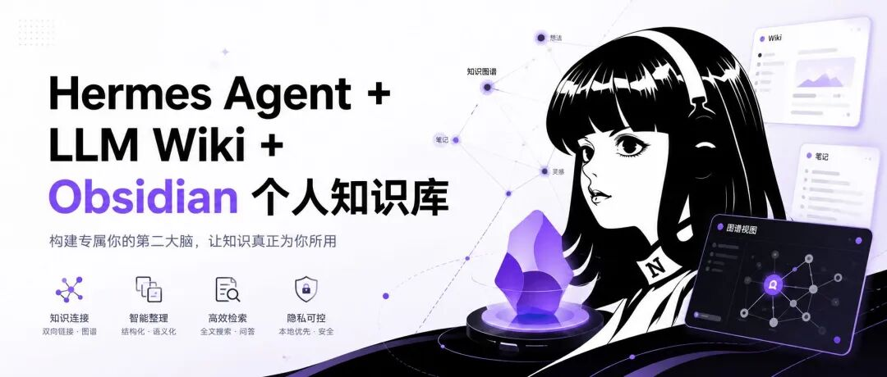
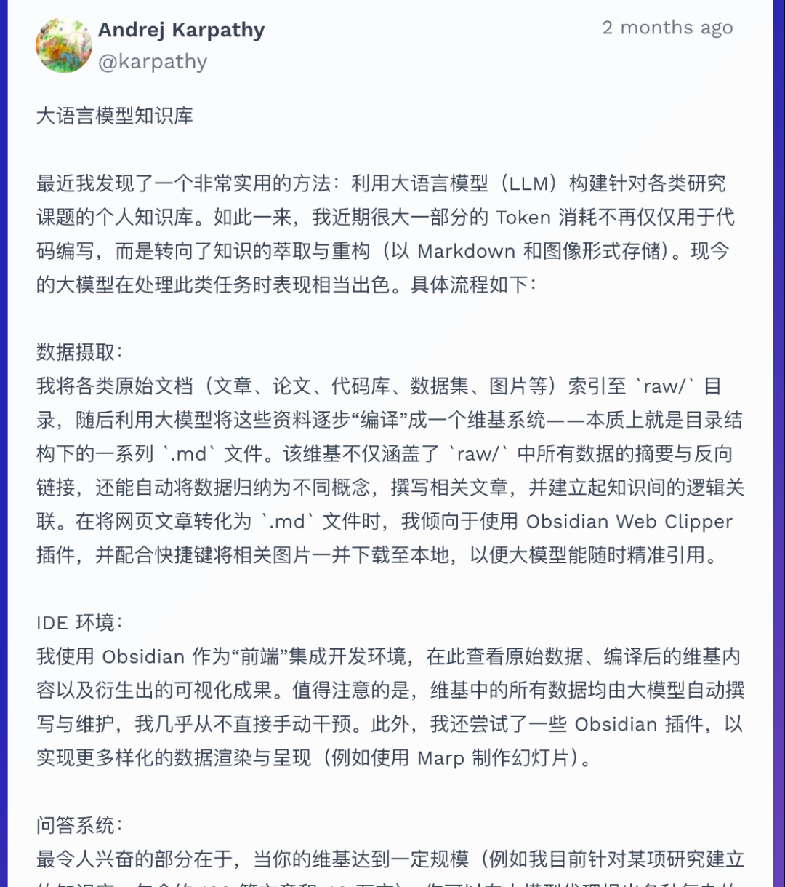
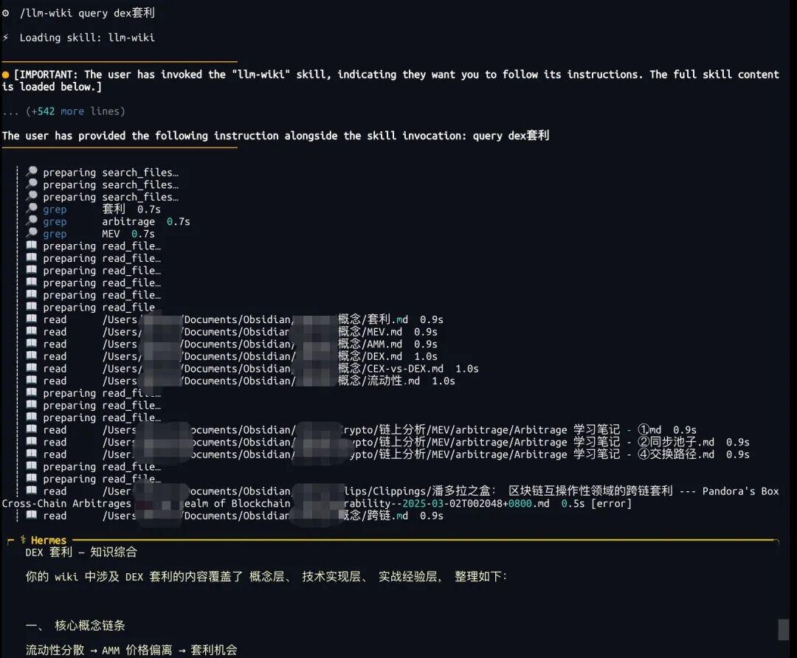
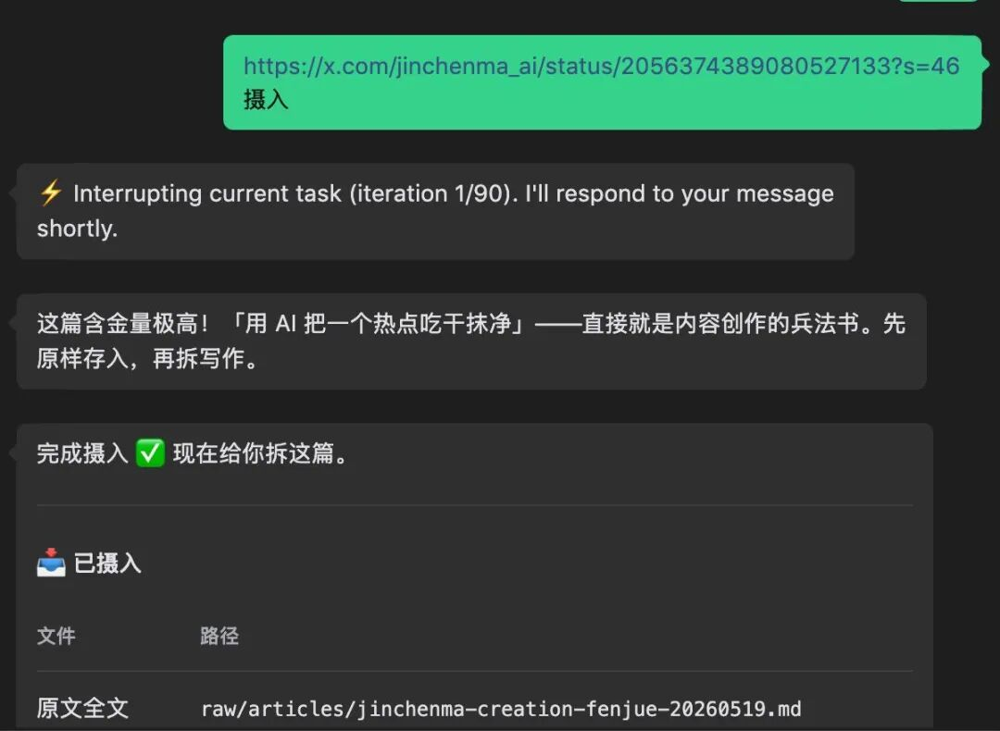
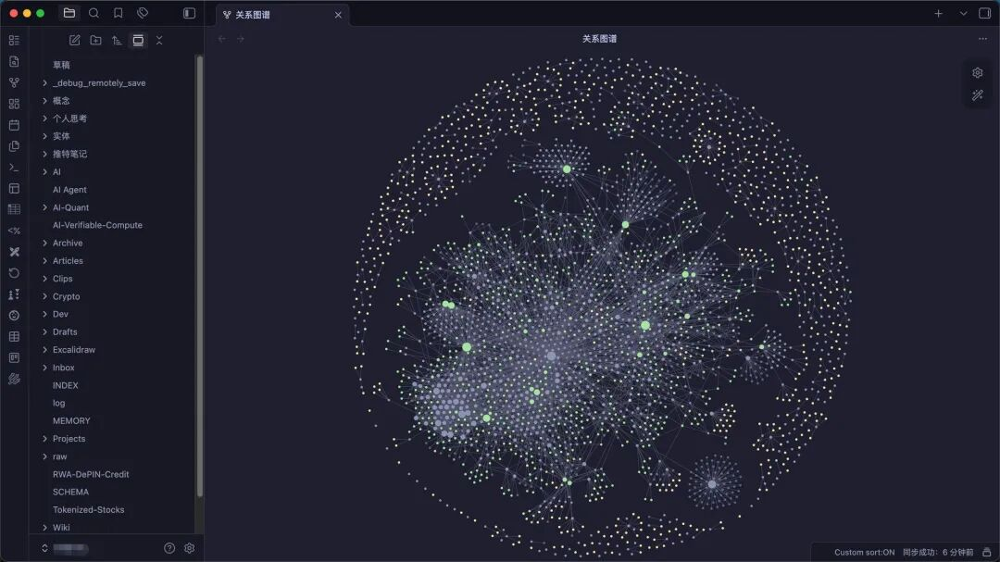

# Hermes Agent + LLM Wiki + Obsidian 个人知识库

> 原文：[微信文章](https://mp.weixin.qq.com/s/j7Rdxlf9roBGqFmhff0EFQ)
> 原始资料：`^[raw/articles/llm-wiki-hermes-agent-obsidian-2026.html]`

---

## 一句话总结

LLM Wiki 提供方法论，Hermes Agent 负责自动执行，Obsidian 让一切可见可控——三者结合构成完整的 AI 驱动的个人知识库解决方案。

---

## 为什么需要 LLM Wiki？

AI 对话次数越多、研究项目越丰富，资料就越零碎。每次对话相当于清零，关键信息丢失。现有 Agent 记忆能记录对话，但知识没有被「消化」—— RAG 只是检索原文，你需要的是让 AI 把知识编译成笔记。

> **RAG 是「查资料」，LLM Wiki 是「翻笔记」。**



## LLM Wiki 三层架构

### 1. Raw Sources（原始资料层）
你丢进去的 PDF、网页、论文、代码文件。这是「真理的源头」，只读永不被修改。

### 2. The Wiki（维基层）
AI 编写和掌管的 Markdown 文件夹，包含：
- **实体页**（Entity Pages）：人物、项目、产品
- **概念页**（Concept Pages）：技术、方法论、思想主题
- **对比分析**：跨文档的综合分析
- 通过 `[[双向链接]]` 串联成知识图谱

### 3. The Schema（指令层）
配置文件（`SCHEMA.md`），告诉 AI：核心目标、格式规则、链接方式。

```
my-wiki/
├── raw/              # 原始资料层（只读）
│   ├── papers/
│   ├── articles/
│   └── notes/
├── wiki/             # 维基层（AI 管理）
│   ├── entities/
│   ├── concepts/
│   ├── INDEX.md
│   └── log.md
└── SCHEMA.md         # 指令层
```



## RAG vs LLM Wiki

| 维度 | RAG | LLM Wiki |
|------|-----|----------|
| 工作原理 | 每次检索原文 | 读已整理的笔记 |
| 知识积累 | ❌ 无积累 | ✅ 越用越密 |
| 可见性 | 黑盒 | 全量 Markdown |
| 部署 | 向量库+GPU | 本地文件夹 |

## Hermes Agent 开箱即用

```bash
pip install hermes-agent
hermes init
hermes skill enable llm-wiki
hermes chat
> /llm-wiki ingest https://xxx
> /llm-wiki query "XXXX"
```

AI 自动：读内容 → 拆成多页面 → 实体页记录核心事实 → 概念页提炼技术内涵 → 每个页面含 wikilinks 交叉引用。



## Obsidian 让知识「看得见」

LLM Wiki 是纯 Markdown 目录，天然兼容 Obsidian：

- **Graph View**：一眼看清哪些概念是孤岛、哪些知识互联
- **双向链接**：AI 写页面时自动建立交叉引用
- **Dataview 插件**：按标签、类型做动态查询
- **标签系统**：一目了然的分类



> AI 负责录入、整理、链接、更新。你负责浏览、阅读、补充、纠错。人机协作的完美分工。



---

## 相关笔记

- [[00 AI Agent 知识库索引]] — AI Agent 知识体系总入口
- [[04 知识资料/知识库总索引|知识库总索引]] — 技术知识库总览
- [[SCHEMA]] — 知识库治理规范
- [[SCHEMA]] — 知识库指令层
