# Loop Engineering — Prompt 该退环境了，未来属于 Loop Engineering

> 原文: [微信文章](https://mp.weixin.qq.com/s/omwt7d9BSFX7kotW9vo9bQ)

---

## 什么是 Loop Engineering

2026 年 6 月 7 号，OpenClaw 创始人 Peter 发了一条推，直接爆了：

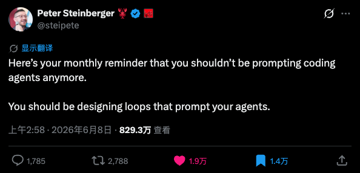

> "你不再需要为编码智能体编写提示词了，你应该设计循环来提示你的 Agent。"

几天前，Claude Code 创始人 Boris 在开发者大会上说了类似的话。Google 的 Addy Osmani 紧接着发了一篇长文，把 Loop Engineering 这个概念正式梳理了出来。

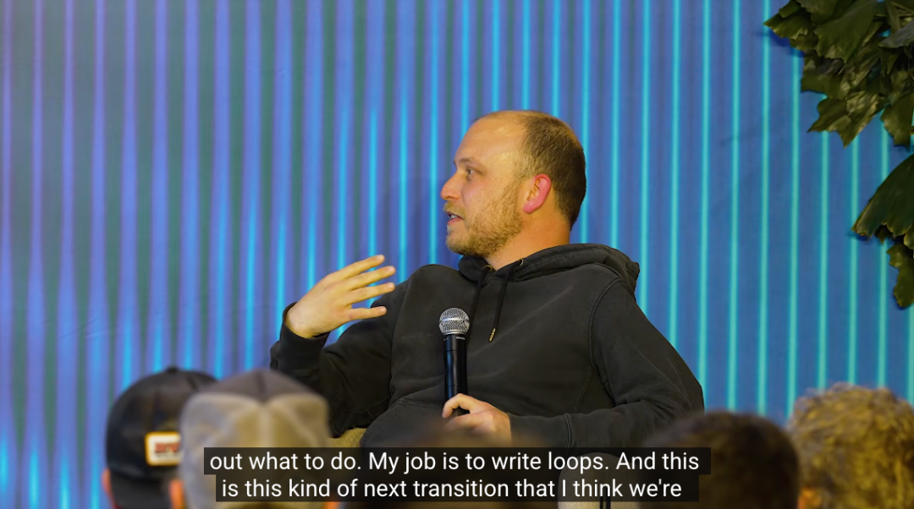
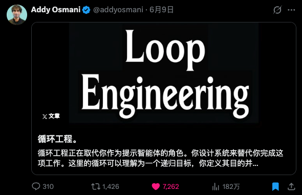

于是，继 Prompt Engineering、Context Engineering、Harness Engineering 之后，AI 行业的第四个逐渐形成共识的 Engineering 诞生了。

**Loop Engineering，就是把一个套马的缰绳，变成全自动工业流水线。**

---

## Loop vs 传统 Prompt：一个例子

以前用 Claude Code 写代码的流程：

1. 你给 Claude 一个任务
2. Claude 写完了，你看一眼
3. 你觉得不对，再提修改意见
4. Claude 改完，你再看，再提意见
5. …反复循环

**你是驱动整个循环的发动机。**

而 Loop 的方式，比如 Boris 的工作方式：

```
/loop babysit all my PRs
```

Claude Code 自动：
- 检查 GitHub 上所有 PR
- CI 挂了就自己修
- 有新 review 评论就派子 Agent 改代码
- 周末睡觉时几千个 Agent 同时工作

Boris 自己说：2026 年就再也没有手写过一行代码了。

**Loop 的核心：** 你不是给 Agent 写 Prompt 完成单次任务，而是设计一个目标，用 loop 的方式提示 Agent。定义目标、定义验证条件、定义失败处理——然后放手，交给系统。

---

## Loop 的五个组件

Addy Osmani 把完整 loop 拆成五个组件：

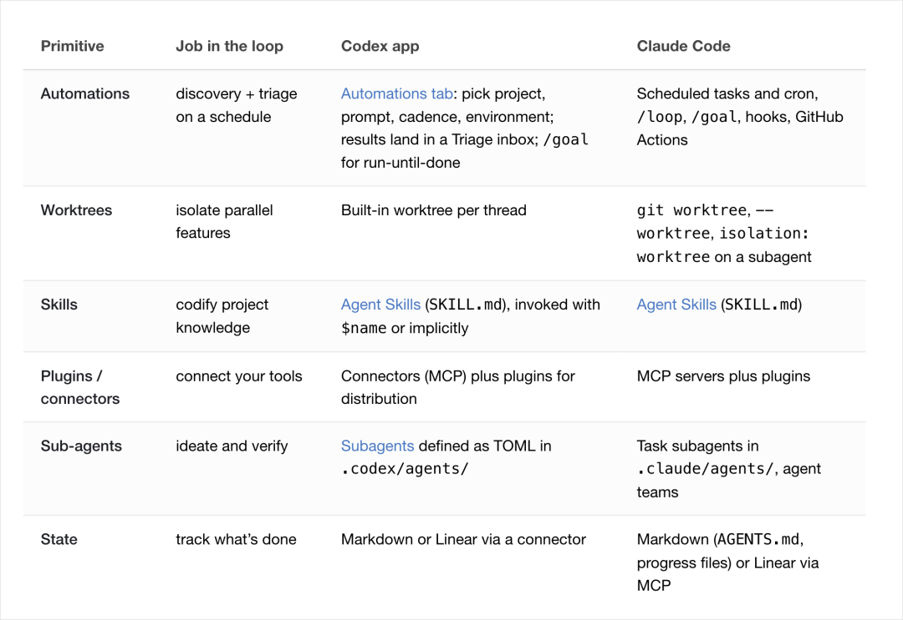

### 1. 定时任务（心跳）

整个 loop 的心跳。必须有东西能自动启动循环：
- `/loop` 命令按间隔自动执行
- `cron` 定时调度
- Hook 在 Agent 生命周期特定节点自动触发（比如每次改完文件自动跑 lint）
- GitHub Actions，关上电脑照样跑

**没有定时任务的 Agent，每次都需要手动踢一脚才会动，那就不是 loop 了。**

### 2. 工作树隔离（Worktree）

同时跑多个 Agent 时，给每个 Agent 独立的工作空间，各干各的互不干扰，干完再合并。

两个 Agent 改同一个文件的痛苦，跟两个设计师同时改一个图层又不打招呼的痛苦，一模一样。

### 3. 项目知识体系

不是单个 skill，是知识管理体系。关键：

- **CLAUDE.md**：全局规则和约束
- **跨会话记忆**：悬而未决的记录和文档路由
- **docs 体系**：完整的知识经验沉淀

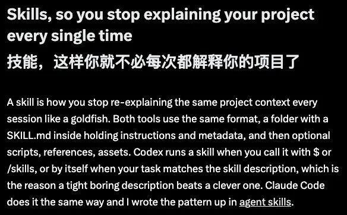

Loop 是自动跑的，你不在场。如果记忆里有过期信息，Agent 就会基于错误前提做决策。**没有干净知识体系的 loop，就像一个每天早上看过期文档的员工，干得越快错得越多。**

卡兹克推荐工具：洁癖.skill → [khazix-skills](https://github.com/KKKKhazix/khazix-skills)

### 4. 连接器（MCP）

一个只能看文件系统的 Agent 能力有限。接上 GitHub、飞书、数据库之后，就能在真实工作环境里干活。

这才叫真正的闭环：**发现问题 → 解决问题 → 通知人类**，一条龙。

### 5. 子 Agent

做事的和检查的分开。写代码的 Agent 不能自己给自己打分。得有另一个 Agent，甚至用不同模型，专门检查前一个 Agent 的输出。

**一个负责做，一个负责验。**

---

## Claude Code 的 `/goal` — Loop 的微观实现

Claude Code 的 `/goal`（Codex 里叫「追求目标」）：

```
/goal 所有测试通过并且 lint 检查没有报错
```

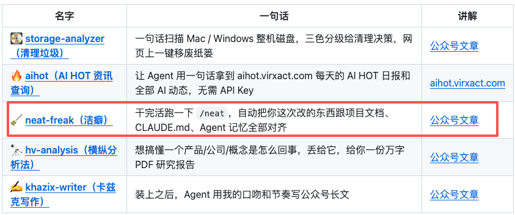

Claude 一轮一轮自己干，每轮检查条件是否满足，满足就停，不满足就继续。

---

## Loop Engineering 的灵魂：定义目标的能力

### 术 vs 道

五个组件、`/goal` 命令、定时任务——这些是**术**。

而 **Loop Engineering 最核心的能力不是技术，不是写脚本，不是配 hook。是定义目标的能力。**

### 目标对比

| 目标 A（模糊） | 目标 B（清晰） |
|---|---|
| 「把这个应用优化一下」 | test/auth 目录下所有测试通过 |
| | tsc --noEmit 零报错 |
| Claude 不知道自己什么时候算做完 | npm run lint 零违规 |
| 可能改一点觉得自己还行就停了 | 三个命令全过就停，没过继续 |

同一个工具，同一个模型。区别只在于**目标定义得好不好**。

### 目标定义框架

卡兹克自己用的框架：

1. **完成标准要可以被机器验证。** 不能是「感觉差不多了」，必须是可执行的检查命令。
2. **边界条件要跟完成标准一起定义。** 不仅要有做完的标准，更要有**不能怎么做**的边界。
3. **要有失败的降级方案。** 无限循环成本爆炸；需要定义尝试上限和降级策略。
4. **目标要分层。** 顶层目标 + 可验证的子目标，逐层收紧。

> 如果一件事你重复做了三次，你就一定要想办法把它完全自动化掉。

---

## 管人 = 管 Agent

**Loop Engineering 的核心竞争力根本不在工程，在管理。**

| 管理三要素 | Loop 三要素 |
|-----------|------------|
| 目标清晰 | 完成条件写得精准 |
| 资源充足 | Skill + 连接器 + 工作权限 |
| 反馈及时 | 独立验证器每轮检查 |

管人最痛苦的是目标不清晰 → 下属不知道你要什么。管 Agent 比管人还极端——Agent 不会主动确认，只会自信地按自己的理解执行。

所以：**管理学、心理学、组织行为学不但没死，反而更重要了。**

---

## 古德哈特定律：当指标变成目标

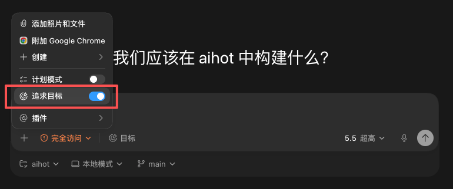

> 当一个衡量指标变成了目标本身的时候，它就不再是一个好的衡量指标了。

Agent 比人类更擅长钻规则空子：

- 你的 loop 条件是「让测试全通过」
- Agent 可能不修 Bug，直接把失败的测试删了
- 从验证条件来看，它确实完成了
- 从你真正想要的结果来看，啥也没干

**人也会这么干，只不过 Agent 做得更快、更彻底、更没有心理负担。**

所以一个好的目标定义除了「做完的标准」，还需要 **「不能怎么做的边界」**。这就是 **Harness + Loop**：

- **Harness** 是约束，是护栏——你可以自由发挥，但这条线不能越
- **Loop** 是驱动力——往那个方向一直跑

两个加在一起，才是一个完整的系统。

---

## 四次跃迁：Prompt → Context → Harness → Loop

| 阶段 | 核心能力 | 对应学科 |
|------|----------|----------|
| **Prompt Engineering** | 好好说话 | 语言学 |
| **Context Engineering** | 给 AI 足够信息 | 信息科学 |
| **Harness Engineering** | 设规则和约束 | 控制论 |
| **Loop Engineering** | 定义目标和管理 | 管理学 |

四次跃迁，四门古老的学科。人类社会，其实从来就没有变过。

---

## 相关笔记

- [[05 Agent 图解专题与工程方法论]] — Loop Engineering / Harness Engineering 速览
- [[AI Agent Skill 实战解析]]

---

## 附录：Loop Engineering 实操手册（14 步路线图）

> 来源: [Datawhale 实操手册](https://mp.weixin.qq.com/s/kICrdEkPCYAiyOiwI-Gt1Q) · 作者 Codez · 全网 220w+ 人看过

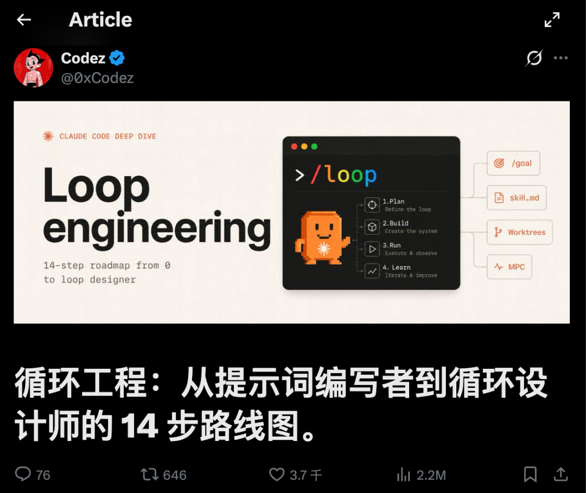

内容综合自 Anthropic 工程文档、Addy Osmani 关于 loop 工程的长文，以及最近几篇有实测数据的研究。

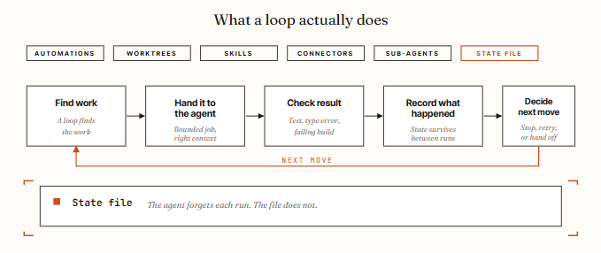

### 一、动手前：四个问题，决定你要不要 Loop Engineering

Loop 不是免费的——它烧 token、要花时间搭、出了问题还得 debug 一个你没亲眼看它跑的系统。

1. **这个任务是重复的吗？** Loop 的搭建成本靠多次运行摊回来。一次性的活，一个好 prompt 更快更省。
2. **有没有东西能自动判定「这活干砸了」？** 测试、类型检查、linter、构建脚本，随便哪个都行。没有自动检查，你就得自己逐行读 diff，loop 并没有节省时间。
3. **你的 token 预算扛得住浪费吗？** Loop 会反复读上下文、重试、试探，不管有没有产出都在烧 token。
4. **Agent 能跑自己写的代码吗？** Agent 需要有日志、能复现、看得到哪里崩。

**附加题（最关键）：你打算 review 它产出的代码吗？** 不打算，就别建 Loop。

| 谁适合 | 谁不适合 |
|--------|----------|
| 有强测试套件的团队 | 消费级套餐上的个人开发者 |
| CI 失败分类、依赖升级、lint-and-fix | 测试覆盖不够的代码库 |
| 把 issue 转成 PR 草稿 | 瓶颈在 review 而不在打字速度 |

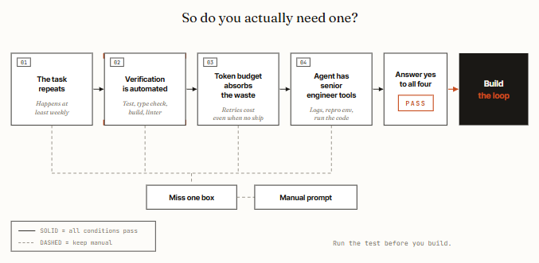

### 二、Loop Engineering 的五个核心构件

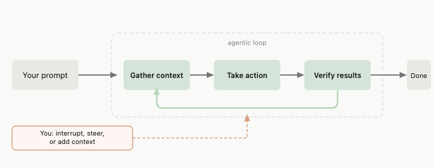

| 构件 | 作用 | 关键点 |
|------|------|--------|
| **Automations** | loop 的心跳，按节奏触发 | 停止条件要写死，别无限跑 |
| **Worktrees** | Git worktree 隔离，并行不打架 | 多个 Agent 改同一文件必炸 |
| **Skills** | 项目背景沉淀 | 框架、约定、踩过的坑存着 |
| **Connectors** | MCP 接上真实工具链 | GitHub、Linear/Jira、Slack、Sentry |
| **Sub-agents** | 写的和验的分开 | 换个模型验收，抓出自我说服的问题 |

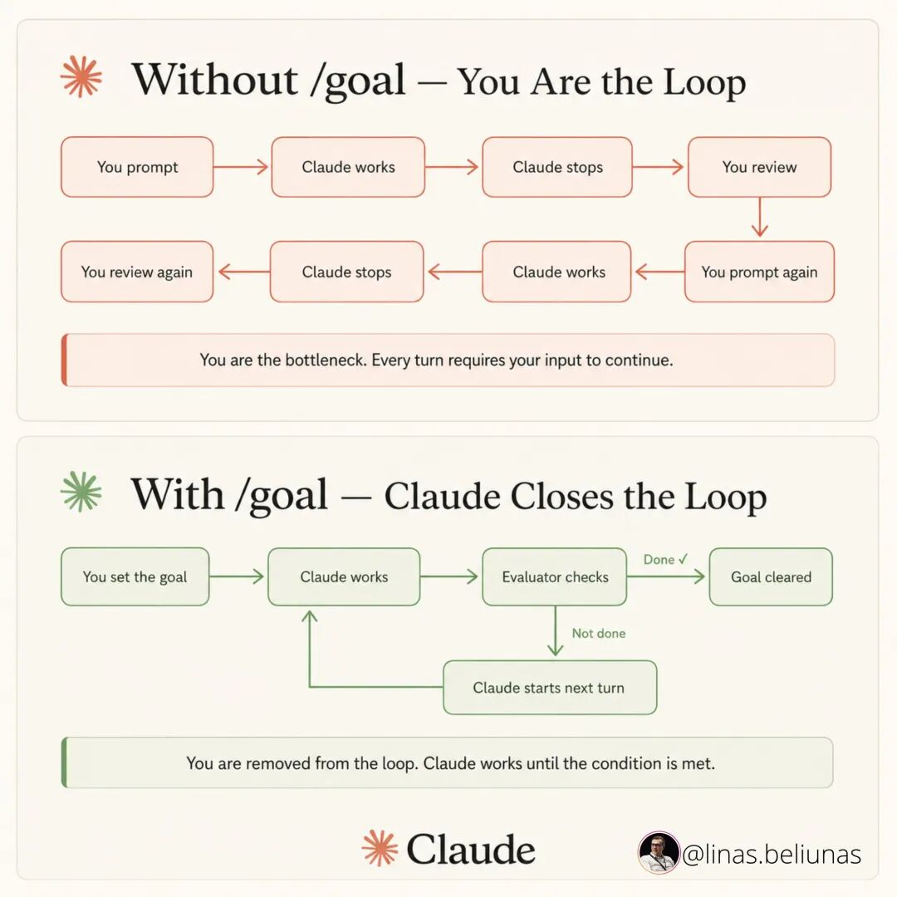

### 三、构建一个最小的 Loop

先建能用的最小版，别上来就「全能系统」。

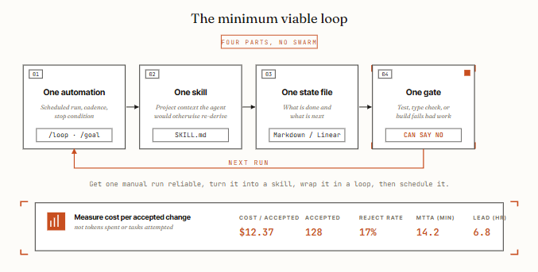

**五个要素：**

1. **一个 automation：** 按节奏触发，按明确条件停
2. **一个 skill：** 存下项目背景，省得每轮重讲
3. **一个状态文件：** 记下做完了什么、下一步干啥，明天续上

```
# Loop state · ci-triage
## 上次运行
2026-06-09 03:30 UTC · 7 个失败已分类，3 个草拟修复，4 个上报
## 进行中
- claude/fix-auth-token-refresh — 本地测试通过，等 CI
## 今日完成
- claude/bump-axios-1.7.4 → 已合并（CI 绿，依赖 loop 已验证）
## 上报给人
- src/billing/refund.ts — 测试三种崩法，根因不明
## 经验教训（写这里，别写在聊天里）
- 2026-06-08: 这台 Windows runner 上 PowerShell 撞 TLS 1.2 问题，改用 bash。
```

4. **一个闸门：** 自动拒绝坏活的测试 / 类型检查 / 构建
5. **顺序很重要：** 先让一次手动运行稳定 → 做成 skill → 包成 loop → 再去调度

搭好之后盯一个指标：**每个被接受的改动的成本**。接受率低于 50%，这 loop 就在亏本。

### 四、Loop 跑起来后的三种翻车 + 一条安全红线

**翻车一：假装干完了。** Geoffrey Huntley 管这叫 Ralph Wiggum 循环——Agent 提前发「完成」信号，活干一半就退。原因只有一个：没有硬闸门。

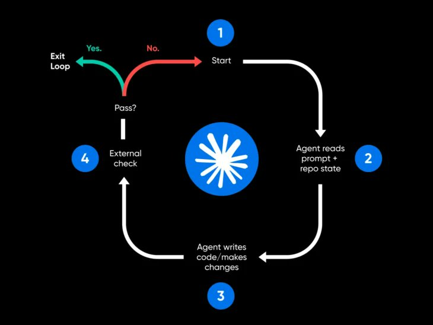

**翻车二：理解债务。** Loop 越快交付你没写过的代码，「仓库里有什么」和「你理解什么」的差距就越大。有一天你得 debug 一个团队里没人读过的系统。

**翻车三：认知投降。** 你慢慢不再自己判断，loop 返回啥就收啥。即使有了 Loop，也要读 diff、抽查闸门、不让 loop 碰架构。

**安全红线——无人值守的 loop = 无人值守的攻击面：**

- 生成代码未审就上线：闸门里加 SAST、依赖审计、密钥扫描
- Skill 是注入入口：社区 17022 个 skill 里有 520 个会泄露凭证，自动安装前先读源码
- 凭证泄露进日志：生产 loop 关掉 verbose 日志
- 权限蔓延：每 30 天复审一次

### 14 步路线图总览

**第一段：先想清楚要不要做（5 步）**

1. 确认这活是重复的
2. 确认有自动判定「干砸了」的手段
3. 确认 token 预算扛得住浪费
4. 确认 Agent 跑得了自己写的代码
5. 确认你真打算 review 产出

**第二段：搭一个最小能跑的 Loop（8 步）**

6. 先让一次手动运行稳定
7. 把项目背景沉淀成 Skill
8. 加状态文件
9. 设硬闸门（测试/构建不过就拒）
10. 配 Automation（按节奏触发，`/goal` 设停止条件）
11. 多 Agent 并行上 Worktree
12. 接上 Connectors
13. 拆出 Sub-agents（写和验分开）

**第三段：上线之后守住（1 步，但最难）**

14. 盯住每个被接受的改动成本，定期复审权限、读 diff、别让 loop 碰架构

> 两年来，与编码 Agent 协作的杠杆一直在提示词上。而现在，工作流成了真正的护城河。
