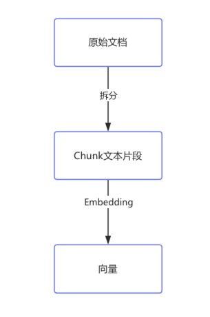
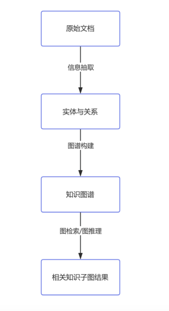

# RAG 进阶面试题：7道场景题

> 原文：[微信文章](https://mp.weixin.qq.com/s/uOl7jYbHLgW4zDO2gcUeew) · 2026-07-14
> 原始资料：`^[raw/articles/wechat-rag-7qa-2026.html]`

---

## 一句话总结

RAG 面试从「概念」卷到「场景」——评估体系、嵌入模型选型、上下文窗口、生产挑战、GraphRAG、检索空结果排查，七道题涵盖工程全链路。

---

## 1. 如何评估 RAG 效果？

不能只看最终答案，要分别评估**检索**和**生成**两个环节。

| 环节 | 指标 | 说明 |
|------|------|------|
| **检索** | Recall@K | 目标文档是否在前 K 个结果里 |
| | Precision@K | 前 K 个结果有多少真正相关 |
| | MRR | 正确结果排名是否靠前 |
| | Hit Rate | 是否命中正确文本片段 |
| **生成** | 正确性 | 答案是否基于检索结果 |
| | 幻觉 | 是否编造了检索结果中没有的信息 |
| | 完整性 | 是否缺少关键信息 |
| | 引用 | 是否给出来源 |
| **端到端** | 测试集通过率 | 每次改参数/模型/TopK 后全量重跑 |
| **线上** | 用户反馈 | 追问率、点赞/踩、引用点击率 |

---

## 2. RAG vs 微调

| 维度 | RAG | 微调 |
|------|-----|------|
| 本质 | 检索外部知识注入上下文 | 修改模型参数 |
| 适合 | 补充外部知识 | 改变行为/格式/风格 |
| 知识更新 | 改知识库即可 | 需重新训练 |
| 成本 | 低 | 高 |
| 溯源 | 天然支持引用 | 难以溯源 |
| 幻觉控制 | 基于检索结果回答 | 依赖训练质量 |

> 实践中可配合使用：RAG 做知识注入，微调做行为对齐。

---

## 3. RAG 怎么解决 LLM 上下文窗口有限？

| 策略 | 做法 |
|------|------|
| **合理切分 Chunk** | 根据文档类型选合适大小，平衡上下文完整性和窗口占用 |
| **控制 TopK** | 初召回可多取，入 Prompt 时严格控制数量 |
| **Rerank 重排序** | 用 Reranker 把真正相关的内容排到前面 |
| **压缩上下文** | 摘要、去重、提取关键信息 |
| **Metadata 过滤** | 检索时按 user_id/kb_id/文档类型过滤，减少无关数据 |

---

## 4. 如何选择合适的嵌入模型？

> 扩展阅读：[[Embedding 模型选型四因素]]（2026-07-15 补充细节版本）

### 四因素口诀

**Embedding 模型选型 = 语言支持 + 向量维度 + 上下文长度 + 性能指标**，先开源验证再考虑商用。

### 推荐模型速查

| 场景 | 推荐模型 | 维度 | 特点 |
|------|---------|------|------|
| 中文通用 | bge-large-zh | 768 | 中文效果最好的开源选择 |
| 中英混合 | M3E | 768 | 多语言支持，一套模型覆盖两种语言 |
| 轻量验证 | Text2Vec | 384 | 轻量中文模型，快速 PoC |
| 英文通用 | sentence-transformers all-MiniLM-L6-v2 | 384 | 轻量英文，工业界常用 |
| 高精度 | OpenAI text-embedding-ada-002 | 1536 | 效果最好，商用首选 |

### 向量维度成本速算

| 维度 | 单条存储 | 百万条总存储 |
|------|---------|-------------|
| 384 | ~1.5KB | ~1.4GB |
| 768 | ~3KB | ~2.8GB |
| 1024 | ~4KB | ~3.7GB |
| 1536 | ~6KB | ~5.6GB |

> 100 万条文档，1536 维比 768 维多占约 2.8GB——数据量大时差距明显。

### 真实场景落地

| 场景 | 推荐 | 理由 |
|------|------|------|
| 多语言电商客服 | M3E | 中英混合，一套模型覆盖 |
| 高精度法律检索 | ada-002 / bge-large | 精度优先，存储成本可接受 |
| 轻量个人知识库 | 384 维模型 | 成本几乎为零 |

### 评估效果

用公开评测集 C-MTEB / MTEB，或用业务数据构建测试集算准确率和召回率。


---

## 5. RAG 系统实际部署面临哪些挑战？

- **文档质量与解析**：重复、过期、格式混乱；PDF/Word/PPT 解析效果参差不齐
- **权限控制**：检索时必须先过滤，不能查出后再让模型判断——会泄密
- **知识更新**：文档增删改后需同步向量数据库，避免检索到过期内容
- **处理延迟**：问题重写→向量检索→全文检索→Rerank，步骤越多延迟越高

---

## 6. GraphRAG vs 传统 RAG





| 维度 | 传统 RAG | GraphRAG |
|------|---------|----------|
| **检索方式** | 向量相似度 | 向量相似度 + 实体关系 + 图路径 + 社区摘要 |
| **适用场景** | 答案可直接从文档找到 | 涉及多实体、多关系的复杂问题 |
| **可解释性** | 文本片段 | 完整实体关系路径 |
| **成本** | 低 | 高（实体抽取、关系建模、图谱更新） |

> 实践中可配合：向量检索找文档 → 图检索补实体关系。

---

## 7. 检索返回 0 个结果时如何排查？

```
📋 排查链路（从上到下）

1. 文档是否入库？
   → 确认上传、解析、拆分、嵌入、写入向量库全流程

2. 向量和索引是否正常？
   → Chunk→向量转换成功？索引构建完成？

3. 检索参数是否合理？
   → TopK 太小？相似度阈值过高？Metadata 过滤条件过严？

4. 问题本身是否超出知识库范围？
   → 问题改写/扩展后重试

5. Embedding 模型是否匹配？
   → 检索用的模型和入库时是同一个吗？
```

---

## 相关笔记

- [[RAG 面试题合集]] — 20题 RAG 精华速查
- [[Agent 架构面试题-RAG篇]] — RAG 深度面试 10 题 + 附录
- [[AI Agent 与 RAG 面试题合集索引]] — 全量索引
