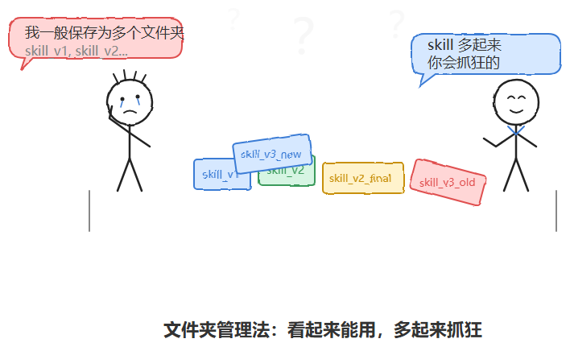
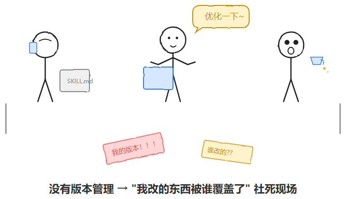
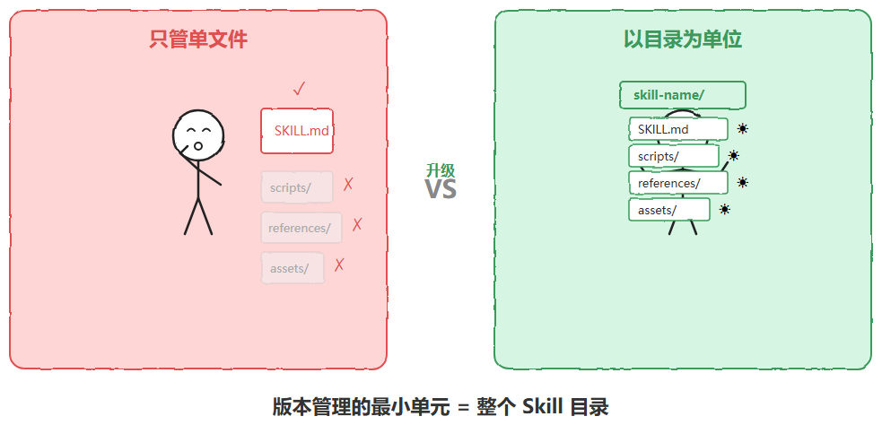
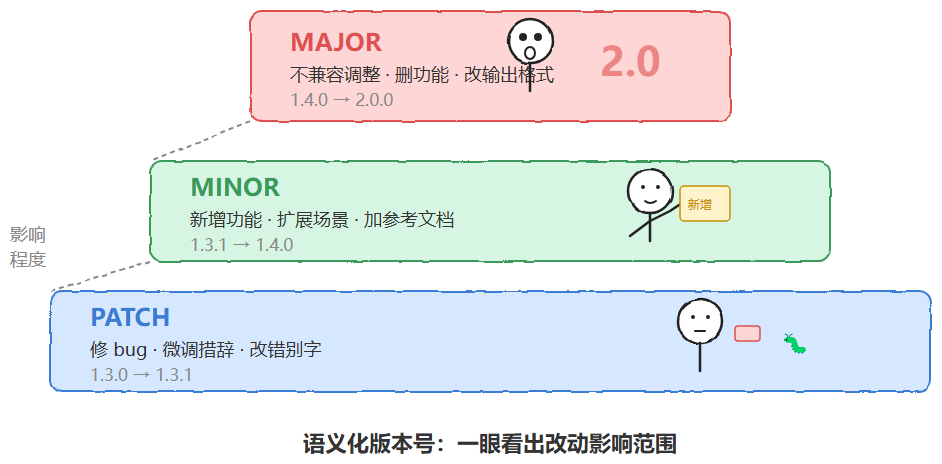
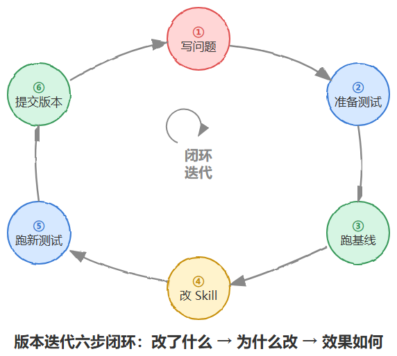

# Skill 版本管理完全指南

> 原文：[微信文章](https://mp.weixin.qq.com/s/ur8E2Xjq6lOpjrnTlX9now) · 2026-07-15
> 原始资料：`^[raw/articles/wechat-skill-version-management-2026.html]`

---

## 一句话总结

Skill 本质上是会被反复修改、被多人依赖、被线上使用的文本资产——和代码没有本质区别。版本管理不是锦上添花，是早晚要踩的坑。三种方案由轻到重：changelog → 语义化版本号 → Git。

---

## 一、为什么 Skill 需要版本管理

Skill = 文件系统中的 Markdown 文档（SKILL.md + scripts + references + assets），和代码/配置文件没有本质区别。

| 诉求 | 说明 |
|------|------|
| **改坏了能回退** | description 调了反而不触发，需要立刻退回到上个可用版本 |
| **多人协作不覆盖** | 同一个 Skill 多人迭代，「我改的被谁覆盖了」 |
| **效果可追溯** | 每次改动留痕才能回答「这次改完变好了还是变差了」 |
| **多环境适配** | 稳定版 vs 实验版 vs 客户定制版 |

---

## 二、Skill 结构决定版本管理对象

```
skill-name/
├── SKILL.md        # 必须，YAML frontmatter + 正文
├── scripts/        # 可选，可执行脚本
├── references/     # 可选，参考文档
└── assets/         # 可选，模板/图标/字体
```

**版本管理以整个 Skill 目录为最小单元**，不是单个 SKILL.md。改了 references 或 scripts 也一样要打版本标记。



---

## 三、三种可落地方案

### 方案一：文件命名 + CHANGELOG（最轻量）

适合个人或小团队起步。

**frontmatter 加版本号**：

```yaml
---
name: contract-review
description: 用于审核合同条款，识别风险点
version: 1.3.0
---
```

**文档末尾或独立 CHANGELOG.md**：

```markdown
## Changelog

### v1.3.0 (2026-07-10)
- 新增对赔偿条款的风险识别逻辑
- 修复了对英文合同触发不准的问题

### v1.2.0 (2026-06-20)
- 增加了 references/risk-clauses.md 参考文档
- description 里补充了"合同审核"关键词，提升触发率

### v1.1.0 (2026-05-15)
- 首次加入 scripts/extract_clauses.py 自动提取条款
```

**优点**：门槛极低。**缺点**：无法回滚历史完整版本，无法 diff。

> 关键习惯：每次改动随手写一行 changelog，哪怕一句话——这个习惯比工具本身更重要。



### 方案二：语义化版本号（Semantic Versioning）

当 Skill 被多人依赖，或维护 Skill 库供团队共享时引入。

| 版本位 | 触发条件 | 示例 |
|--------|---------|------|
| **PATCH**（修订号） | 修 bug、微调措辞、改错别字，不改变行为逻辑 | 1.3.0 → 1.3.1 |
| **MINOR**（次版本号） | 新增功能/文档/场景，不影响已有功能使用方式 | 1.3.1 → 1.4.0 |
| **MAJOR**（主版本号） | 不兼容调整：彻底改变输出格式、删除功能、改触发逻辑 | 1.4.0 → 2.0.0 |

> 面试官问「怎么知道每个版本的区别」——语义化版本号就是最直接的回答。看到 1.3→2.0，就知道这次改动不简单，得小心。

**description 改动特别提醒**：看起来只改了几个词，实际上影响「Claude 在什么情况下会不会想起来用这个 Skill」这件全局性的事。建议至少按 MINOR 处理，甚至配合上线前做 A/B 测试。



### 方案三：Git 版本控制（团队协作）

适合 Skill 库形成规模或多团队协作。

| 实践 | 做法 |
|------|------|
| **仓库结构** | 一个 Skill 一个仓库，或一个仓库放多个 Skill 目录 |
| **分支管理** | 实验性改动开分支 → 跑测试 → 确认再合并。主分支永远是稳定版 |
| **Tag 标记发布** | 每次达到「可放心给全团队用」的状态打 tag，随时取出回滚 |
| **Commit message** | 写清楚「为什么改」，不只写「改了什么」。Skill 改动基于测试反馈，背景信息必须留存 |
| **PR 评审** | description（触发逻辑）的调整必须过 review——「改好了这个场景，改坏了那个场景」 |

---

## 四、版本管理必须绑定效果评估



成熟的迭代流程：

```
1. 写清楚要解决的问题（如「某类场景触发不准」）
2. 准备 test prompts，覆盖典型 + 边界场景
3. 跑一遍现有版本，记录基线表现
4. 修改 Skill，再跑测试用例
5. 对比两次结果，确认变好而非拆东墙补西墙
6. 确认无误 → 提交新版本，更新版本号 + changelog
```

---

## 五、四个容易踩的坑

| 坑 | 为什么踩 | 怎么避 |
|----|---------|--------|
| **只改 SKILL.md，不改 references** | 版本不一致 | 以整个 Skill 目录为单位，改什么检什么 |
| **description 改动缺乏敬畏心** | 看起来改几个词，实际影响全局触发 | 至少按 MINOR 处理，跑触发测试 |
| **版本历史只存在脑子里** | 图省事不改记录 | 一行 changelog 远好过什么都不记 |
| **把「能跑」当「改好了」** | Skill 能工作不代表比旧版好 | 新旧版本跑同一批测试用例对比 |



---

## 相关笔记

- [[Agent Skill 本质与设计面试题解析]] — Skill 结构、渐进式加载、开放标准
- [[AI Agent Skill 实战解析]] — Skill 实战攻略
- [[Skill编排的6种依赖关系]] — Skill 间依赖模式
- [[DeepSeek Agent 全流程面试题一面详解]] — Skill 分层体系与自动沉淀机制
