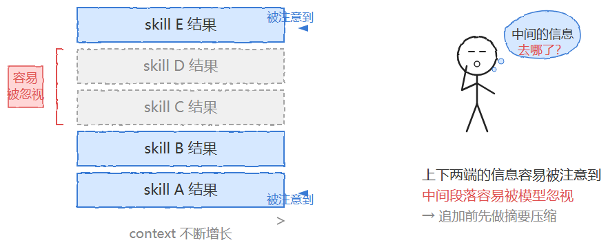
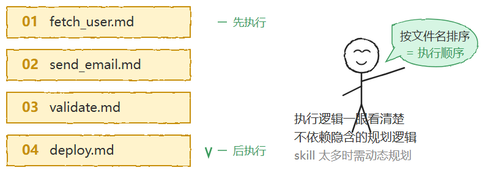
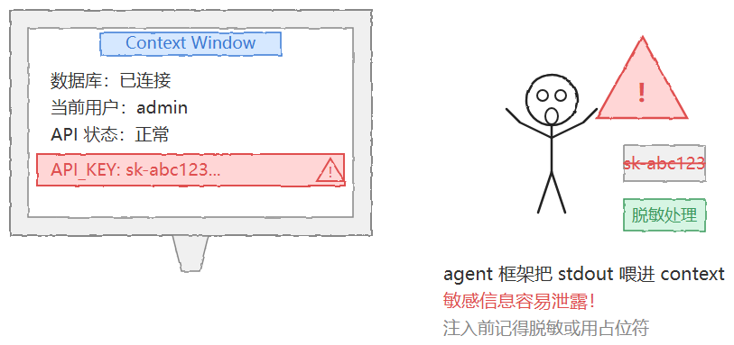
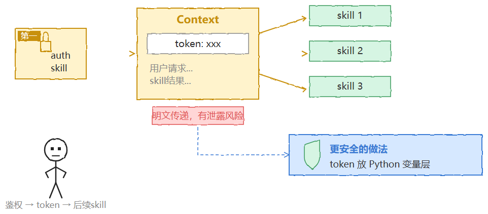

# Skill 编排：你做了一堆 skill，它们之间怎么传数据、怎么建立依赖？

> 原文: [微信文章](https://mp.weixin.qq.com/s/kS8oyTzjK1LhE_0NRSBJuw)
>
> 滴滴二面追问实录 — 从"能跑就行"到"能管得住"

---

文章目录
前言
一、skill 编排：从"能跑就行"到"能管得住"
二、数据依赖：context 是唯一的信息通道
三、执行顺序依赖：文件名前缀与动态规划的分界线
四、工具与环境依赖：依赖注入思维
五、版本依赖：别让覆盖写入吃掉你的回滚能力
六、权限依赖：auth skill 永远第一个跑
七、循环依赖：线性执行模型的天然护城河
八、从架构师视角看 skill 编排的几个工程取舍
九、面试话术：考官想听的是什么
总结
前言
前段时间圈子里有人去面滴滴，二面聊到 Agent 系统设计，他项目里做了好几个 skill 串起来跑，面试官就顺着问了一句：
“你做了一堆 skill，它们之间怎么传数据的？或者说怎么建立依赖的？”
他想了想，说把前面 skill 的结果放进 context，后面的 skill 读整个 context 就能拿到了。面试官点点头，又追问：
"那如果 skill 数量多了，context 越来越长怎么办？模型还能注意到中间的信息吗？"
他愣了一下，说可以做摘要压缩。面试官继续追：
“那执行顺序谁来管？版本更新了怎么回滚？有些操作要先鉴权怎么保证？”
——他发现自己一个都答不利索。
其实每个点他都在项目里遇到过，但从来没系统梳理过。
这是很多人做 skill 编排的通病：能跑就行，没想过依赖关系到底有几种、每种怎么解。
这篇文章就把 skill 之间的依赖关系彻底拆清楚。读完你能搞明白：
skill 之间到底有几种依赖关系
（不是只有"数据传递"这一种）
context 作为唯一信息通道，它的边界和坑在哪
执行顺序、版本管理、权限鉴权
这三类依赖的工程解法
为什么循环依赖在 md-skill 架构下天然不存在
架构师视角的 skill 编排工程取舍
和面试高分话术
不管你是正在准备大厂 Agent 岗面试的求职者，还是在一线做 Agent 系统开发的工程师，这篇都能帮你把 skill 编排从直觉拉到机制层面。开拆！
一、skill 编排：从"能跑就行"到"能管得住"
先说一个很多 Agent 开发者会碰到的场景：你做了几个 skill——一个查用户信息、一个发邮件、一个写日报——把它们串起来跑，发现效果还行。于是你觉得 skill 编排不过如此，就是"前一个的输出当后一个的输入"嘛。
但一旦 skill 数量从 3 个涨到 10 个、20 个，问题就全冒出来了：执行顺序谁定？中间结果怎么传？版本更新了旧流程怎么办？有些操作需要先鉴权怎么保证？这些都不是"能跑就行"能糊弄过去的。
面试官问"怎么传数据、怎么建立依赖"，表面上是在问数据传递，实际上是在考你对
整个编排系统的认知深度
。只答出"放 context 里"是 60 分，能系统说出 6 种依赖类型 + 每种的解法 + 各自的边界，才是 90 分。
先上一张全景图，把 6 种依赖关系列清楚：
依赖类型
核心问题
解法方向
数据依赖
后面的 skill 怎么拿到前面的结果
结果追加进 context
顺序依赖
先跑哪个后跑哪个
文件名前缀 / 规划层动态决策
工具依赖
skill 需要的数据库/API/环境信息从哪来
context 开头注入环境快照
版本依赖
skill 更新了旧流程怎么办
文件名带版本号，保留历史
权限依赖
某些操作要先鉴权
auth skill 固定第一个跑
循环依赖
A 依赖 B、B 又依赖 A
线性执行天然避免
你会发现，6 种依赖的解法几乎都指向同一个核心：
context 是 skill 之间唯一的信息通道。管好 context 的内容和顺序，大多数依赖问题就自然解了。
下面逐个拆。
二、数据依赖：context 是唯一的信息通道
两个 skill 之间最常见的关系，就是后面那个需要前面那个的输出结果，才能接着往下干活。
这种依赖其实不需要什么复杂的状态管理机制。最直接的办法：
把 A 的执行结果追加到共享的 context 里，B 调用时把整个 context 一并带上，它自然就能读到 A 的结果。
context
=
"用户请求：发邮件给 Alice
\n\n
"
# 执行 skill
A：查收件人信息
result_a
=
call_llm(skills[
"fetch_user"
]
+
"
\n\n
上下文：
\n
"
+
context)
context
+=
f
"[fetch_user 结果]
\n
{result_a}
\n\n
"
# 执行 skill
B：发邮件，读整个
context，
A
的结果已经在里面了
result_b
=
call_llm(skills[
"send_email"
]
+
"
\n\n
上下文：
\n
"
+
context)
这里有个非常值得注意的边界：context 会随着 skill 链条增长变得越来越长。研究者把这种现象叫
“lost-in-the-middle”
——模型更容易注意到 context 开头和结尾的内容，中间那段信息容易被忽视掉。面试官追问"context 越来越长怎么办"，就是想看你有没有意识到这个边界。
应对方式：如果 skill 数量多、context 累积很长，可以在追加新内容之前，先对之前的结果做一轮摘要压缩。不是把所有历史原样保留，而是提炼出关键信息再往下传。这跟人类开会记纪事是一个道理——你不需要记住每个人说的原话，只需要记住结论和待办。
数据依赖的要点
：context 追加是最朴素的解法，但它有天花板。当链条超过 5-7 个 skill，摘要压缩就不再是可选项而是必选项。
三、执行顺序依赖：文件名前缀与动态规划的分界线
知道该跑哪些 skill 是一回事，知道先跑哪个又是另一回事。
执行顺序依赖有两种解法，适用场景完全不同：
方案一：让大模型在规划阶段自己决定。
适合 skill 数量多、执行路径因用户输入不同而产生分叉的场景。模型根据当前 context 动态判断下一步该调哪个 skill。灵活，但不够透明——你很难从外部一眼看出执行逻辑。
方案二：文件名加数字前缀，按文件名排序。
适合执行路径相对固定的场景：
01_fetch_user.md
02_send_email.md
03_write_log.md
这个方案的好处是
极其透明
——执行逻辑从文件列表里一眼就能看清楚，不依赖任何隐含的规划逻辑。面试时能说出这个方案，至少说明你认真想过执行顺序的问题，不是全靠模型自己猜。
但它有明显的边界：当 skill 数量增长到几十个、执行路径因为用户输入不同而产生分叉时，静态的数字前缀就不够用了。这时候才真正需要让规划层去做动态决策。
工程判断
：不要一上来就上动态规划。如果你的业务流程相对固定，数字前缀的透明性远比动态规划的灵活性值钱。等到分叉多了再上规划层，不要过早设计。
四、工具与环境依赖：依赖注入思维
有些 skill 需要连数据库，有些需要调外部 API，还有些需要知道当前登录用户是谁。这些环境信息如果缺失，skill 轻则报错，重则静默失败——什么也不说就出问题了。
解法：
在 context 的最开头注入一段环境快照
，让后续所有 skill 都能读到这些信息：
context
= f
"""
环境信息：
- 数据库：已连接
- 当前用户：admin
- API 状态：正常
用户请求：{user_request}
"""
这个思路跟软件工程里的**“依赖注入”**是一脉相承的——不让 skill 自己去猜测或获取环境信息，而是由外部统一注入进去。好处是 skill 本身保持无状态，换一个环境只需要改注入内容，skill 逻辑一行都不用动。
但有一个安全坑必须留意：
注入进 context 的内容会被大语言模型完整读取。
业内有研究发现，debug 日志里出现的 API 密钥和 token，有相当比例会通过这个路径泄露出去——因为 agent 框架习惯把 stdout 直接喂进 context window。所以环境信息里如果有敏感字段，注入前必须做脱敏处理，或者替换为占位符。真正需要用密钥的地方，走代码层面的变量传递，不要让它进 context。
五、版本依赖：别让覆盖写入吃掉你的回滚能力
Skill 文件不是一成不变的。提示词会更新、行为会调整、边界条件会修复——这些变动都会产生新版本，而旧版本可能还在被某些流程引用着。
最简单的版本管理方式：
文件名里带版本号，Agent 加载时取最新的那个。
send_email_v1.md
send_email_v2.md  ← 用这个
这个方案的实际价值不只是"用新不用旧"——更关键的是它
保留了历史版本
。当新版本的行为出了问题，可以快速回滚到 v1 做对比，不需要去猜"我到底改了什么"。
相比之下，如果 skill 文件直接覆盖写入、不留历史，调试时就没有基准可以参照，排查问题的成本会高出不少。这在工程上叫"丢失了可回溯性"——你以为是在维护一个文件，实际上是在烧掉自己的调试线索。
版本依赖的要点
：文件名带版本号看起来土，但它同时解决了"用新不用旧"和"出问题能回滚"两个需求。不要嫌它简单，简单本身就是优势——任何人看一眼文件列表就知道当前在用哪个版本、历史改过几版。
六、权限依赖：auth skill 永远第一个跑
某些操作需要先确认身份——如果不做鉴权就直接跑到发邮件那一步，要么报错，要么更糟糕：静默执行了不该执行的动作。
处理方式：
把 auth skill 固定为第一个执行的步骤
，后续的 skill 从 context 里读取鉴权结果（比如 token）：
# 永远第一个执行
context
= call_llm(skills[
"auth"
] +
"\n\n"
+ user_request)
# 后续 skill 从 context 里拿 token
这里有个隐性假设值得说清楚：auth skill 的结果被追加进了 context，而 context 本身是明文传递给大语言模型的。如果 token 不需要模型去"理解"、只需要在 API 调用时附上，更安全的做法是：
把 token 放在 Python 变量这一层，不让它进入 context，只在实际发起外部请求时才读取。
这个区分很关键——context 里的信息是"给模型看的"，代码变量里的信息是"给程序用的"。鉴权 token 属于后者，不该让模型看到，更不该让它有机会在生成文本时把 token 吐出来。这跟前面环境依赖里说的"密钥脱敏"是同一个原则：
敏感信息走代码通道，不走 context 通道。
七、循环依赖：线性执行模型的天然护城河
A 依赖 B，B 又依赖 A——这种情况在模块化系统里是个经典的工程噩梦。Java 项目里的循环 import、微服务里的服务互调，都踩过这个坑。
但在 md-skill 的架构下，这个问题
天然就不存在
。
原因很简单：context 是单向追加的，执行顺序是线性的，没有任何机制能让"已经执行完的 skill"回过头来等待后面的结果。这不是什么精心设计的防护措施，而是线性执行模型附带的一个好处。
不过有一点需要保证：
规划层不要把 A、B 排进一个相互等待的死循环里。
这属于规划逻辑的职责范围，不是 skill 文件自身能解决的。换句话说，循环依赖在 skill 执行层面被线性模型自然规避了，但在 skill 规划层面仍需要人来把关——如果你的规划层是 LLM 驱动的，得确保它不会生成"A 等 B、B 等 A"的执行计划。
循环依赖的要点
：线性执行是天然护城河，但护的是执行层不是规划层。规划层的死循环风险，得靠规划逻辑自己防。
八、从架构师视角看 skill 编排的几个工程取舍
前面把 6 种依赖类型拆完了，都偏"认知"。但作为一个做工程落地的人，更关心的是：在真实项目里，skill 编排还有哪些容易被忽略、却最影响结果的工程取舍？
1. context 不是垃圾桶，它是一个有容量的注意力预算。
很多人把 context 当成万能口袋——环境信息、历史结果、debug 日志、中间状态全往里塞。但 context 的本质是模型的注意力预算，塞进去的每一段都在跟其他段抢注意力。
context 越长，模型对关键信息的注意力越稀释。
工程上的做法是分层管理：核心信息放前面、中间结果做摘要、debug 日志走代码通道不进 context。
2. 静态排序和动态规划不是二选一，而是分层组合。
很多团队纠结"用文件名前缀还是让 LLM 动态规划"，其实这两者不矛盾。工程上更稳的做法是
两层组合
：外层用文件名前缀固定主干流程（01_auth → 02_fetch → 03_process → 04_output），内层在每个 skill 内部让 LLM 根据输入动态决定具体执行路径。主干不动，枝叶灵活。
3. 版本管理不只是文件名带版本号，还要管"谁在引用哪个版本"。
文件名带版本号解决了"保留历史"的问题，但如果 v1 还在被流程 A 引用、v2 已经被流程 B 采用了，你得知道哪些流程还在用旧版。
别只管版本号，不管依赖图。
一个简单的做法是在每个 skill 文件头部加一行
# used_by: flow_A, flow_B
，手动维护引用关系。土但有效。
4. 鉴权不只是 auth skill 第一个跑，还要管 token 的生命周期。
auth skill 跑完拿到 token，但 token 会过期。如果你的 skill 链条跑了一半 token 失效了，后面的操作会静默失败。
工程上得有 token 刷新机制
——要么在每次调用前检查有效期，要么把 token 刷新做成一个可被中途调用的 skill。别假设 auth 跑一次就一劳永逸。
5. 摘要压缩不是"删字数"，是"保信息密度"。
context 太长时做摘要压缩，很多人的做法是让 LLM “总结一下前面的内容”。但摘要本身会丢失信息——你无法保证 LLM 摘要时保留的恰好是后续 skill 需要的。
更稳的做法是结构化摘要
：不是让模型自由发挥，而是按固定模板提取——“已完成步骤”“关键结果”“待处理事项”“环境状态”——把摘要变成结构化数据，减少信息丢失。
6. skill 编排的终极原则：能不传就不传，能晚传就晚传。
context 里的信息越少，模型的注意力越集中。不是每个 skill 都需要看到完整的 context 历史。
最小权限原则在 skill 编排里同样适用
——给每个 skill 只传它完成当前任务所需的最小 context，而不是一股脑把整个历史都塞过去。
九、面试话术：考官想听的是什么
这道题面试官到底想听什么？分三层来说。
第一层：基本认知——能说出"不止一种依赖"
回答
分数
问题在哪
“把结果放 context 里就行”
60 分
只答了数据依赖，没意识到还有其他 5 种
“context 传数据 + 文件名排顺序”
70 分
答了两种，但缺版本/权限/循环
“6 种依赖：数据/顺序/工具/版本/权限/循环”
85 分
覆盖全，但缺少边界讨论
“6 种依赖 + 每种的解法 + 边界 + 工程取舍”
90+ 分
有系统框架 + 有实战深度
第二层：细节追问——面试官会往下挖的点
面试官点头后大概率会追问这几个方向：
“context 越来越长怎么办？”
→ 答 lost-in-the-middle 现象 + 摘要压缩，别只说"做摘要"三个字，要说清楚为什么需要摘要（注意力稀释）。
“执行顺序谁管？”
→ 答"静态前缀 + 动态规划分层组合"，别一上来就说"让 LLM 自己决定"——那是 60 分答案。
“token 安全怎么保证？”
→ 答"敏感信息走代码通道不走 context 通道"，这是区分"会用"和"用得好"的分水岭。
“循环依赖怎么办？”
→ 答"线性执行天然规避执行层循环，但规划层要防死循环"——答出这个层次区分，基本就稳了。
第三层：设计哲学——一句话升华
如果面试官最后问"你觉得 skill 编排的核心挑战是什么"，高分回答是：
“skill 编排的核心挑战不是怎么传数据，而是怎么管 context 的注意力预算。context 是 skill 之间唯一的信息通道，但它是一个有容量限制的通道——管好这个通道的内容、顺序和安全边界，是 skill 编排从’能跑’到’能管’的关键。”
这句话把数据依赖、顺序依赖、安全依赖全部串到了一个统一的框架里，比逐个列举 6 种依赖更有高度。面试官想听的，就是这种从"列举"到"抽象"的能力。
总结
把全文收一下，核心就这么几条：
skill 之间的依赖关系不止"数据传递"一种
，完整说有 6 种：数据依赖、执行顺序依赖、工具/环境依赖、版本依赖、权限依赖、循环依赖。只答出第一种是 60 分。
6 种依赖的解法几乎都指向同一个核心
：context 是 skill 之间唯一的信息通道。结果追加进 context、环境快照注入 context 开头、auth 结果从 context 读取——管好 context 的内容和顺序，大多数依赖问题自然解。
context 不是垃圾桶，是注意力预算
。lost-in-the-middle 现象决定了 context 越长，模型对中间信息的注意力越低。链条超过 5-7 个 skill 时，摘要压缩从可选项变成必选项。
敏感信息走代码通道，不走 context 通道
。API 密钥、鉴权 token 这些东西不该让模型看到，更不该让它有机会在生成文本时吐出来。
循环依赖在执行层被线性模型天然规避
，但规划层的死循环风险仍需人来把关——线性执行护的是执行层，不是规划层。
静态排序和动态规划不是二选一
，而是分层组合：外层用文件名前缀固定主干，内层让 LLM 在每个 skill 内部动态决策。
最后留一句话给你：
skill 编排的终极原则不是"怎么传"，而是"能不能不传"——最小权限原则在 context 管理里同样适用，给每个 skill 只传它完成当前任务所需的最小 context。

---

## 核心知识卡片

### 6 种依赖类型速查

| 依赖类型 | 核心问题 | 解法 |
|----------|----------|------|
| 数据依赖 | 后面的 skill 怎么拿前面的结果 | 结果追加进 context |
| 顺序依赖 | 先跑哪个后跑哪个 | 文件名前缀 / 规划层动态决策 |
| 工具依赖 | 数据库/API/环境信息从哪来 | context 开头注入环境快照 |
| 版本依赖 | skill 更新了旧流程怎么办 | 文件名带版本号，保留历史 |
| 权限依赖 | 某些操作要先鉴权 | auth skill 固定第一个跑 |
| 循环依赖 | A 依赖 B、B 又依赖 A | 线性执行天然避免 |

### context 管理铁律

- **context 是注意力预算**，不是垃圾桶
- 链条超过 5-7 个 skill → 摘要压缩必选项
- **敏感信息走代码通道，不走 context 通道**
- 最小权限原则：给每个 skill 只传它所需的最小 context

### 面试话术分层

| 分数 | 回答内容 |
|------|----------|
| 60 | "把结果放 context 里就行" |
| 70 | "context 传数据 + 文件名排顺序" |
| 85 | "6 种依赖：数据/顺序/工具/版本/权限/循环" |
| 90+ | "6 种依赖 + 每种的解法 + 边界 + 工程取舍" |

### 一句话升华

> "skill 编排的核心挑战不是怎么传数据，而是怎么管 context 的注意力预算。context 是 skill 之间唯一的信息通道，但它是一个有容量限制的通道——管好这个通道的内容、顺序和安全边界，是 skill 编排从'能跑'到'能管'的关键。"

---

## 相关笔记

- [[腾讯AI Agent后端开发一面]] — 后端开发岗面试题（含第33题 Skill 标准）
- [[大模型算法岗面经-Agent项目拷打实录]] — 算法岗多Agent深度拷打
- [[AI Agent 50道高频面试题答案合集]] — 50题标准答案（含 Skill/MCP 对比等）
- [[AI Agent 面试题与答案]] — 面试题答案汇总
