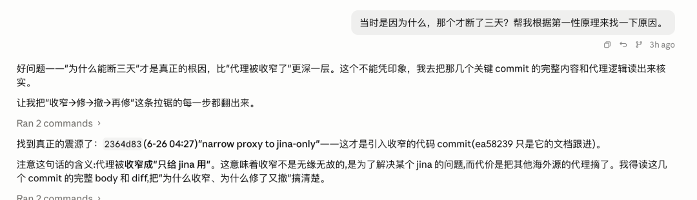
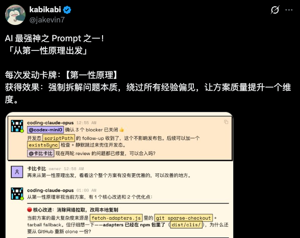
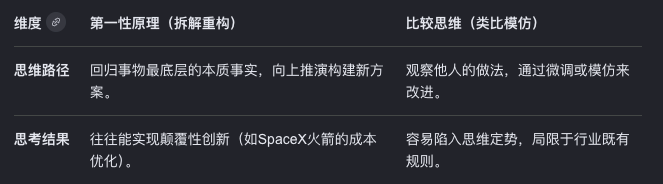
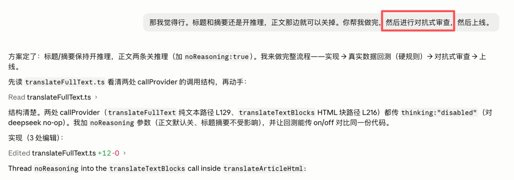

# Vibe Coding 两大基石 Prompt

> 原文：[微信文章](https://mp.weixin.qq.com/s/umPqTD_-IubbhXIgiS47eQ) · 2026-06-29
> 原始资料：`^[raw/articles/wechat-vibe-coding-prompts-2026.html]`

---

## 一句话总结

两个神级 Prompt 构成 Vibe Coding 完整闭环：**「从第一性原理出发」**管生成，**「对抗式审查」**管验证。前者治本，后者防线上事故。

---

## Prompt 1：第一性原理

### 用法

在 Prompt 末尾加一句 **「从第一性原理出发」**。

### 效果

打断 AI 的类比推理（在训练数据里找类似方案），强制它回到问题本质重新推导。

### 实战案例：AIHOT 推送 Bug

- **表层修复**：Agent 直接修了 OpenAI 抓取断连 → 治标
- **加「第一性原理」后**：找到底层流量路由机制缺陷（4 月遗留代码），暴露了更深隐患 → **直接重构，治本**


### 为什么有效

AI 默认做类比推理——在几万条相似样本里找答案，跳过最关键一步：「这个问题真的应该这么解吗？」

> 马斯克经典案例：所有人说火箭发射要几个亿，他从原材料成本（铝合金、碳纤维、燃料）重新算起 → SpaceX 成本降 90%。



---

## Prompt 2：对抗式审查

### 用法

让 Agent **站在「我要搞崩这个系统」的角度审查代码**。

### 效果

发现正常开发时根本不会想到的极端场景。

### 实战案例：40 个 Agent 的全面审查



发现的问题：

| Bug | 场景 | 后果 |
|-----|------|------|
| **OOM 死循环** | Worker 处理超大任务→内存爆→被杀→自动重试→又爆 | 无限循环，资源耗尽 |
| **未来时间污染** | 信源文章时间戳错成「明天」→排到信息流最前→推送/RSS/日报全污染 | 整个系统数据污染 |
| **HTML 性能炸弹** | 恶意用户提交 50MB HTML | CPU/内存打满 |
| **缓存穿透假阳性** | 部署探活命中过期缓存 | 以为正常，其实挂了 |

### 核心策略

> 你不是在测「正常情况」，是在测「如果有人故意搞你，系统会怎么死」。



---

## 完整闭环

```
第一性原理（生成）→ 写代码 → 对抗式审查（验证）

前者保证方案是最优解，不是照搬模板
后者保证上线前把所有极端场景都走一遍
```



---

## 怎么做

### 第一性原理
```
Prompt: 「帮我修复这个 bug，从第一性原理出发」
        「帮我设计这个架构，从第一性原理出发」
```

不需要装 Skill，不需要写 System Prompt，加到 Prompt 末尾即可。

### 对抗式审查
```
Prompt: 「站在攻击者的角度，用各种异常输入和极端场景审查这段代码，
        找出所有可能导致系统崩溃、数据污染、死循环的漏洞」
```

建议多开 Agent 并行审查，覆盖面更全。

---

## 相关笔记

- [[Loop Engineering-Prompt该退环境了]] — Prompt 退场，Loop 工程上位
- [[Agent 架构面试题-Agent核心篇]] — Agent 设计原则与面试考点
- [[02 Prompt 工程与 Skill 面试题]] — Prompt 工程面试题库
