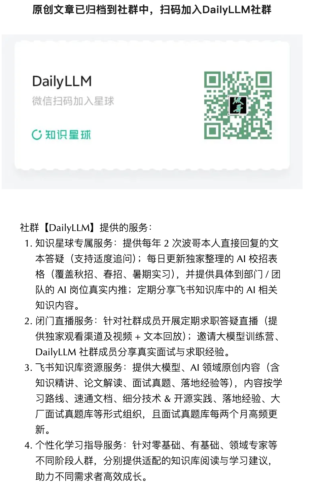

# 大模型算法岗面经 | Agent 项目拷打实录

> 原文: [微信文章](https://mp.weixin.qq.com/s/cgZnPtC3OmvAtWD5K768Ww)
>
> 面试官全程围绕简历上的多 Agent 项目展开，问得非常细，几乎每一个技术选型都要给出"为什么"。涉及具体业务和数字的部分做了脱敏。

---

## 一句话总结

手撕崩了，项目八股勉强招架。但事后复盘收获巨大——把这些点想清楚，下一场面试稳了一半。

---

## 面试节奏（约70分钟）

| 阶段 | 时长 | 内容 |
|------|------|------|
| 自我介绍 + 项目自述 | ~8 min | 挑一个最有代表性的项目讲 |
| 项目深挖 | ~35 min | 围绕多 Agent 项目反复追问，层层递进 |
| 基础八股穿插 | ~10 min | 从项目引申出的基础题 |
| 手撕代码 | ~15 min | 经典 DP 题 |
| 反问 | ~5 min | |

> 项目背景：多 Agent 协作的智能问答系统，6 个职责不同的子 Agent，带短期记忆和长期记忆，用 SFT + GRPO 做了对齐训练。

---

## 项目深挖：一连串"为什么"

### Q1：Agent 架构设计是为了解决什么问题？特定领域还是通用？

**面试官想听什么**：你是"为了用而用"，还是"为了解决问题而用"。

**核心框架**：问题 → 现有方案的不足 → 你的方案 → 代价

- **场景先行**：垂直领域复杂问答，用户查询多步、需外部工具、需跨文档检索
- **为什么需要 Agent**：任务可拆解，需规划→检索→推理→汇总多步流程，单 prompt 端到端做不好
- **为什么是多 Agent**：单 Agent 上下文堆积导致注意力衰减、指令遵循下降、工具误调；拆分后每个 Agent 的 prompt 更聚焦，且可以**异构**（有的强工具，有的强写作）
- **代价**：延迟变长、调度复杂、错误会传递放大。但在该场景下准确率提升远大于代价

> 💡 讲项目最忌"流水账"。用四段论：问题 → 不足 → 方案 → 代价。每段都要有数据或例子支撑。

---

### Q2：6 个 Agent 怎么保证彼此独立、不互相串职责？

非常工程化的问题，考察有没有真把系统跑通。

**五层保障**：

1. **Prompt 正反两面写**：既写"应该做什么"，也写"不应该做什么"。LLM 对 negative instruction 的遵循弱于 positive，所以要加例子
2. **工具权限隔离**：每个 Agent 在调度层只能看到授权的工具子集，从工程上堵死越权
3. **输入输出 Schema 强约束**：Agent 之间走结构化 JSON，字段不对就报错重试。用 pydantic 做校验
4. **统一编排**：子 Agent 不互相直接调用，由上层 Planner/Router 调度，避免环形依赖
5. **Critic Agent 兜底**：在关键节点加轻量校验 Agent，检查中间结果格式和合理性

**追问：Schema 校验失败怎么办？**
> 先自修（retry with error feedback）最多 2 次，失败再向上抛。「自修」对 GPT-4 级模型有效，对 7B 小模型基本无效，会陷入循环，所以要设上限。

> 💡 Schema 校验和 retry 策略是 Agent 工程的「暗坑」，简历写了 Agent 一定要准备这个细节。

---

### Q3：短期记忆为什么没用 Redis？

面试官熟悉主流 Agent 框架默认用 Redis，反过来问"为什么不用"。

| 维度 | 分析 |
|------|------|
| 场景层面 | 会话生命周期短（分钟级）、单机并发不高，Redis 运维复杂度收益不明显 |
| 性能层面 | 进程内存 + 轻量 LRU 读写延迟比 Redis 网络往返低一个数量级 |
| 灵活性 | 短期记忆有非字符串结构（嵌套中间结果、调用栈），Redis 要序列化反序列化，Python 对象更直接 |
| 诚实补充 | 多副本横向扩展时 Redis 是必选的，目前体量没到那个阶段 |

> 💡 面试官问"你为什么不用 X"，不要硬凹说 X 不好。要讲"在我的场景下 X 的优势没体现出来，而它的成本是真实的"，同时主动承认 X 的适用场景。

---

### Q4：上下文塞不下了，做了什么压缩策略？

三层策略：

1. **滑动窗口**：最近 N 轮对话保留原文
2. **滚动摘要**：超过窗口的早期对话，用轻量 LLM 做摘要替换原文
3. **重要信息提取**：用户的关键约束、偏好、已确认事实单独放在「事实区」，不参与压缩

**追问：摘要会丢信息吗？怎么评估？**

> 会丢。离线构造「长对话+正确答案」评测集，对比有摘要 vs 无摘要的回答准确率。

> 💡 补充「前向遗忘曲线」：摘要后的内容对**人称、时间、否定词**特别容易丢，所以摘要 prompt 要专门强调"保留时间、否定、约束条件"。

---

### Q5：记忆里存的是结构化文本，有多模态的吗？

**当前版本**：图表通过工具调用动态生成（返回图片 URL），URL 存记忆里。

**如果要支持原生多模态记忆**：
- **存储**：图片走对象存储，记忆里只存引用 + caption
- **检索**：caption 走文本召回，图片走 CLIP-like 多模态向量召回
- **注入上下文**：VLM 模型才能消费图片，否则用 caption 兜底

> 💡 「我没做过但要回答」的题，核心是展现技术视野。把"如果做，我会怎么做"讲清楚，比硬吹"我做过"安全得多。

---

### Q6：长期记忆的召回怎么保证高召回率？

RAG 八股核心题。四个层次：

1. **多路召回**：向量召回（语义）+ BM25（关键词）+ 元数据过滤（时间、用户、权限）
2. **Query 改写**：LLM 做 query rewrite / HyDE，把口语化问题改写成检索友好的形式
3. **Rerank**：多路召回的结果用 cross-encoder 精排
4. **Chunking 策略**：按语义单元切（段落、句子），加 overlap，避免关键信息被切碎

**追问：怎么评估召回率？**
> Recall@K 是底线（K=5/10/20），MRR 衡量质量。需要构造 query → 标注 ground truth doc id 的评测集。

> 💡 拉开差距的关键：讲评测！能说清楚 Recall@K、MRR、nDCG 区别，以及怎么构造评测集，立刻和"只会背 RAG 流程图"的同学拉开差距。

---

### Q7：为什么长期记忆和短期记忆用了不同的存储？

考察对架构设计「为什么」的理解。

| 维度 | 短期记忆 | 长期记忆 |
|------|----------|----------|
| 数据量 | KB ~ MB | GB ~ TB |
| 访问模式 | 全量读 | 检索式读 |
| 生命周期 | 会话级 | 跨会话持久 |
| 一致性 | 强 | 最终一致即可 |
| 数据形态 | 完整对话/中间状态 | 抽取/向量化的片段 |

> 核心结论：存储选型跟着访问模式走。短期记忆优化延迟，长期记忆优化召回，目标函数不同，自然方案不同。

---

### Q8：RL 用了 GRPO，为什么没用 DPO 或 PPO？

技术深度题，答不出来基本凉了一半。

| 方案 | 分析 |
|------|------|
| **GRPO vs PPO** | PPO 需要训练 value model（critic），显存和工程开销大；GRPO 用 group 内相对 reward 替代 critic，省一个模型，Agent 这类 rollout 长、样本贵的场景性价比高 |
| **GRPO vs DPO** | DPO 是 offline 的，需预先准备 (chosen, rejected) 偏好对；Agent 多步决策的偏好对构造极其困难（credit assignment 问题严重）。GRPO 是 online 的，直接用 Verifier 给 reward，更适合多步任务 |
| **GRPO 代价** | 训练不稳定时调参痛苦，reward 设计是最大 bug 来源（reward hacking） |
| **工程角度** | DeepSeek-R1 之后 GRPO 在推理类任务上的有效性被广泛复现，生态成熟 |

---

### Q9：6 个子 Agent 是同一个底座模型吗？

- 是**同一个底座模型**（参数共享），不同 Agent 通过不同 system prompt + 工具列表区分
- **训练两阶段**：
  1. **SFT 冷启动**：高质量 (任务, 工具调用轨迹) 数据，让模型学会格式
  2. **GRPO 强化**：基于奖励信号优化多步决策质量

---

### Q10：Agent 之间的通信协议怎么设计？

结构化 JSON 协议，字段包括：
- `from_agent` / `to_agent`
- `task_id` 追踪链路
- `payload` 携带中间结果
- `status` / `error` 错误传递

关键设计：状态机（FSM）管理 Agent 间流转，Planner 根据中间产出动态调整后续调度。

---

### Q11：部署时遇到了哪些坑？

1. **长对话 OOM**：上下文 token 暴涨 → 压缩策略
2. **工具调用超时**：外部 API 不稳定 → 超时 + 重试 + 降级
3. **Agent 循环**：两个 Agent 互相纠正形成死循环 → 最大轮次限制
4. **模型幻觉导致错误传递**：一个 Agent 编造结果传给下一个 → Critic Agent 拦截

---

### Q12：如果要重新设计这个系统，你会改什么？

1. **从 rule-based router 到 LLM-based router**：更灵活但延迟更高，需要权衡
2. **引入 Human-in-the-loop**：关键决策点让人确认
3. **工具即服务**：把工具独立部署，Agent 通过 API 调用而非进程内调用
4. **可观测性**：加上完整的 trace + metric + log，方便排查 Agent 链路的瓶颈

---

---

## 核心复盘总结

### 面试红线 🚫
- 讲项目最忌流水账，要先讲场景再讲技术
- 不要硬凹"某个技术不好"，要讲"在我的场景下不适合"
- 没做过的事不要硬吹，把"如果做会怎么做"讲清楚即可

### 加分项 ✨
- 每个技术决策都能讲出「为什么」和「代价」
- Schema 校验 + retry 策略的工程细节
- 评测指标（Recall@K、MRR、nDCG）不止会背，还会构造评测集
- 对 GRPO/DPO/PPO 的技术差异有清晰认知

### 必准备清单 📋
- [ ] 自己的项目用「四段论」过一遍
- [ ] Agent 的 Schema 校验和 retry 策略
- [ ] 记忆管理的压缩策略和评估方法
- [ ] RAG 的召回评估体系
- [ ] RL 算法选型的 rationale
- [ ] 部署踩坑和可观测性方案

---

## 相关笔记

- [[腾讯AI Agent后端开发一面]] — 后端开发岗面试题（45道）
- [[AI Agent 面试题与答案]] — 面试题答案详解
