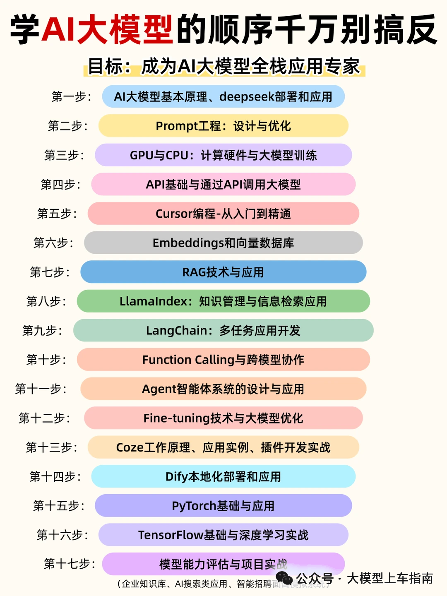

# 腾讯AI Agent后端开发一面

> 原文: [微信文章](https://mp.weixin.qq.com/s/XWBa1X-iLt7pOc-w4CLgvA)

---

## 面试问题整理版

### Agent 相关

1. 先做自我介绍，然后简单讲一下自己做过的 Agent 项目。
2. Agent 项目有没有真正上线？如果上线了，整体部署方式是怎样的？
3. 项目里有没有用到现成框架，比如 `LangChain` 或 `LangGraph`？
4. 你怎么理解 Agent？它和普通 LLM 应用最大的区别是什么？
5. Agent 常见的工作模式有哪些，比如 `ReAct`、`Plan and Execute` 这类？
6. 你的项目里有没有用到 `ReAct`？具体是怎么落地的？
7. 意图识别模块是怎么做的？
8. 项目里有哪些工具？这些工具是怎么注册、管理和调用的？
9. 工具调用时，怎么保证参数提取得准？
10. 如果工具调用经常出错，你会怎么提升正确率？
11. `Function calling`、工具调用和普通 Prompt 调用有什么区别？
12. 你们有没有用 `MCP`？为什么要把 `OAuth 2.1` 接到 `MCP` 里？
13. 项目一里最难的点是什么？最后怎么解决的？
14. 做代码重构的时候，你是怎么用 AI 辅助的？
15. 你怎么看 Agent 后续的发展？哪些场景你觉得更容易落地？

### RAG / 知识库

16. 知识库是怎么搭的？从文档接入到检索的大致流程是什么？
17. 文档分块策略是怎么设计的？
18. 如果用户上传的是表格或图片，你们怎么解析里面的信息？
19. `embedding` 模型是怎么选型的？主要看哪些指标？
20. RAG 项目里，`MySQL` 和 `Elasticsearch` 的数据一致性怎么保证？
21. 手动干预切片是怎么做的？为什么需要这一步？
22. 讲一下你的召回和重排策略。
23. 做知识检索时，怎么提高模型最终回答的准确率？
24. RAG 里怎么处理 `lost in the middle` 问题？
25. 怎么控制模型幻觉？如果从 RAG、Prompt 和输出约束几个角度拆，你会怎么做？

### 系统设计 / 工程

26. 系统里多租户隔离是怎么实现的？
27. `SSE` 流式输出时，如果用户中途关掉浏览器，怎么保留已经输出的内容？后续还能不能恢复？
28. 如果要提升模型响应速度，你会从哪些地方优化？
29. 单看 Prompt 层面，有哪些办法能让模型回答更快、更稳定？
30. 一个比较完整的 Prompt 通常会包含哪些部分？
31. `token` 和字符有什么区别？
32. 你平时用哪些 AI 工具比较多？简单对比一下它们的差异。
33. 你觉得一个 Skill 写得好不好，应该看哪些标准？
34. 介绍一下 LangChain 和 LangGraph，它们分别适合什么场景？
35. 了解 Kubernetes 吗？项目里有没有实际用到？

### 基础

36. Java 线程池有哪些核心参数？
37. 进程、线程、协程有什么区别？
38. 什么场景下，协程会比线程更有优势？
39. 讲一下 HashMap 的底层原理。

### 手撕

40. 手撕题：给一个 int 数组，判断它排序之后能不能组成等差数列。

### 反问

41. 反问：部门主要做什么业务？
42. 反问：消费者 C 端里有哪些功能和 AI 应用研发相关？
43. 反问：会不会做类似千问点外卖里的子 Agent 这类功能？
44. 反问：后台系统后面会不会从传统 GUI 转成对话式交互？
45. 反问：对我后续学习有什么建议？面试官建议多了解一些 AI 主流框架。

---

## 相关笔记

- [[AI Agent 面试题与答案]]
