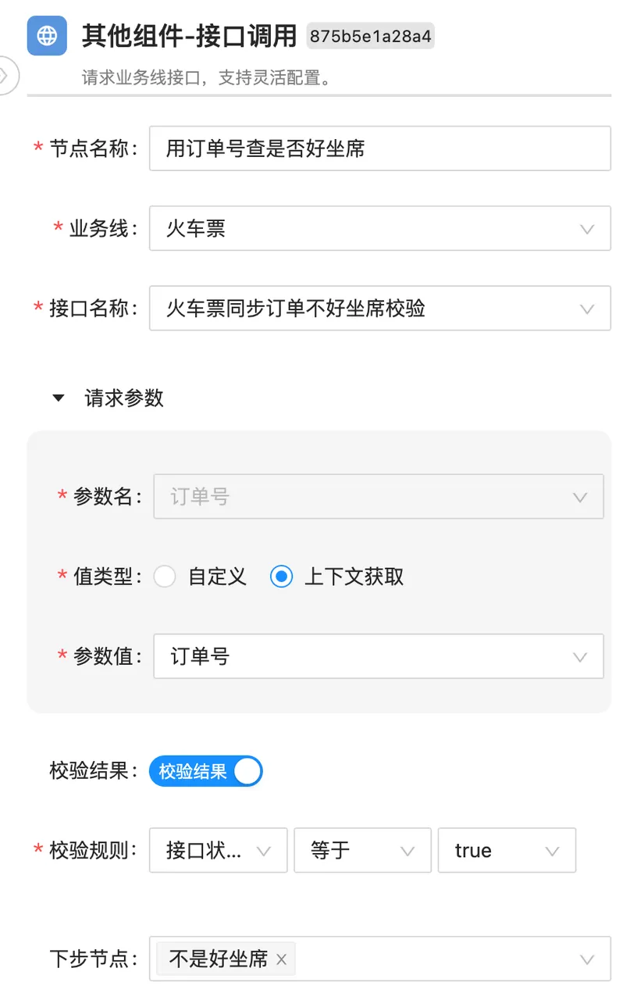
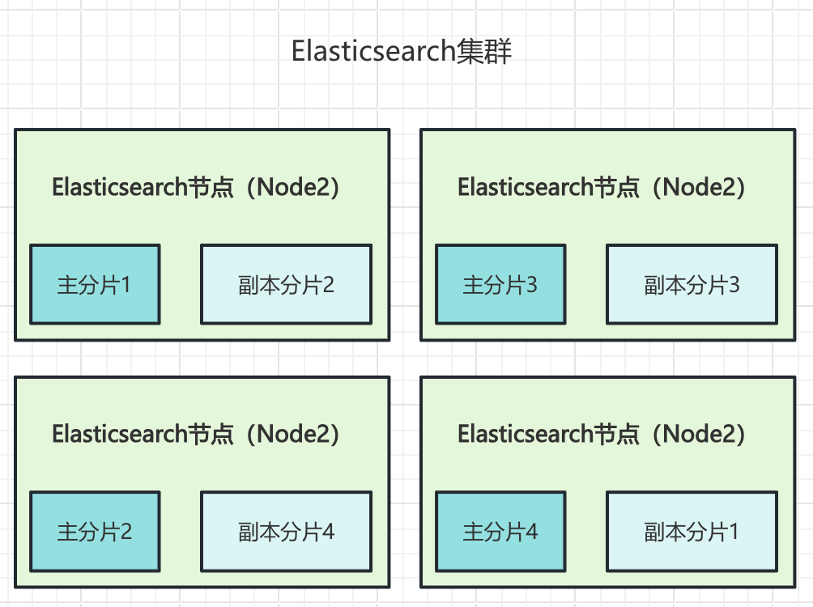
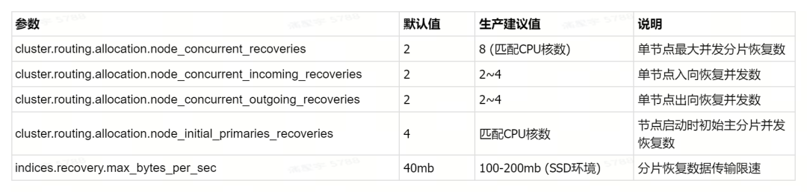
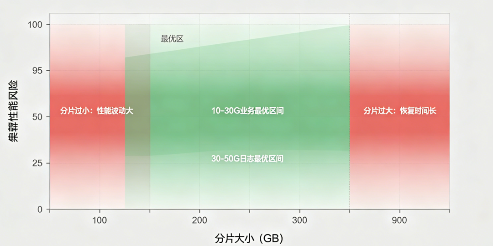
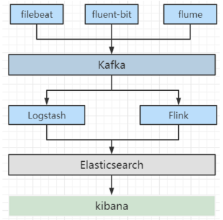
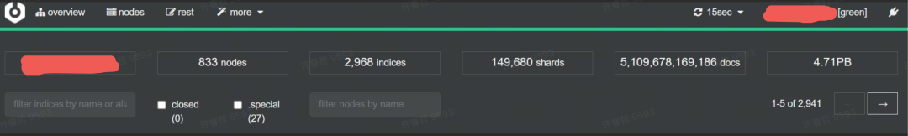
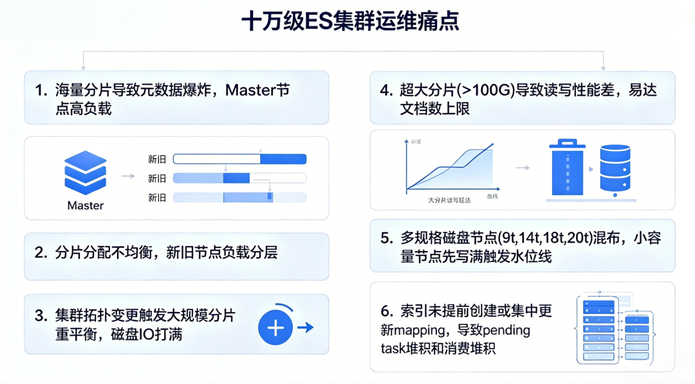
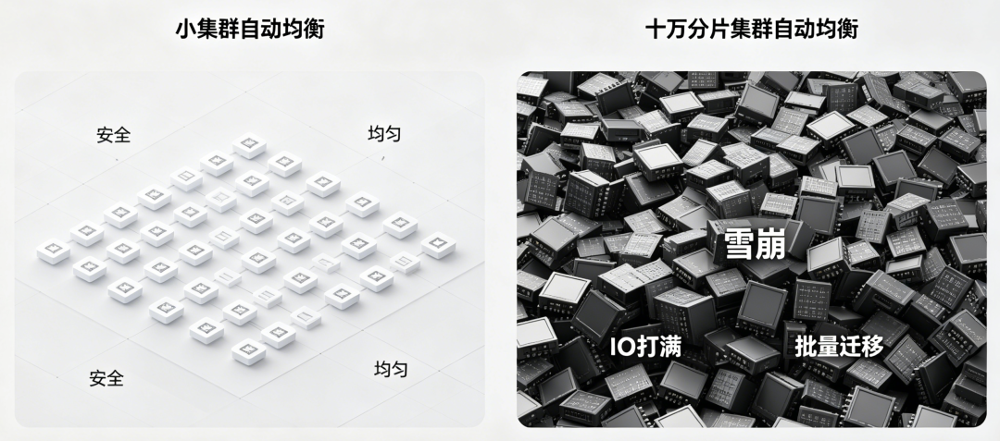
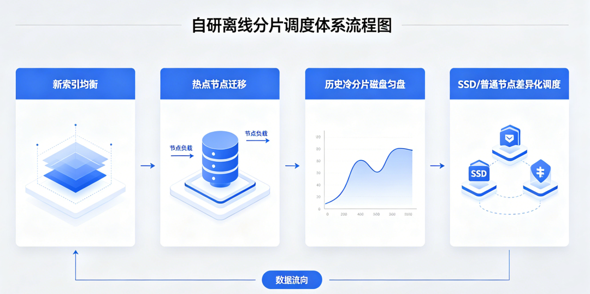
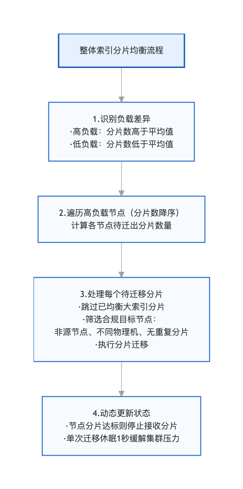

# ES 分片运维实战：从原理到十万级分片治理

> 原文: [微信文章](https://mp.weixin.qq.com/s/YxRGwfHImAI8hO5Xf499tA)
> 作者: 许睿哲，去哪儿网数据平台

---

## 一、核心痛点

集群稳定性问题、性能瓶颈、扩容故障，核心集中在三点：
1. 分片规划不合理
2. 分片恢复参数默认化
3. 重平衡机制不熟悉

---

## 二、分片管理核心原理

### 主分片 vs 副本分片

| | 主分片 (Primary) | 副本分片 (Replica) |
|---|:--:|:--:|
| 职责 | 写操作唯一执行者 | 数据备份 + 分担读压力 |
| 写入 | ✅ | ❌ 不参与写 |
| 容灾 | 挂了副本晋升 | 自动接管 |
| 可修改 | ❌ 创建后不可改 | ✅ 可增减 |

> 生产环境**禁止 0 副本**，有丢数据风险。主分片数规划失误只能 Reindex。

### 分片分配核心原则

- **同分片不同节点**：主分片和副本绝不会在同一节点
- **负载优先**：自动倾向低负载节点
- **整体均衡**：自动调整各节点分片数

> ⚠️ ES 自带策略不一定最优。日志集群新增节点后，次日索引大量分片倾斜给新节点，需人工干预。

### 分片状态速查

| 状态 | 含义 |
|------|------|
| STARTED | 正常运行 |
| UNASSIGNED | 未分配，异常，需排查 |
| INITIALIZING | 正在初始化 |
| RECOVERING | 正在从其他节点同步 |
| RELOCATED | 跨节点迁移中 |

---

## 三、分片恢复调优

### 核心参数（生产建议值）

```json
PUT /_cluster/settings
{
  "persistent": {
    "cluster.routing.allocation.node_concurrent_recoveries": 8,
    "cluster.routing.allocation.node_concurrent_incoming_recoveries": 8,
    "cluster.routing.allocation.node_concurrent_outgoing_recoveries": 8,
    "cluster.routing.allocation.node_initial_primaries_recoveries": 8,
    "indices.recovery.max_bytes_per_sec": "200mb"
  }
}
```

> `transient` 覆盖 `persistent`，但重启后丢失。修改前确认两者不冲突。

### 监控命令

```bash
# 分片恢复进度
GET /_cat/recovery?v=true&h=i,s,t,ty,shost,thost,f,fp,b,bp

# 集群健康
GET /_cluster/health

# 节点负载
GET /_cat/nodes?v&h=name,diskUsed,diskAvail,heapUsed,heapMax
```

---

## 四、分片重平衡

集群拓扑变化时 ES 自动执行跨节点分片迁移。

> ⚠️ 十万级大集群的自动重平衡往往是故障根源。建议：
> - 大集群关闭自动平衡，改为维护窗口手动触发
> - 控制并发迁移数，避免带宽/磁盘打满

---

## 五、分片策略最佳实践

### 分片数量规划

| 数据量/节点 | 单分片大小 | 总分片数 |
|-------------|-----------|----------|
| 日志类（大吞吐） | 30-50 GB | ≤ 节点数 × 20 |
| 搜索类（低延迟） | 10-30 GB | ≤ 节点数 × 10 |
| 时序类 | 20-40 GB | 随天数增长 |

**硬限制**：单节点分片数 ≤ 1000（堆内存限制）。

### 索引生命周期

```
Hot（SSD, 多副本）→ Warm（HDD, 1副本）→ Cold（冻结）→ Delete
```

---

## 六、高频运维命令

```bash
# 查看分片分布
GET /_cat/shards?v&h=index,shard,prirep,state,node,store

# 查看未分配原因
GET /_cat/shards?v&h=index,shard,prirep,state,unassigned.reason

# 手动移动分片
POST /_cluster/reroute
{
  "commands": [{
    "move": {
      "index": "my-index", "shard": 0,
      "from_node": "node-1", "to_node": "node-2"
    }
  }]
}

# 强制分配未分配分片（慎用）
POST /_cluster/reroute?retry_failed=true

# 关闭/开启分片分配（维护时用）
PUT /_cluster/settings
{ "transient": { "cluster.routing.allocation.enable": "none" } }
```

---

## 七、总结

| 要点 | 建议 |
|------|------|
| 分片规划 | 单分片 10-50GB，提前评估增长 |
| 副本策略 | 生产至少 1 副本，关键业务 2 副本 |
| 恢复调优 | 别用默认值，按集群规模调整 |
| 重平衡 | 大集群维护窗口手动触发 |
| 监控 | recovery 进度 + 节点负载 + 磁盘 |

---

## 插图























## 相关笔记

- [[K8s PVC 绑定 PV 全过程]]
- [[Prometheus 监控全流程实战]]
