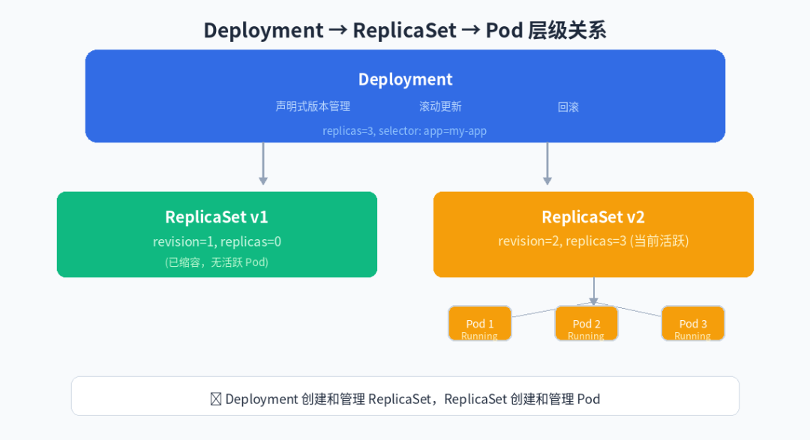
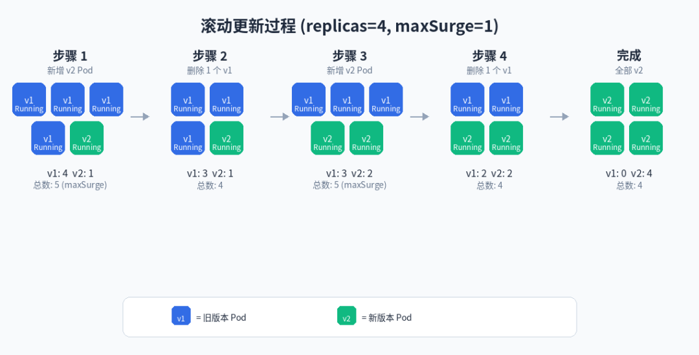
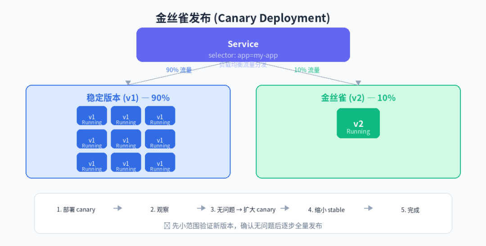

# K8s Deployment 实战指南

> 原文: [微信文章](https://mp.weixin.qq.com/s/xxhZ38HOyj-Ru6kjshW3MQ)

---

## 为什么需要 Deployment？

| 手动管理 Pod | Deployment |
|-------------|------------|
| 无自愈 | ✅ 自动重启 |
| 更新难 | ✅ 滚动更新 |
| 无法回滚 | ✅ 一键回滚 |
| 手动扩缩容 | ✅ HPA 自动 |
| 无滚动更新 | ✅ 零停机 |

**层级关系**：`Deployment → ReplicaSet → Pod`

- Deployment：版本管理 / 回滚 / 滚动更新
- ReplicaSet：副本数 + 自愈
- Pod：实际运行容器



---

## 最小可用的 Deployment

```yaml
apiVersion: apps/v1
kind: Deployment
metadata:
  name: nginx-deployment
  labels:
    app: nginx
spec:
  replicas: 3
  selector:
    matchLabels:
      app: nginx           # ⚠️ 必须匹配 template.labels
  template:
    metadata:
      labels:
        app: nginx
    spec:
      containers:
      - name: nginx
        image: nginx:1.25
        ports:
        - containerPort: 80
```

> ⚠️ `selector.matchLabels` 必须和 `template.metadata.labels` 完全匹配。

---

## 滚动更新

修改 `spec.template` 时逐步替换：先创建新 Pod → 就绪后 → 销毁旧 Pod。

```
replicas=4, maxSurge=1, maxUnavailable=0

初始:  v1 v1 v1 v1
步骤1: v1 v1 v1 v1 v2    ← 多创建1个v2
步骤2: v1 v1 v1 v2       ← v2就绪，删1个v1
...
最终:  v2 v2 v2 v2
```



> 只有修改 `spec.template` 才触发更新。改 `replicas` 不触发。

| 参数 | 含义 | 默认值 |
|------|------|--------|
| `maxSurge` | 允许超出期望数的 Pod 数 | 25% |
| `maxUnavailable` | 允许不可用的 Pod 数 | 25% |

`maxSurge=1, maxUnavailable=0` → 最稳妥，零停机。两者不能同时为 0。

---

## 回滚

```bash
kubectl rollout history deployment/nginx-deployment          # 查看历史
kubectl rollout undo deployment/nginx-deployment             # 回滚上一版本
kubectl rollout undo deployment/nginx-deployment --to-revision=1  # 指定版本
```

**回滚本质**：复用之前保留的 ReplicaSet — 把旧的扩回来，新的缩回去。

```bash
kubectl annotate deployment --record    # 推荐：记录变更原因
```

`revisionHistoryLimit`（默认 10）控制保留历史版本数。

---

## 暂停与恢复

需要批量修改时避免多次触发滚动更新：

```bash
kubectl rollout pause deployment/nginx-deployment    # 1. 暂停

kubectl set image deployment/nginx-deployment nginx=nginx:1.26
kubectl set resources deployment/nginx-deployment -c=nginx --requests=cpu=100m

kubectl rollout resume deployment/nginx-deployment   # 3. 一次性触发
```

> ⚠️ 别忘恢复！暂停后所有更新都不生效。

---

## HPA 自动扩缩容

```yaml
apiVersion: autoscaling/v2
kind: HorizontalPodAutoscaler
metadata:
  name: nginx-hpa
spec:
  scaleTargetRef:
    kind: Deployment
    name: nginx-deployment
  minReplicas: 2
  maxReplicas: 10
  metrics:
  - type: Resource
    resource:
      name: cpu
      target:
        type: Utilization
        averageUtilization: 70
```

> ⚠️ HPA 不工作最常见原因：Pod 没设 `resources.requests`。

---

## 金丝雀发布

两个 Deployment + 一个 Service：

```
Service selector: app: my-app
  ├── app-stable × 9 (v1) → 90% 流量
  └── app-canary × 1 (v2) → 10% 流量

没问题 → canary 扩到 10，stable 缩到 0
```

---

## 生产必备配置

### 健康检查

```yaml
livenessProbe:                # 挂了自动重启
  httpGet:
    path: /healthz
    port: 8080
  initialDelaySeconds: 15
  failureThreshold: 3

readinessProbe:               # 没准备好不接流量
  httpGet:
    path: /ready
    port: 8080
  initialDelaySeconds: 5
  periodSeconds: 5
```

> readinessProbe 直接影响滚动更新：新 Pod 探针通过后才接流量，旧 Pod 才删除。探针不过 → 更新卡住。



### 推荐策略

```yaml
spec:
  strategy:
    type: RollingUpdate
    rollingUpdate:
      maxSurge: 1
      maxUnavailable: 0          # 零停机
  minReadySeconds: 10            # 防止"假就绪"
  revisionHistoryLimit: 5
  progressDeadlineSeconds: 300
```

---

## 排障速查

| 原因 | 排查 | 解决 |
|------|------|------|
| 镜像拉取失败 | ImagePullBackOff | 检查镜像名/标签 |
| readinessProbe 失败 | describe pod Events | 修正探针 |
| 资源不足 | describe node | 扩容或降低 requests |
| PDB 阻止 | kubectl get pdb | 调整 PDB |

```bash
kubectl rollout status deployment/<name>    # 更新状态
kubectl rollout history deployment/<name>   # 更新历史
kubectl rollout undo deployment/<name>      # 回滚
kubectl rollout restart deployment/<name>   # 强制重启
```

> ⚠️ 不要用 `latest` 标签！默认 Always 拉取，无法区分版本。

---

## 核心口诀

```
Deployment 管 ReplicaSet，ReplicaSet 管 Pod。
改模板触发更新，改副本只扩缩。
出了问题能回滚，暂停改完再恢复。
```

---

## 资源管理：requests/limits/QoS 与 OOM 避坑

> 补充来源: [微信文章](https://mp.weixin.qq.com/s/Uvryq7lNIH2x-dnHwExqaw)

### requests vs limits

| 参数 | 作用 | 谁管 |
|------|------|------|
| **requests** | 调度依据，决定 Pod 能否放上节点 | Kube-scheduler |
| **limits** | 运行时上限，超内存杀、超 CPU 限流 | 内核 CFS / OOM Killer |

```yaml
resources:
  requests:
    cpu: "500m"       # 调度需要 0.5 核
    memory: "256Mi"   # 调度需要 256 MiB
  limits:
    cpu: "1"          # 最多 1 核，超了限流
    memory: "512Mi"   # 最多 512 MiB，超了 OOM Kill
```

> ⚠️ 只设 limits 不设 requests → K8s 自动把 requests 补成 limits，资源被白白占着。**显式同时写两者。**

---

### QoS 三种等级

K8s 根据 requests/limits 自动计算，资源紧张时驱逐顺序：**BestEffort → Burstable → Guaranteed**

| 等级 | 条件 | 驱逐优先级 |
|------|------|:--:|
| **Guaranteed** | 每个容器 requests == limits | 最低（最后被踢） |
| **Burstable** | 有 requests 且 requests < limits | 中等 |
| **BestEffort** | 没有任何 requests/limits | 最高（第一批被踢） |

```bash
kubectl get pod <name> -o json | jq .status.qosClass
```

> 数据库/API Gateway → Guaranteed；普通微服务 → Burstable；测试/批处理 → BestEffort。

---

### CPU 限流陷阱

**Prometheus 显示 CPU 才 20%，响应时间却忽高忽低？**

根因：CFS 配额按 100ms 周期分配。CPU limit = 1 Core = 每周期 100ms。并行线程瞬间烧光配额 → throttling → 毫秒级延迟尖刺。

**排查**：
```promql
rate(container_cpu_cfs_throttled_seconds_total[5m])
```

---

### 生产环境推荐配置

| 服务类型 | requests | limits | QoS |
|----------|----------|--------|-----|
| 数据库 | cpu:1, mem:2Gi | cpu:1, mem:2Gi | Guaranteed |
| API 网关 | cpu:500m, mem:512Mi | cpu:1, mem:1Gi | Burstable |
| 普通微服务 | cpu:200m, mem:256Mi | cpu:500m, mem:512Mi | Burstable |
| 批处理/日志 | 不设 | 不设 | BestEffort |

**关键建议**：
- 生产环境**必须设 requests/limits**
- JVM 应用：`-Xmx` 必须 < memory limit（留堆外内存空间）
- CPU limit 适当宽松（或干脆不设 CPU limit，只设 request）

---

## 相关笔记

- [[Kubernetes 学习]]
- [[kubectl 常用管理命令速查]]
- [[K8s PVC 绑定 PV 全过程]]
