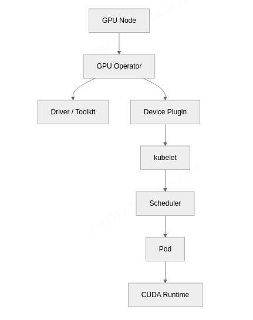
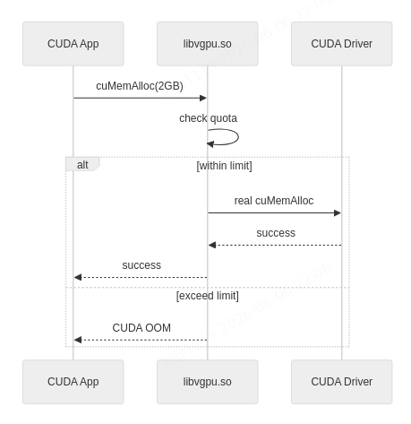

# K8s GPU 虚拟化落地全链路

> 原文: [微信文章](https://mp.weixin.qq.com/s/xTctA75eOjzcu2iVSc2Ksw)

---

## 原生 K8s 的 GPU 痛点

K8s 原生 GPU 管理只能按**整卡分配**：
```yaml
resources:
  limits:
    nvidia.com/gpu: 1   # 只能按整卡申请
```

一台 8×A100 的机器，K8s 看到的是 `nvidia.com/gpu=8`，不是 `gpu-memory=640GB`。一个推理服务哪怕只用 2GB 显存，剩下 78GB 对 K8s 也是"不可用"。

**核心目标**：让调度器理解显存和算力，并在运行时限制住它们。

---

## GPU Operator：铺路，不切卡

GPU Operator 托管节点软件栈：

| 组件 | 作用 |
|------|------|
| NVIDIA Driver | GPU 驱动 |
| nvidia-container-toolkit | 容器访问 GPU |
| device-plugin | 注册 GPU 资源 |
| DCGM Exporter | GPU 监控 |
| MIG Manager | MIG 实例管理 |
| NFD | 标记 GPU 节点能力 |

> 解决的是 GPU 节点 Day-0/Day-1 运维问题。**真正的显存切分需要 MIG/MPS/HAMi。**

---

## 三种方案对比

| 方案 | 切分方式 | 隔离性 | 支持硬件 | 场景 |
|------|----------|:--:|------|------|
| **MIG** | 硬件级切分 | 强 | A100/A30/H100 | 在线推理、多租户 |
| **MPS** | 多进程共享上下文 | 弱 | 多数 NVIDIA GPU | 单租户高并发 |
| **HAMi** | 软件虚拟化+调度扩展 | 中 | NVIDIA/AMD/寒武纪等 | 开发环境、混部 |

---

## MIG（Multi-Instance GPU）

硬件级将一张 GPU 切成多个独立实例，每个实例有独立显存、缓存和算力。

```bash
# 查看 MIG 能力
nvidia-smi mig -lgip
# 创建 MIG 实例
nvidia-smi mig -cgi 9,9,9 -C     # 3 个 1g.5gb 实例
```

```yaml
# Pod 申请 MIG 实例
resources:
  limits:
    nvidia.com/mig-1g.5gb: 1
```

优点：强隔离、独立显存；缺点：仅新架构 GPU、静态切分不灵活。

---

## MPS（Multi-Process Service）

多个进程共享同一 GPU 上下文，消除上下文切换开销。

```bash
# 启动 MPS
nvidia-cuda-mps-control -d
```

优点：提升单卡并发利用率（多进程共用）；缺点：弱隔离、进程崩溃影响全局。

---

## HAMi（异构算力虚拟化中间件）

软件层虚拟化，接在 device-plugin 和调度器之间：

- 显存限制：容器内 `CUDA_VISIBLE_DEVICES` + 显存配额
- 算力限制：劫持 CUDA API，按比例限速
- 调度扩展：自定义资源 `nvidia.com/vgpu-memory`、`nvidia.com/vgpu-cores`

```yaml
resources:
  limits:
    nvidia.com/vgpu-memory: 8000   # 8GB 显存
    nvidia.com/vgpu-cores: 30      # 30% 算力
```

优点：跨厂商（NVIDIA/AMD/寒武纪）、灵活配额；缺点：软件层隔离不如 MIG。

---

## 与商业方案对比

| 方案 | MIG | HAMi | qGPU/cGPU |
|------|:--:|:--:|:--:|
| 隔离性 | ⭐⭐⭐ | ⭐⭐ | ⭐⭐⭐ |
| 灵活性 | ⭐ | ⭐⭐⭐ | ⭐⭐ |
| 硬件要求 | A100+ | 不限 | NVIDIA 特定 |
| 成本 | 免费 | 开源 | 商业授权 |

---

## 落地建议

| 场景 | 推荐方案 |
|------|----------|
| 生产推理、多租户强隔离 | MIG |
| 开发环境、Jupyter、混部 | HAMi |
| 单租户高并发（如批推理） | MPS |
| GPU 节点 Day-0 运维 | GPU Operator |
| 监控/可观测 | DCGM Exporter + Prometheus |

---

## 插图





## 相关笔记

- [[K8s Deployment 实战指南]]
- [[K8s PVC 绑定 PV 全过程]]
- [[K8s网络 CNI规范 Flannel Calico原理]]
