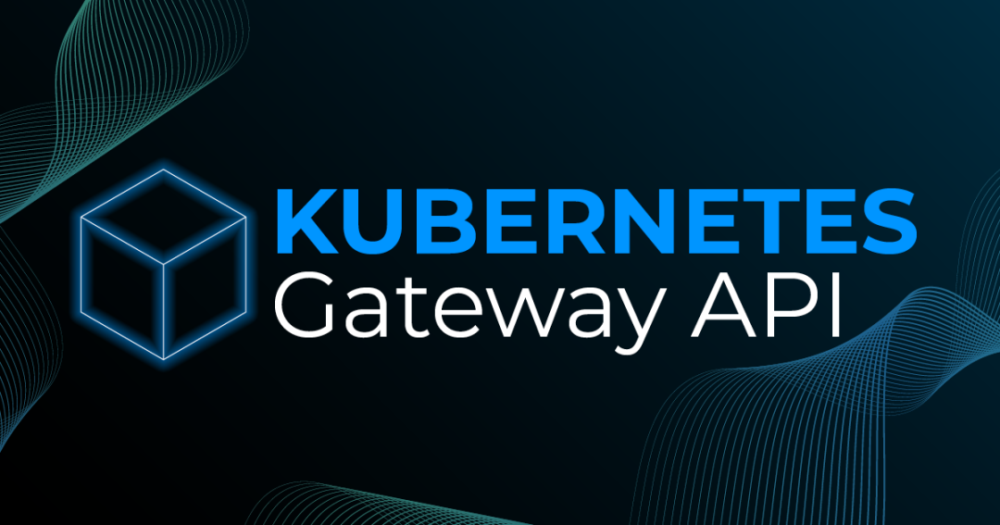

# Kubernetes Gateway API 完全指南

> 原文: [微信文章](https://mp.weixin.qq.com/s/t8kSMyjp_3aCUtda_mve7w)
> 作者: 小陈运维

Gateway API 是 Ingress 的演进版本，由 SIG-NETWORK 社区维护，解决 Ingress 在表达能力、扩展性和标准化方面的局限。

---

## 为什么需要 Gateway API？

| Ingress 局限 | Gateway API 优势 |
|-------------|-----------------|
| 仅支持 HTTP/HTTPS | 原生支持 HTTP、HTTPS、TCP、UDP、gRPC、TLS |
| 注解不兼容（厂商锁定） | 标准 CRD，跨厂商一致 |
| 复杂路由难以实现 | 权重分配、流量镜像、Header/Query 匹配 |
| 角色分离不清 | 三层模型：基础设施 → 集群运维 → 应用开发者 |

---

## 核心资源对象

### 1. GatewayClass（集群级）

定义网关实现类型，由基础设施提供商创建。

```yaml
apiVersion: gateway.networking.k8s.io/v1
kind: GatewayClass
metadata:
  name: nginx-gateway-class
spec:
  controllerName: gateway.networking.k8s.io/nginx-ingress-controller
```

### 2. Gateway（命名空间级）

负载均衡器实例，配置监听器、TLS 等。

```yaml
apiVersion: gateway.networking.k8s.io/v1
kind: Gateway
metadata:
  name: production-gateway
spec:
  gatewayClassName: nginx-gateway-class
  listeners:
    - name: http
      port: 80
      protocol: HTTP
      allowedRoutes:
        namespaces:
          from: All
    - name: https
      port: 443
      protocol: HTTPS
      tls:
        mode: Terminate
        certificateRefs:
          - name: tls-secret
```

### 3. HTTPRoute

最常用的路由类型，支持路径、Header、Query 匹配。

```yaml
apiVersion: gateway.networking.k8s.io/v1
kind: HTTPRoute
metadata:
  name: web-app-route
spec:
  parentRefs:
    - name: production-gateway
  hostnames: ["app.example.com"]
  rules:
    - matches:
        - path:
            type: PathPrefix
            value: /api
      backendRefs:
        - name: api-service
          port: 8080
          weight: 90
        - name: api-service-v2
          port: 8080
          weight: 10
```

### 4. 其他路由类型

| 资源 | 用途 |
|------|------|
| TCPRoute | TCP 流量（数据库、消息队列） |
| TLSRoute | TLS Passthrough |
| UDPRoute | UDP 流量（DNS、游戏） |
| GRPCRoute | gRPC 方法/元数据匹配 |
| ReferenceGrant | 跨命名空间引用授权 |

---

## 架构原理

```
用户 → API Server → Gateway Controller → 数据平面（Envoy/Nginx）
  ↓        ↓              ↓                    ↓
创建资源  存储CRD      监听+生成配置          代理流量
```

- **控制平面**：Gateway Controller 监听 CRD 变化，转换为数据平面配置
- **数据平面**：Envoy/Nginx/HAProxy 等实际处理流量
- **状态反馈**：每个资源有详细 Status（Accepted/Programmed/Ready）



---

## 实践指南（Envoy Gateway）

### 部署 MetalLB

```bash
kubectl apply -f https://raw.githubusercontent.com/metallb/metallb/v0.15.3/config/manifests/metallb-native.yaml
```

配置 IP 地址池：

```yaml
apiVersion: metallb.io/v1beta1
kind: IPAddressPool
metadata:
  name: first-pool
  namespace: metallb-system
spec:
  addresses:
    - 192.168.1.15-192.168.1.19
```

### 安装 Envoy Gateway

```bash
helm install eg oci://docker.io/envoyproxy/gateway-helm \
  --version v1.7.3 -n envoy-gateway-system --create-namespace
```

### 部署示例应用

```bash
# 两个版本的后端
kubectl apply -f demo-app.yaml    # web-app-v1 + web-app-v2
```

### 配置基本路由

```bash
kubectl create namespace web-app
kubectl apply -f gateway.yaml
kubectl apply -f httproute-basic.yaml
```

测试：
```bash
curl -H "Host: app.example.com" http://192.168.1.16
```

---

## 高级路由

### 流量分割（金丝雀发布）

```yaml
backendRefs:
  - name: web-app-v1
    weight: 90
  - name: web-app-v2
    weight: 10
```

### 基于 Header 的路由

```yaml
rules:
  - matches:
      - headers:
          - name: x-version
            value: v2
    backendRefs:
      - name: web-app-v2
```

### URL 重写

```yaml
filters:
  - type: URLRewrite
    urlRewrite:
      path:
        type: ReplacePrefixMatch
        replacePrefixMatch: /
```

### 请求/响应头修改

```yaml
filters:
  - type: RequestHeaderModifier
    requestHeaderModifier:
      add:
        - name: X-Forwarded-Gateway
          value: "nginx-gateway"
  - type: ResponseHeaderModifier
    responseHeaderModifier:
      add:
        - name: X-Powered-By
          value: "Gateway-API"
```

---

## 最佳实践

### 安全
- RBAC 限制：应用团队只能管理 Route，不能改 Gateway
- ReferenceGrant 控制跨命名空间访问
- TLS 证书用 cert-manager 自动管理

### 性能
- 限制 `allowedRoutes` 来源减少配置复杂度
- 合并相似路由规则，减少配置数量

### 发布策略

| 策略 | 做法 |
|------|------|
| 金丝雀 | 5%→25%→50%→100% 逐步切流 |
| 蓝绿 | 快速切换权重：100%→0→100% |
| A/B 测试 | 各 50% 权重对比效果 |

---

## 故障排查

### Gateway 状态 Not Accepted

```bash
kubectl get gatewayclass
kubectl get pods -n <controller-namespace>
kubectl describe gateway <name>
```

### HTTPRoute 未被接受

```bash
kubectl describe gateway <gateway-name>     # 检查 allowedRoutes
kubectl get svc <backend-service-name>      # 后端是否存在
kubectl get referencegrant -A               # 跨命名空间授权
```

### 流量未正确路由

```bash
kubectl run test --rm -i --tty --image=curlimages/curl -- \
  curl http://<service>.<namespace>.svc.cluster.local
curl -v -H "Host: <hostname>" http://<gateway-ip>/<path>
```

---

## FAQ

| 问题 | 答案 |
|------|------|
| 和 Ingress 共存吗？ | 可以，逐步迁移 |
| 如何选 Controller？ | 通用→Envoy/NGINX；服务网格→Istio；简单→Contour |
| WebSocket 支持？ | HTTPRoute 天然支持，无需额外配置 |
| 如何迁移 Ingress？ | 用 `ingress2gateway` 工具转换 |
| 最低 K8s 版本？ | v1.22+，推荐最新稳定版 |

---

## 常见场景

- **多域名托管**：一个 HTTPRoute 配多个 hostnames
- **API 网关**：按路径 `/users`、`/orders`、`/payments` 分发到不同后端
- **A/B 测试**：两个 variant 各 50% 权重

---

## 七大资源完整部署实战

> 补充来源: [微信文章](https://mp.weixin.qq.com/s/lzKQZK7X0rOnP_0Tz8t_jg)

前置：安装 Envoy Gateway 控制器

```bash
helm repo add gateway https://gateway.envoyproxy.io/helm-charts
helm repo update
helm install eg gateway/envoy-gateway -n envoy-gateway-system --create-namespace
```

---

### 0. GatewayClass（全局，部署一次）

```yaml
apiVersion: gateway.networking.k8s.io/v1
kind: GatewayClass
metadata:
  name: eg
spec:
  controllerName: gateway.envoyproxy.io/gatewayclass-controller
```

```bash
kubectl apply -f gatewayclass.yaml
kubectl get gatewayclass eg     # 需显示 Ready
```


---

### 1. HTTPRoute（L7 Web/API 主力）


完整 5 层（GatewayClass + Gateway + HTTPRoute + Service + Deployment）：

```yaml
# Gateway
apiVersion: gateway.networking.k8s.io/v1
kind: Gateway
metadata:
  name: http-gateway
spec:
  gatewayClassName: eg
  listeners:
    - name: http
      protocol: HTTP
      port: 80
---
# HTTPRoute
apiVersion: gateway.networking.k8s.io/v1
kind: HTTPRoute
metadata:
  name: api-route
spec:
  parentRefs:
    - name: http-gateway
  hostnames: ["www.api-service.com"]
  rules:
    - matches:
        - path:
            type: PathPrefix
            value: /
      backendRefs:
        - name: api-service
          port: 80
---
# Service + Deployment（略）
```

测试：

```bash
kubectl get gateway http-gateway
export GATEWAY_IP=$(kubectl get gateway http-gateway -o jsonpath='{.status.addresses[0].value}')
curl -H "Host: www.api-service.com" http://$GATEWAY_IP/
```

---

### 2. HTTPS TLS 终止


```yaml
apiVersion: gateway.networking.k8s.io/v1
kind: Gateway
metadata:
  name: https-gateway
spec:
  gatewayClassName: eg
  listeners:
    - name: https
      protocol: HTTPS
      port: 443
      tls:
        mode: Terminate
        certificateRefs:
          - name: tls-secret
            kind: Secret
      allowedRoutes:
        namespaces:
          from: All
---
# HTTPRoute 同上，parentRefs 指向 https-gateway
```

```bash
# 创建自签名证书
openssl req -x509 -nodes -days 365 -newkey rsa:2048 \
  -keyout tls.key -out tls.crt -subj "/CN=www.api-service.com"
kubectl create secret tls tls-secret --cert=tls.crt --key=tls.key

curl -k -H "Host: www.api-service.com" https://$GATEWAY_IP/
```

---

### 3. 流量分割（金丝雀发布）


```yaml
rules:
  - matches:
      - path:
          type: PathPrefix
          value: /
    backendRefs:
      - name: api-service-v1
        port: 80
        weight: 90
      - name: api-service-v2
        port: 80
        weight: 10
```

---

### 4. 请求头精准路由


```yaml
rules:
  - matches:
      - headers:
          - name: x-canary
            value: "true"
    backendRefs:
      - name: api-service-v2
        port: 80
  - matches:
      - path:
          type: PathPrefix
          value: /
    backendRefs:
      - name: api-service-v1
        port: 80
```

```bash
curl -H "Host: www.api-service.com" http://$GATEWAY_IP/              # → v1
curl -H "Host: www.api-service.com" -H "x-canary: true" http://$GATEWAY_IP/  # → v2
```

---

### 5. 跨命名空间路由


需创建 ReferenceGrant 授权：

```yaml
apiVersion: gateway.networking.k8s.io/v1beta1
kind: ReferenceGrant
metadata:
  name: allow-ns-b-route
  namespace: ns-gateway
spec:
  from:
    - group: gateway.networking.k8s.io
      kind: HTTPRoute
      namespace: ns-b
  to:
    - group: ""
      kind: Service
```

Gateway 在 `ns-gateway`，HTTPRoute 在 `ns-b`，Service 在 `ns-b` → 跨命名空间流量。

---

### 6. TCPRoute（L4 代理）


```yaml
apiVersion: gateway.networking.k8s.io/v1
kind: Gateway
metadata:
  name: tcp-gateway
spec:
  gatewayClassName: eg
  listeners:
    - name: tcp
      protocol: TCP
      port: 5432
---
apiVersion: gateway.networking.k8s.io/v1alpha2
kind: TCPRoute
metadata:
  name: postgres-route
spec:
  parentRefs:
    - name: tcp-gateway
  rules:
    - backendRefs:
        - name: postgres-service
          port: 5432
```

测试：

```bash
kubectl get gateway tcp-gateway
psql -h $GATEWAY_IP -p 5432 -U admin -d testdb
```

---

### 7. GRPCRoute


```yaml
apiVersion: gateway.networking.k8s.io/v1
kind: GRPCRoute
metadata:
  name: grpc-route
spec:
  parentRefs:
    - name: https-gateway
  hostnames: ["grpc.api-service.com"]
  rules:
    - matches:
        - method:
            service: "helloworld.Greeter"
            method: "SayHello"
      backendRefs:
        - name: grpc-server
          port: 50051
```

测试：

```bash
grpcurl -authority grpc.api-service.com $GATEWAY_IP:443 helloworld.Greeter/SayHello
```

---

### 资源对照总结


| 资源 | 层级 | 协议 | 典型场景 |
|------|:--:|------|----------|
| HTTPRoute | L7 | HTTP/HTTPS | Web/API |
| GRPCRoute | L7 | gRPC | 微服务通信 |
| TLSRoute | L7 | TLS | TLS Passthrough |
| TCPRoute | L4 | TCP | 数据库、消息队列 |
| UDPRoute | L4 | UDP | DNS、游戏 |

## 相关笔记

- [[K8s Deployment 实战指南]]
- [[kubectl 常用管理命令速查]]
- [[K8s PVC 绑定 PV 全过程]]
