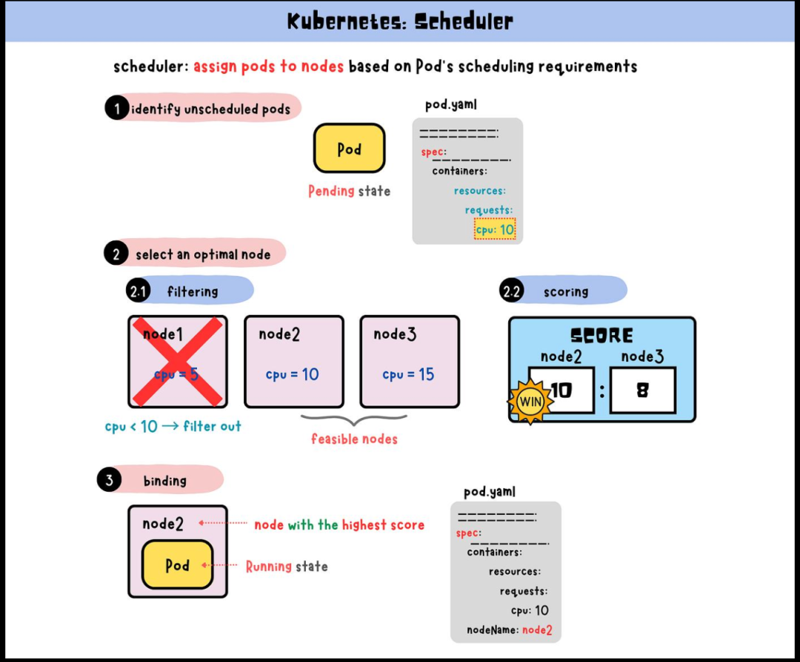

# K8s Pod 调度到节点的完整流程

> 原文: [微信文章](https://mp.weixin.qq.com/s/cyfH_NNSp5D6-U2WyJbwGA)

---

## 调度流程总览

```
用户创建 Pod
  ↓
写入 API Server / etcd
  ↓
kube-scheduler 发现未调度的 Pod
  ↓
过滤（Filter）：排除不合适的 Node
  ↓
打分（Score）：给剩余 Node 排序
  ↓
选择得分最高的 Node
  ↓
绑定 Pod 到该 Node
  ↓
目标 Node 上的 kubelet 创建并运行容器
```



---

## 一、Pod 创建后不会立刻运行

Pod 最开始只是写入 API Server，此时 `NODE` 字段通常为空。

```bash
kubectl get pod -o wide
```

**kube-scheduler** 负责监听未绑定的 Pod，为它们选择最合适的节点。

---

## 二、调度的三个阶段

```
待调度 Pod
  ↓
① 过滤：哪些 Node 可以运行？
  ↓
② 打分：哪些 Node 更适合运行？
  ↓
③ 绑定：把 Pod 绑定到目标 Node
```

---

## 三、过滤阶段（Filter）

### 1. 资源不足

只看 **requests**，不看 limits：

```yaml
resources:
  requests:
    cpu: "2"
    memory: "4Gi"
```

如果 Node 剩余资源不足以满足 requests，该节点被过滤。

### 2. Node 不可调度

```bash
kubectl cordon node-1   # 新 Pod 不会再调度到这台 Node
```

### 3. NodeSelector 不匹配

```yaml
spec:
  nodeSelector:
    disk: ssd
```

只有带 `disk=ssd` 标签的 Node 才能运行。

```bash
kubectl label node node-1 disk=ssd
```

### 4. NodeAffinity 不满足

比 nodeSelector 更灵活：

```yaml
affinity:
  nodeAffinity:
    requiredDuringSchedulingIgnoredDuringExecution:
      nodeSelectorTerms:
        - matchExpressions:
            - key: node-role
              operator: In
              values:
                - app
```

### 5. Taint / Toleration 不匹配

Node 设置污点：

```bash
kubectl taint nodes node-1 dedicated=gpu:NoSchedule
```

Pod 需要声明容忍：

```yaml
tolerations:
  - key: "dedicated"
    operator: "Equal"
    value: "gpu"
    effect: "NoSchedule"
```

---

## 四、打分阶段（Score）

对通过过滤的节点打分，考虑因素：

- 哪个节点资源更空闲
- 哪个节点镜像已存在（启动更快）
- 是否满足亲和性倾向
- 是否能让 Pod 分布更均匀
- 是否满足拓扑分布约束

**选择得分最高的节点**，分数相同则随机选一个。

---

## 五、绑定阶段（Bind）

kube-scheduler 向 API Server 发起绑定请求，设置 `spec.nodeName`：

```yaml
spec:
  nodeName: node-1
```

---

## 六、kubelet 接手

```
拉取镜像 → 创建容器 → 挂载存储 → 配置网络 → 启动 Pod
```

> **kube-scheduler 决定 Pod 去哪台机器，kubelet 负责在那台机器上把 Pod 跑起来。**

---

## 七、Pod 一直 Pending 的排查

### 常见原因

| 原因 | 排查方法 |
|------|----------|
| **资源不足** | `kubectl describe pod` 看 Events → `Insufficient cpu/memory` |
| **标签不匹配** | 检查 nodeSelector / nodeAffinity vs 实际 Node 标签 |
| **污点未容忍** | Pod 缺少对应 toleration |
| **PVC 无法绑定** | 存储卷绑定失败 |

### 常用命令

```bash
# 查看 Pod 调度事件
kubectl describe pod <pod-name>

# 查看节点资源
kubectl describe node <node-name>

# 查看节点标签
kubectl get nodes --show-labels

# 查看节点污点
kubectl describe node <node-name> | grep Taints
```

---

## 相关笔记

- [[Kubernetes 学习]]
- [[Kubernetes 问题]]
